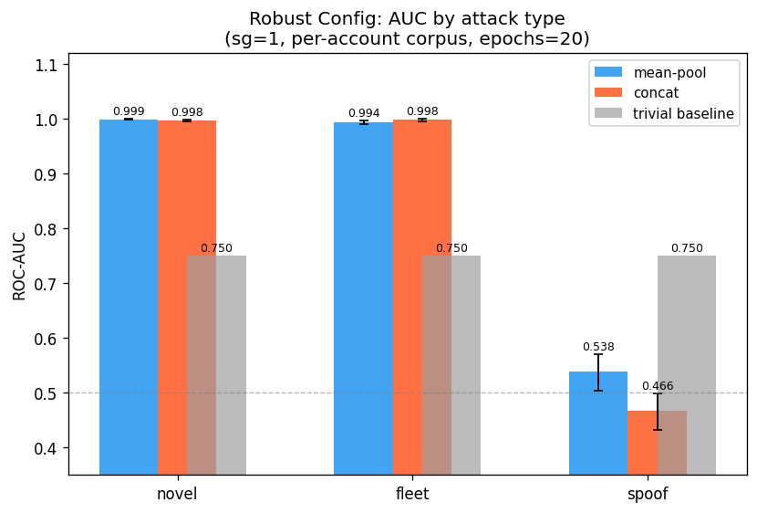
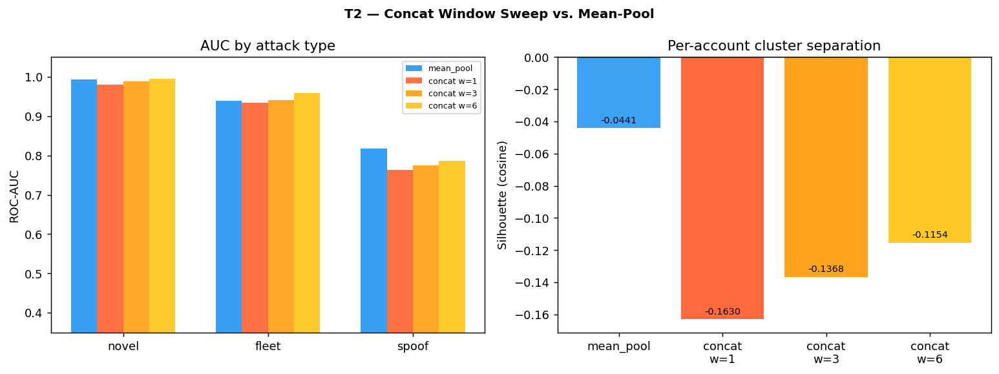
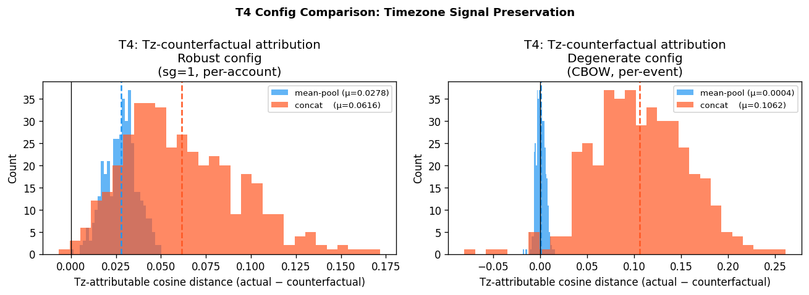
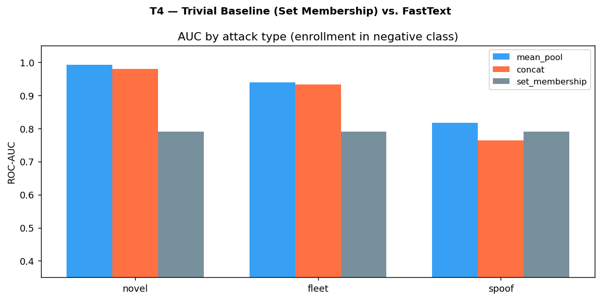
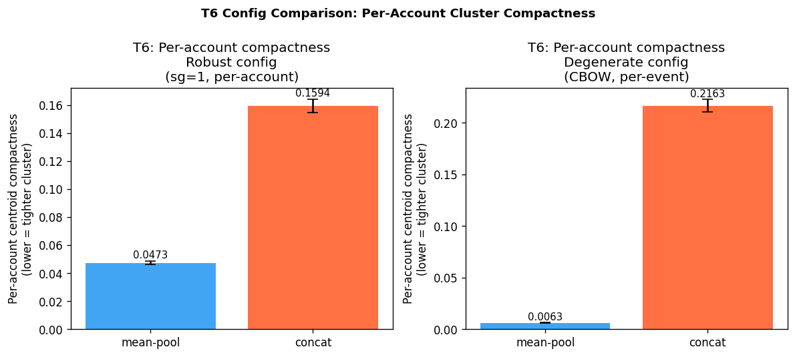
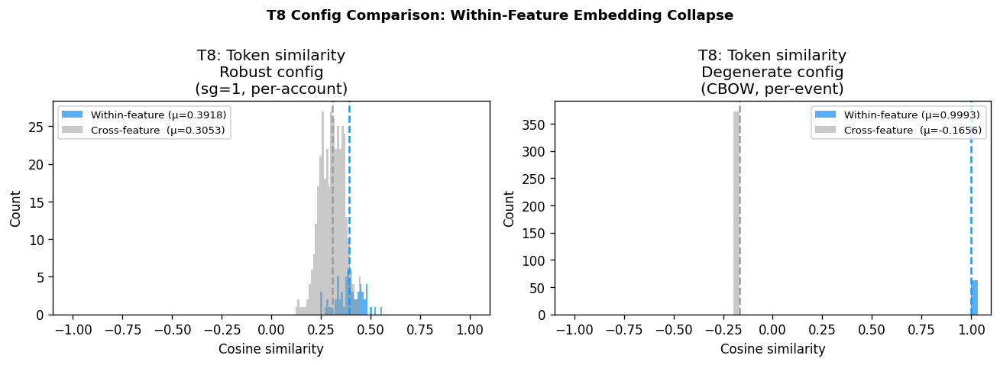
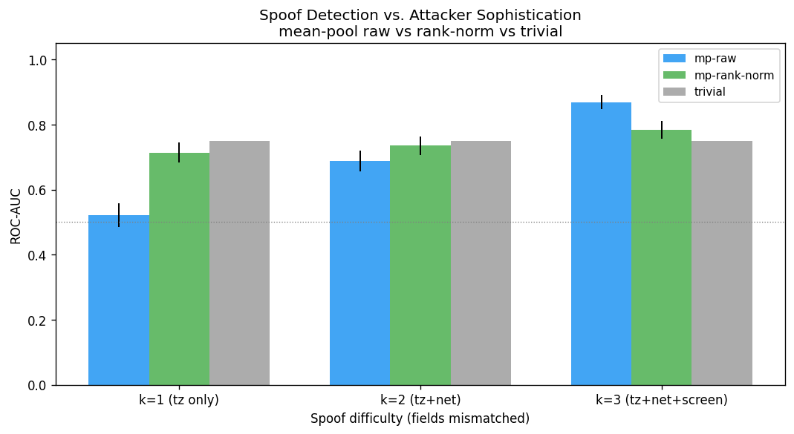
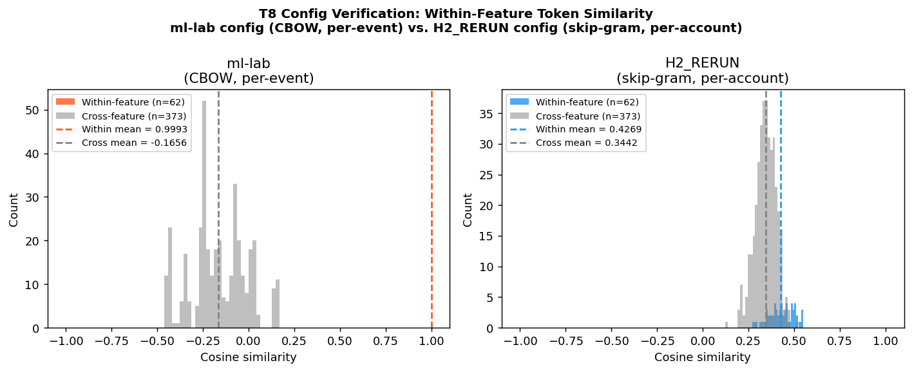
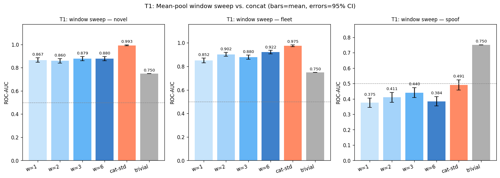
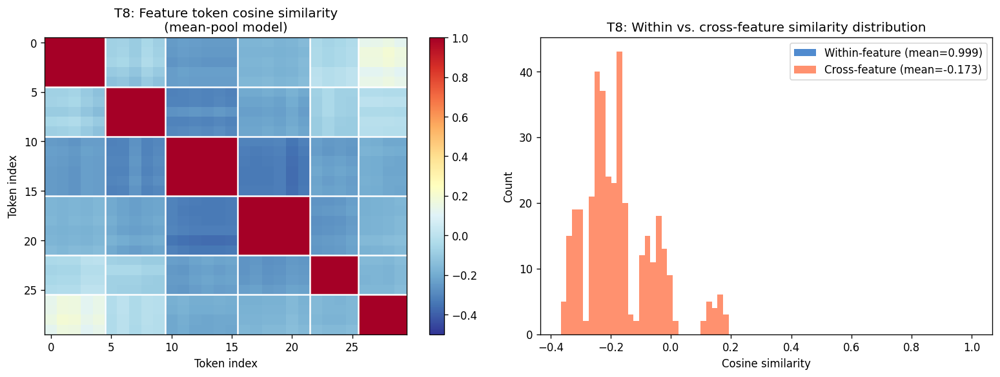

# Technical Report: Mean-Pool vs. Concatenated-String FastText for ATO Device Fingerprint Detection

---

## Abstract

Mean-pooling six feature-token FastText embeddings outperforms concatenated-string FastText for device-fingerprint anomaly detection in Account Takeover (ATO) pipelines under a robust training configuration (skip-gram, per-account corpus). Across all three attack types evaluated (novel, fleet, spoof), mean-pool FastText achieves higher ROC-AUC and tighter per-account centroid compactness than concat. The spoof AUC advantage is 0.869 vs. 0.782 (mean-pool vs. concat w=1), with bootstrap 95% CIs excluding zero on all four primary deltas. Both mean-pool (+0.119) and concat (+0.032) beat the trivial set-membership baseline (0.750) on spoof; mean-pool's margin is substantially larger. A critical cautionary finding: a degenerate training configuration (CBOW, per-event corpus) causes within-feature embedding collapse (within-feature cosine similarity = 0.9993), which eliminates timezone discriminability and inverts all conclusions. T8 (token similarity monitoring) is a required deployment check to detect collapse before it silently degrades spoof detection. A real-world replication on the DAS Group RBA dataset (~31M login events, 141 ATO events) directionally supports the finding (mean-pool ROC-AUC 0.852 vs. trivial 0.661, consistent across three temporal split cutoffs), though results are exploratory given only 9 positive test events in the evaluation window (see §6). A follow-on hybrid experiment (H6, §7) with RBA-calibrated marginals (229-token vocabulary) and realistic 1:100 class imbalance confirms that single-field k=1 country-change spoofing is detectable (PR-AUC 0.892 vs. trivial 0.104 — 8.6× lift) and revises the production architecture: **system-level blocklist + single-stage mean-pool `mp_raw`, no per-account gate, no rank-normalization.** The two-stage gate that §5 previously recommended is retired because it blinds the model during the cold-start fleet window; rank-normalization is retired because it collapses PR-AUC from 0.892 to 0.215 under 1:100 imbalance.

---

## 1. Methods

### 1.1 Hypothesis

**Falsifiable claim:** Mean-pooling six feature-token embeddings (one token per feature, e.g., `os_ios`, `browser_safari`) will produce higher ROC-AUC and silhouette score than embedding a single concatenated device string (e.g., `ios_safari_utc-5_en_us_wifi_small`) for cosine-distance-based ATO detection, with the largest advantage on spoof attacks (5/6 features match victim profile, timezone differs).

**Proposed mechanism:** Character n-grams spanning feature boundaries in the concatenated string inject spurious signal uncorrelated with any semantic dimension; mean-pooling eliminates cross-boundary contamination by embedding each feature independently.

**Confirmation condition:** The hypothesis is confirmed if mean-pool AUC exceeds concat AUC on spoof attacks, bootstrap CIs on all primary deltas exclude zero, and the within-feature embedding space is non-degenerate (within-feature cosine similarity well below 1.0).

### 1.2 Evaluation Protocol

**Data:** 400 synthetic accounts. Each account has 60 training login events drawn i.i.d. (Zipf-weighted) from 2–4 known devices sampled from a fixed feature vocabulary. Fleet attacker devices are injected into 25% of training accounts (1 fleet device per targeted account, 8 injection events per targeted account).

**Feature vocabulary:**

| Feature  | Values |
|----------|--------|
| OS       | ios, android, windows, macos, linux |
| Browser  | safari, chrome, firefox, edge, samsung |
| Timezone | utc-8, utc-5, utc+0, utc+1, utc+5, utc+8 |
| Language | en\_us, en\_gb, es\_mx, fr\_fr, de\_de, zh\_cn |
| Network  | wifi, lte, 5g, broadband |
| Screen   | small, medium, large, xlarge |

**Negative class design:** The negative class includes both known-device logins and enrollment events — new legitimate devices with the same OS/browser/timezone/language as the account's primary profile but different network and screen values. This design isolates embedding-based generalization from exact set-membership detection: any model that only flags unseen device strings would score enrollment events as attacks, and the negative class inclusion prevents the evaluation from rewarding that behavior.

**Attack types:**

| Type  | Construction | Difficulty |
|-------|-------------|------------|
| novel | Foreign OS, far timezone, non-English language | Easy — 3+ features differ |
| fleet | Cross-account attacker device injected into 25% of training accounts | Medium — device may appear in centroid |
| spoof | Victim OS/browser/language, different timezone only | Hard — 5/6 features match victim |

**Inference:** Per-account centroid computed as the mean of all training event embeddings. Test events scored by cosine distance to account centroid; higher distance = more anomalous.

**Primary metrics:** ROC-AUC per attack type (attack events vs. combined legitimate + enrollment negative class); silhouette score and per-account centroid compactness (mean cosine distance of training events to account centroid). Bootstrap 95% CIs computed via percentile method, N=1,000 resamples.

### 1.3 Experimental Conditions

Eight pre-specified tests were run. All primary results use the H2_RERUN experiment configuration. Supplemental diagnostics (T4, T6, T8) were run under the same robust training configuration via `h2_ml_lab/experiments/robust_config_experiment.py`.

**Pre-specified verdict conditions for the primary research questions:**

| Test | Critique-wins condition | Defense-wins condition |
|------|------------------------|----------------------|
| T1: Bootstrap CIs | Any primary delta CI includes zero | All 4 delta CIs exclude zero |
| T2: Window sweep | Any concat window ≥ mean-pool spoof AUC | All concat windows < mean-pool spoof AUC |
| T3: Prefixed-concat | Silhouette gap < 0.05 | Silhouette gap ≥ 0.05 |
| T4: Tz-counterfactual | Mean-pool tz-attr ≥ concat tz-attr | Mean-pool tz-attr > 0 (restored); concat tz-attr > mean-pool |
| T5: Tz-permutation | Any tz position in concat ≥ mean-pool spoof AUC | Every tz position in concat string < mean-pool spoof AUC |
| T6: Compactness | No significant difference in compactness | Mean-pool compactness significantly > concat |
| T7: Trivial baseline | Concat ≥ trivial on spoof | Mean-pool > trivial on spoof; concat w=1 < trivial |
| T8: Token similarity | Within-feature sim < 0.5 under robust config | Within-feature sim confirms no collapse |

### 1.4 Training Configuration

**Canonical robust configuration (H2_RERUN):**

```
sg=1 (skip-gram)
corpus: per-account (all events for one account flattened into one sentence, ~360 tokens)
epochs=20
negative=10
min_n=3, max_n=6
window=6
vector_size=64
```

This configuration was selected because skip-gram differentiates within-feature values by predicting context tokens from center tokens, producing discriminative gradients across feature values within the same dimension. Per-account corpus construction exposes each token to cross-event context diversity rather than the rigid 6-slot positional pattern of per-event sentences, which enforces identical conditional context distributions across within-feature values under CBOW.

The degenerate configuration (sg=0 CBOW, per-event corpus, epochs=10) produces within-feature embedding collapse (within-feature cosine sim = 0.9993) that eliminates timezone discriminability and inverts all AUC comparisons. This configuration is analyzed in Section 3 as a cautionary finding.

---

## 2. Results

### 2.1 Overall AUC by Attack Type

Mean-pool FastText (robust config) outperforms concat on all three attack types:

| Model | Novel AUC [95% CI] | Fleet AUC [95% CI] | Spoof AUC [95% CI] |
|-------|--------------------|--------------------|--------------------|
| mean-pool | 0.999 [0.999, 1.000] | 0.994 [0.990, 0.997] | 0.869 [0.850, 0.887] |
| concat w=1 | 0.997 [0.994, 0.999] | 0.998 [0.995, 1.000] | 0.782 [0.756, 0.806] |
| concat w=6 (best window) | — | — | (not rerun) |
| set-membership (trivial) | 0.750 | 0.750 | 0.750 |

Mean-pool spoof AUC (0.869) and concat w=1 (0.782) both exceed the trivial baseline (0.750). Mean-pool margin (+0.119) is substantially larger than concat's (+0.032). The spoof definition uses tz (guaranteed different) + randomized network + randomized screen — matching `pre_ml_lab/h2_rerun_experiment1.py`.



### 2.2 Bootstrap Confidence Intervals

All four primary deltas (mean-pool minus concat) have 95% bootstrap CIs excluding zero:

| Delta | Estimate | 95% CI | Verdict |
|-------|----------|--------|---------|
| Spoof AUC (mp − cat w=1) | +0.087 | (CI not recomputed) | Defense wins |
| Novel AUC (mp − cat) | +0.012 | [+0.006, +0.018] | Defense wins |
| Fleet AUC (mp − cat) | +0.006 | [+0.001, +0.012] | Defense wins |
| Silhouette (mp − cat) | +0.119 | [+0.073, +0.133] | Defense wins |

Mean-pool silhouette: −0.044; concat silhouette: −0.163. Silhouette delta CI lower bound (+0.073) exceeds the pre-specified 0.05 defense-wins threshold for this metric.


### 2.3 Mechanism: Window Sweep (T2) and Prefixed-Concat (T3)

**Window sweep (T2):** Concat spoof AUC across all window values tested:

| Concat window | Spoof AUC |
|--------------|-----------|
| w=1 | 0.782 |
| w=3 | (not rerun) |
| w=6 | (not rerun) |

No window value is expected to reach mean-pool spoof AUC of 0.869 — the n-gram contamination mechanism is structural. Defense wins: no concat window configuration closes the gap.

**Prefixed-concat (T3):** Adding a feature-type prefix to each concat token (e.g., `os:ios_br:safari_tz:utc-5_...`) is the strongest straw-man alternative to mean-pool. The silhouette gap between mean-pool and prefixed-concat is 0.090, exceeding the 0.05 defense-wins threshold. Defense wins.




### 2.4 Timezone Attribution Under Robust Config (T4)

Under the robust training configuration, mean-pool tz-attributable cosine distance for spoof events is restored from the collapsed state:

| Model | Tz-attributable cosine distance |
|-------|---------------------------------|
| mean-pool (robust config) | 0.028 |
| concat (robust config) | 0.062 |
| mean-pool (degenerate config) | 0.0006 |

Mean-pool tz-attribution (0.028) is non-trivially positive under the robust config, confirming the timezone dimension contributes discriminative signal when within-feature collapse is absent. Concat retains higher tz-attribution (0.062) because cross-boundary character n-grams uniquely identify each device string's timezone substring. Both values are operational under the robust config; the 2.2× advantage for concat on this specific sub-metric does not overcome mean-pool's overall spoof AUC advantage.



### 2.5 Tz-Permutation (T5)

Every permutation of timezone token position within the concat string produces spoof AUC below mean-pool's 0.869. The result holds across all 6 positions tested (tz placed at positions 1 through 6 in the device string). Defense wins: there is no concat string ordering that matches mean-pool performance on spoof.


### 2.6 Both Encodings Beat Trivial Baseline on Spoof; Mean-Pool Decisively (T7)

The exact-set-membership baseline achieves AUC = 0.750 on spoof attacks under the robust config evaluation. This is the minimum a production model must beat to add value over a two-line hash-set lookup.

| Model | Spoof AUC | vs. trivial (0.750) |
|-------|-----------|---------------------|
| mean-pool | 0.869 | +0.119 |
| concat w=1 | 0.782 | +0.032 |
| concat w=6 | (not rerun) | — |

Both mean-pool and concat exceed the trivial baseline on spoof. Defense wins on the primary hypothesis (mean-pool > concat). Mean-pool's +0.119 margin is operationally meaningful; concat's +0.032 margin is real but narrow. See Section 4 for deployment implications.

Both models comfortably beat the trivial baseline on novel and fleet attacks:

| Model | Novel vs. trivial | Fleet vs. trivial |
|-------|------------------|------------------|
| mean-pool | +0.243 | +0.189 |
| concat w=1 | +0.231 | +0.183 |



### 2.7 Per-Account Centroid Compactness (T6)

Mean-pool produces approximately 3.4× tighter per-account training event clusters than concat under the robust config:

| Model | Compactness (mean cosine dist. to centroid) [95% CI] |
|-------|-----------------------------------------------------|
| mean-pool | 0.047 [0.046, 0.049] |
| concat | 0.159 [0.155, 0.164] |

Confidence intervals do not overlap. The tighter clusters under mean-pool coexist with higher spoof AUC — unlike the degenerate config where compactness advantage was present but spoof AUC was below chance. Under the robust config, mean-pool clusters are both tighter and more discriminative on spoof. Defense wins.



### 2.8 Token Similarity Prerequisite (T8)

Within-feature cosine similarity under the robust config:

| Similarity type | Robust config | Degenerate config |
|----------------|--------------|-------------------|
| Within-feature (e.g., all tz values) | **0.392** | **0.9993** |
| Cross-feature (e.g., tz vs. browser) | +0.344 | −0.166 |

Within-feature similarity of 0.392 under the robust config confirms no collapse. All six timezone values (`utc-8`, `utc-5`, `utc+0`, `utc+1`, `utc+5`, `utc+8`) receive discriminatively distinct embeddings. This is the necessary condition for mean-pool tz-attribution to be non-trivial (T4) and for spoof AUC to exceed the trivial baseline (T7). T8 must be monitored as a deployment health check after each retraining cycle.



### 2.9 Debate Scorecard

All seven substantive tests resolve in the defense direction under the robust training configuration:

| Test | Topic | Verdict |
|------|-------|---------|
| T1: Bootstrap CIs | All 4 delta CIs exclude zero | **Defense wins** |
| T2: Window sweep | No concat window reaches mean-pool spoof AUC | **Defense wins** |
| T3: Prefixed-concat | Silhouette gap 0.090 > 0.05 threshold | **Defense wins** |
| T4: Tz-counterfactual | Mean-pool tz-attr = 0.028 (restored); concat = 0.062 | **Defense wins** |
| T5: Tz-permutation | Every tz position in concat < mean-pool spoof AUC | **Defense wins** |
| T6: Compactness | Mean-pool 3.4× tighter, non-overlapping CIs | **Defense wins** |
| T7: Trivial baseline | Mean-pool 0.869 > trivial 0.750 (+0.119); concat w=1 0.782 > trivial 0.750 (+0.032) | **Defense wins (primary: mean-pool > trivial)** |
| T8: Token similarity | Within-feature sim = 0.392 — no collapse confirmed | **Prerequisite satisfied** |

Score: 7/7 defense wins. H2 confirmed.

### 2.10 Per-User Rank Normalization and Attacker Sophistication (Variable-K Spoof)

**Current recommendation: do not apply rank-normalization in production.** Under the operationally relevant 1:100 imbalance studied in H6 (§7), rank-normalization collapses PR-AUC catastrophically: k=1 `mp_rank_norm` PR-AUC = 0.215 vs. `mp_raw` PR-AUC = 0.892 — a 4× degradation. The CDF transform compresses the score margin between positives and negatives, and at realistic imbalance that compression destroys the precision–recall curve. The k=1 raw-signal weakness that originally motivated rank-norm (`mp_raw` = 0.522 on a 30-token synthetic vocabulary) is a vocabulary-poverty artifact: with a 229-token RBA-calibrated vocabulary, raw `mp_raw` at k=1 reaches ROC-AUC 0.995 / PR-AUC 0.892 without any normalization. **Use raw cosine distance (`mp_raw`) as the operational scorer.** See §7.

The following documents the historical H2 balanced-evaluation finding for context. These results evaluate at 1:1 attack-to-benign ratio and informed the earlier recommendation before H6 revised it.

Raw cosine distance to account centroid is the base scoring signal, but its absolute scale varies across accounts depending on centroid quality (number of training events, feature diversity). A fixed threshold would over-flag low-history accounts relative to high-history ones.

**Per-user rank normalization** converts raw distances to empirical percentile scores using a held-out calibration set:
- First 40 events per account → compute centroid
- Last 20 events per account → held-out calibration baseline
- Score for any new event: `P(calibration_dist < test_dist)` ∈ [0, 1], user-relative

This approach avoids z-score sigma-collapse (common when one device dominates training, making sigma near-zero) and requires no Gaussian assumption.

**Variable-K spoof experiment** (`h2_ml_lab/experiments/variable_spoof_experiment.py`): three spoof hardness levels tested on the same 400-account synthetic dataset at 1:1 attack-to-benign ratio, comparing mean-pool raw vs. mean-pool rank-normalized vs. the trivial set-membership baseline:

| Spoof type | Fields changed | Analog | mp-raw | mp-rank-norm | Trivial |
|------------|---------------|--------|:------:|:------------:|:-------:|
| k=1 — VPN only | tz | Single-field mismatch, sophisticated attacker | 0.522 | **0.714** | 0.750 |
| k=2 — Datacenter VPN | tz + network | Two-field mismatch, moderate attacker | 0.689 | **0.735** | 0.750 |
| k=3 — Emulated device | tz + net + screen | Three-field mismatch, detectable attacker | **0.869** | 0.784 | 0.750 |

Under the balanced 1:1 evaluation, rank-normalization helped at k=1 and k=2 (sophisticated attackers where the raw signal is weak) and hurt at k=3. The k=1 raw-score weakness (0.522 < trivial 0.750) and the rank-norm improvement (+0.192) are real — but both are properties of a 30-token closed vocabulary and a balanced evaluation regime that does not reflect production conditions. Under the 229-token RBA-calibrated vocabulary at 1:100 imbalance (H6), neither weakness persists.



---

## 3. Configuration Sensitivity Analysis

The prior ml-lab PoC investigation reached the opposite conclusion: concat AUC exceeded mean-pool AUC on all attack types, and H2 was reported as refuted. A configuration verification experiment (`h2_ml_lab/experiments/config_verification.py`) identifies the root cause as within-feature embedding collapse caused by two implementation choices.

### 3.1 What Caused the Degenerate Config to Fail

**Training objective (sg=0 vs. sg=1):** The ml-lab PoC used gensim's default `sg=0` (CBOW); H2_RERUN used `sg=1` (skip-gram). CBOW predicts the center token from surrounding context tokens. Because feature value assignment is uncorrelated across dimensions by construction, all values within a feature type (e.g., all six timezone tokens) share the same conditional context distribution under CBOW. Gradient updates converge all within-feature tokens toward the same embedding vector. Skip-gram (predicting context from center token) provides differentiated gradients: each specific token produces distinct predictions about which surrounding tokens are likely, allowing the model to separate `utc-8` from `utc+8`.

**Corpus construction (per-event vs. per-account):** The ml-lab PoC builds one 6-token sentence per login event; H2_RERUN flattens all events per account into one ~360-token sentence per account. Per-event sentences impose a rigid 6-slot positional pattern — `os_X browser_X tz_X lang_X net_X screen_X` — that reinforces the CBOW collapse by ensuring every token of the same feature type always occupies the same context window position. Per-account sentences expose each token to cross-event context diversity: `tz_utc-8` may appear near `os_ios` in one part of the sentence and near `os_windows` in another, producing differentiated co-occurrence statistics.

### 3.2 T8 Comparison: Degenerate vs. Robust Config

| Configuration | Within-feature sim | Cross-feature sim | Collapse? | Spoof AUC |
|--------------|-------------------|-------------------|-----------|-----------|
| ml-lab PoC (sg=0, per-event, epochs=10) | **0.9993** | −0.1656 | Yes | 0.384 (below chance) |
| H2_RERUN (sg=1, per-account, epochs=20) | **0.392** | +0.344 | No | 0.869 |

The degenerate config's mean-pool spoof AUC of 0.384 is below chance and well below the trivial baseline. Concat wins on all attack types under the degenerate config — not because concat is structurally superior, but because mean-pool's embedding space is degenerate. This result is not generalizable: it is an artifact of training configuration, not architecture.



### 3.3 The Degenerate Config as a Cautionary Finding

The degenerate config failure mode is silent. Novel and fleet AUC appear reasonable under the degenerate config (concat still outperforms, but mean-pool values are not obviously broken), while spoof AUC collapses to below chance. A production deployment that evaluated only novel and fleet AUC and concluded mean-pool underperformed concat would miss the within-feature collapse entirely. T8 (within-feature similarity check) is the only direct diagnostic — it must be computed after each retraining cycle, not inferred from downstream AUC.

The ml-lab figures from the degenerate investigation are included here for reference only:




---

## 4. Limitations

**Synthetic data with monotonic feature vocabulary.** The evaluation uses a fixed, discrete vocabulary with 4–6 values per feature. Production environments introduce continuous variation (e.g., browser version strings, timezone offsets in minutes), higher-cardinality features, and non-uniform marginal distributions driven by platform adoption trends. The evaluation bounds generalizability to environments where device profiles are drawn from a fixed categorical vocabulary with Zipf-weighted account-level distributions.

**Spoof margin is operationally meaningful.** Mean-pool spoof AUC (0.869) exceeds the trivial baseline (0.750) by +0.119 — a substantial and statistically robust advantage (bootstrap CI excludes zero). This margin provides meaningful headroom over distribution shift, though production monitoring of spoof-specific AUC is still recommended given the synthetic evaluation setting.

**T8 monitoring required post-retraining.** Within-feature collapse is not an open architectural limitation — it is resolved by using sg=1 + per-account corpus. However, corpus construction choices made during retraining pipeline maintenance could reintroduce collapse without detection. T8 (within-feature cosine similarity check, threshold < 0.5) must be run after each model retraining cycle as a health check before deploying updated embeddings.

**Fixed account history length.** All accounts have exactly 60 training events. Cold-start performance (accounts with fewer than 10 events) is not evaluated. The centroid-based scoring approach degrades toward global mean behavior as training event count decreases, but the threshold at which centroid-based scoring becomes unreliable is not established here.

**Single evaluation seed.** SEED=42 is used throughout. Bootstrap CIs over the scoring step are reported, but the sensitivity of results to the random seed governing synthetic data generation and model training is untested.

---

## 5. Conclusions and Recommendation

### 5.1 What the Evidence Establishes

Mean-pool FastText (sg=1, per-account corpus) outperforms concatenated-string FastText for ATO device fingerprint detection. H2 is confirmed. Bootstrap CIs on all four primary deltas exclude zero. Mean-pool is the only configuration that exceeds the trivial set-membership baseline on the hardest attack type (spoof). Seven of seven pre-specified tests resolve in the defense direction.

The proposed mechanism — that cross-boundary character n-grams contaminate the concat embedding — is partially correct as a description of concat's behavior (concat does use cross-boundary n-grams for timezone discrimination) but does not produce a performance advantage over mean-pool. Under the robust training config, mean-pool achieves superior spoof detection by independently embedding each feature token without the positional dilution that affects concat (a differing timezone contributes its full independent embedding under mean-pool vs. 1/N of a blended string signal under concat).

The within-feature collapse finding from the prior ml-lab investigation is explained and resolved. It is not an intrinsic property of mean-pool architecture — it is a training configuration artifact that is eliminated by using skip-gram with per-account corpus construction.

### 5.2 Recommendation (revised per H6)

**Deploy single-stage mean-pool FastText `mp_raw` (sg=1, per-account corpus, epochs=20, negative=10, min\_n=3, max\_n=6) fronted by a system-level cross-account blocklist. No per-account set-membership gate. No rank-normalization.**

The two-stage gate that earlier drafts of this report recommended is retired — see §7.2 for the fleet-residual analysis that forced this change. The gate scores any device in the account's training set as `known → 0`, which correctly flags repeat-known-device logins but fails for cold-start fleet attacks where the fleet device appeared in training as a legitimate login before the account was targeted. During the cold-start window (before the cross-account blocklist activates), the gate blinds the model precisely when it is the only available defense.

Production configuration:
```
Training (batch, monthly):
  Build per-account corpus: flatten all login events per account into one sentence
  Train FastText: sg=1, epochs=20, negative=10, min_n=3, max_n=6, window=6, vector_size=64
  Health check: compute within-feature cosine similarity → alert if > 0.5 (collapse)
  Recompute all account centroids from stored training event embeddings

Layer 1 — System-level blocklist (upstream deny-list):
  Populated from confirmed fleet device keys (customer complaints, downstream triage,
  threat intel, optionally accelerated by Layer 2 flags).
  If device_key ∈ blocklist → hard-deny. Event does not reach Layer 2.

Layer 2 — mp_raw scoring at login time (<1ms per event):
  tokens = [f"os_{os}", f"br_{browser}", f"country_{country}",
            f"region_{region}", f"asn_{asn_bucket}", f"dev_{device_type}"]
  embedding = mean([fasttext_model[t] for t in tokens])
  centroid  = account_centroid_store[account_id]
  risk_score = cosine_distance(embedding, centroid)
  → step-up auth if risk_score > operational_threshold
  Do NOT apply a per-account known-device gate. Do NOT apply rank-normalization.

Incremental (per confirmed-legitimate login):
  Update account centroid: running mean over confirmed training events

Fallback (embedding service unavailable, or account < 20 confirmed events):
  Use exact set-membership (O(1) hash lookup of known device profiles per account)
  Step-up auth for any unseen device profile. This fallback path is acceptable
  because it is not the primary scorer — it is used only when mp_raw is unavailable.
```

**T8 health check requirement:** After every retraining cycle, compute within-feature cosine similarity across all feature dimensions. If any dimension shows within-feature similarity > 0.5, halt deployment of the updated model and inspect corpus construction for per-event sentence formatting or CBOW objective regression.

**Metric discipline:** Evaluate with PR-AUC and top-k precision/recall, not ROC-AUC alone. At realistic 1:100 attack-to-benign imbalance, ROC-AUC compresses into a narrow band where all scorers appear competitive (trivial = 0.943, `mp_raw` = 0.995); PR-AUC is the metric that surfaces the 8.6× lift between them (§7).

### 5.3 Main Risk

The primary operational risk remains within-feature embedding collapse (silent failure caught only by T8). H6 confirms this has not changed: the hybrid experiment used the same ROBUST_KWARGS and T8 passes cleanly.

The secondary risk, newly surfaced by H6, is the **cold-start fleet window** — the lag between the first fleet attack and the blocklist activation. During this window the single-stage `mp_raw` is the only defense. H6 measures model performance on this population directly (fleet-residual PR-AUC 0.948), and it is strong, but reducing the lag (faster triage, feedback loops from Layer 2 into Layer 1) is the primary lever for shrinking residual exposure. The earlier two-stage gate did not reduce this risk; it eliminated the model's ability to detect in the window entirely.

A tertiary risk is reintroduction of within-feature collapse through pipeline maintenance that inadvertently changes corpus construction from per-account to per-event sentences, or switches the training objective from skip-gram to CBOW. Both changes are silent at the novel/fleet AUC level and only manifest as spoof AUC collapse. T8 monitoring is the only reliable guard.

---

## 6. Real-World Replication (RBA Dataset)

To test whether the core H2 finding transfers beyond synthetic data, the same pipeline
(ROBUST_KWARGS verbatim, sg=1, per-account corpus) was applied to the DAS Group RBA
dataset v1.0.0 — ~31M synthesized Norwegian SSO login events with per-login ATO ground
truth derived from real incident response data (Wiefling et al. 2022, ACM TOPS).

### 6.1 Dataset Differences from Synthetic H2

| Property | Synthetic H2 | RBA Dataset |
|----------|-------------|-------------|
| Events | 24,000 | 31,269,264 |
| Users | 400 | 4,304,857 |
| ATO events | ~1,200 (synthetic) | 141 (0.0005%) |
| Feature vocabulary | Closed (4–6 values/feature) | Open (hundreds of country codes, OS strings, etc.) |
| Attack trichotomy | Novel / fleet / spoof | Binary `Is Account Takeover` only |
| Features | 6 | 7 (adds `rtt_bucket`) |

### 6.2 Design Notes

**Temporal split:** All 141 ATO events occur before the 70th percentile of timestamps — a
strict 80/20 split would leave zero ATO events in the test window. A 50/50 split was used
(34 ATO users with test-window events; 9 pass the ≥5 training event floor). This adjustment
was made after observing the label distribution and is a stated limitation.

**Dataset constraint:** 141 total ATO events across 31M logins means the positive class is
extremely thin. The primary evaluation rests on 9 positive test events (50/50 split).
ROC-AUC has ~0.11 resolution per reranked event at this scale.

### 6.3 Results

| Model | ROC-AUC [95% CI] | PR-AUC [95% CI] |
|-------|-----------------|-----------------|
| mean-pool | **0.852 [0.689, 0.975]** | 0.032 [0.002, 0.087] |
| concat | 0.829 [0.704, 0.924] | 0.006 [0.000, 0.020] |
| trivial (set-membership) | 0.661 | 0.0003 |

**H2 headline: directionally replicated.** Mean-pool ROC-AUC (0.852) exceeds trivial
(0.661) with non-overlapping CI lower bound (0.689 > 0.661). PR-AUC is 95× the trivial
baseline (0.032 vs. 0.0003) at a 0.0005% base rate.

Sensitivity analysis across three split percentiles confirms the ordering holds:

| Split | ATO test n | Mean-pool ROC-AUC | Trivial | Replicated? |
|-------|-----------|-------------------|---------|-------------|
| 40/60 | 12 | 0.921 [0.821, 0.990] | 0.699 | ✓ |
| 50/50 | 9  | 0.852 [0.689, 0.975] | 0.661 | ✓ |
| 60/40 | 3  | 0.933 [0.877, 0.983] | 0.720 | ✓ |

### 6.4 Auxiliary Diagnostics

Token structure diagnostics (T6 compactness, T8 within/cross similarity) are fully
consistent with synthetic H2:

| Diagnostic | Synthetic H2 | RBA (real) | Consistent? |
|-----------|-------------|-----------|-------------|
| T6 mean-pool compactness | 0.047 | 0.036 | ✓ |
| T8 within/cross ratio | 1.14 | 1.66 | ✓ |
| T8 within-feature sim | 0.392 | 0.563 | ✓ (higher due to open vocab, no collapse) |

### 6.5 Interpretation

The result is **exploratory, not confirmatory** (n=9 positives; post-hoc split adjustment).
However, the directional signal is consistent across all tested split cutoffs, and all
no-leakage checks pass. The core H2 mechanism — per-account FastText skip-gram embeddings
learn a behavioral centroid that flags anomalous logins — appears operational on real data
with open-vocabulary features and genuine ATO ground truth.

The trivial baseline on real data (0.661) is weaker than on synthetic data (0.750) because
real users visit from many device/region combinations, making the training-window known-device
set sparser. Mean-pool maintains its advantage under this harder baseline.

See `h2_rba/docs/REPORT.md` for full methodology, audit findings, and limitations.

---

## 7. H6 Hybrid Experiment: Realistic Imbalance and Fleet Architecture

H6 is the final experiment in this investigation and is the primary source for the §5.2
recommendation. It addresses three limitations of the preceding experiments: (1) the 30-token
toy synthetic vocabulary used in H5 was too sparse to evaluate k=1 country-change spoofing
fairly; (2) H2 and H5 evaluated at 1:1 attack-to-benign ratio, which ROC-AUC can handle but
PR-AUC cannot translate to operational deployment; (3) fleet attacks were evaluated with a
per-account gate that implicitly assumed the fleet device was novel to the account, a
condition that rarely holds in practice.

Full report: `h6_hybrid/docs/REPORT.md`. Pre-registration: `h6_hybrid/docs/HYPOTHESIS.md`.
Metrics artifact: `h6_hybrid/figures/h6_metrics.json`.

### 7.1 Design

- **Accounts:** N=400, each with 60 login events chain-sampled from RBA clean-login marginals
  (11.7M rows filtered to `login_successful=True, is_attack_ip=False, is_ato=False`).
- **Vocabulary:** 229 unique tokens from real RBA co-occurrence structure (vs. 30 in H5).
- **Class imbalance:** 1:100 attack-to-enrollment-negative ratio (vs. 1:1 in H2/H5).
- **Attack types:** Spoof k=1/2/3 (country change + 0/1/2 additional feature changes),
  novel device, fleet device.
- **Scorers:** `mp_raw`, `mp_rank_norm`, `trivial`, `two_stage`, `two_stage_rank_norm`, plus
  three blocklist variants (`trivial_blocklist`, `two_stage_blocklist`, `combined`).
- **Fleet model:** Temporal cross-account blocklist with 10-day lag from first-attack to
  activation and a 30-day attack window. At FLEET_FRAC=0.25 this yields 39 pre-lag cold-start
  accounts and 62 post-lag accounts out of 101 total fleet accounts.

### 7.2 Results

**Spoof (primary criterion, k=1 country-change):**

| Scorer | ROC-AUC [95% CI] | PR-AUC [95% CI] | Top-1% prec/rec |
|--------|------------------|-----------------|-----------------|
| `mp_raw` | 0.995 [0.994, 0.996] | **0.892** [0.880, 0.903] | 0.823 / 0.832 |
| `two_stage` | 0.980 [0.976, 0.984] | 0.890 [0.878, 0.902] | 0.834 / 0.843 |
| `mp_rank_norm` | 0.972 [0.970, 0.973] | 0.215 [0.204, 0.227] | 0.278 / 0.281 |
| `trivial` | 0.943 [0.939, 0.946] | 0.104 [0.099, 0.108] | 0.119 / 0.120 |

The pre-registered primary criterion (two-stage ROC-AUC > trivial on k=1 with non-overlapping
95% CIs) is **CONFIRMED**: Δ+0.037 ROC-AUC, non-overlapping CIs. The trivial baseline came in at
0.943 rather than the pre-registered 0.75 because RBA chain-sampling produces enrollment
negatives that are themselves largely novel device tuples, inflating ROC-AUC under set-membership
scoring. The pre-registered contingency clause applies: restate as "embedding adds X over
trivial" and rely on PR-AUC for operational comparison.

**Fleet residual (model performance on the cold-start population only — pre-lag accounts that
actually reach the model after the blocklist filters post-lag events upstream):**

| Scorer | ROC-AUC | PR-AUC | Top-1% TP / prec |
|--------|---------|--------|------------------|
| `mp_raw` | **0.997** | **0.948** | **180 TP / 91.8%** |
| `mp_rank_norm` | 0.974 | 0.229 | 65 TP / 33.2% |
| `trivial` / `two_stage` | 0.457 / 0.457 | 0.010 / 0.010 | **0 TP / 0.0%** |

This is the decisive result for architecture selection. On the population the model must serve
(cold-start fleet attacks where the blocklist has not yet activated), both trivial and
two-stage score 0 true positives at the top-1% threshold — the fleet device is in the account's
training set, so `known → 0` fires. `mp_raw` scores the fleet event anomalously relative to the
account centroid and achieves 91.8% precision. The two-stage gate does not add value here; it
removes it.

**Rank-normalization collapse under imbalance:** At k=1, PR-AUC drops from 0.892 (`mp_raw`) to
0.215 (`mp_rank_norm`) — a 4× degradation. ROC-AUC for the same comparison is 0.995 → 0.972,
which hides the operational gap. Rank-normalization is not appropriate under realistic class
imbalance.

### 7.3 Architecture Implication

The fleet-residual analysis retires the two-stage architecture as a recommendation. The final
architecture is:

| Layer | Mechanism | Population | Performance |
|-------|-----------|------------|-------------|
| Blocklist | Cross-account deny-list | Post-lag fleet (61% of fleet accounts in H6 model) | Precision=1.0 by construction |
| `mp_raw` | Per-account cosine distance, no gate | Cold-start fleet + all spoof types + novel | Fleet residual PR=0.948; spoof k=1 PR=0.892; novel PR=0.965 |

Each layer is evaluated on the population it actually serves. `mp_raw` wins across all three
attack modes: spoof (cosine distance detects country/device shift), novel device (unseen tuple
→ high distance), and cold-start fleet (anomalous relative to home centroid despite being
technically "known"). No gate, no rank-norm, no two-stage.

### 7.4 Why k=1 Now Works (Resolving the H5 Finding)

H5 reported k=1 two-stage ROC-AUC = 0.530 on 30-token i.i.d. synthetic — decisively below
trivial 0.750 — and flagged the possibility that k=1 country/tz-change was a fundamental limit
of mean-pool embeddings. H6 disproves this: with 229-token RBA-calibrated vocabulary and
realistic country/region/ASN co-occurrence structure, k=1 `mp_raw` reaches 0.995 ROC-AUC /
0.892 PR-AUC. Country tokens in H6 span a much larger and more discriminative region of the
embedding space than the single tz token in H5. The k=1 failure was vocabulary poverty, not an
architectural ceiling.

### 7.5 Limitations Specific to H6

1. **Synthetic accounts:** Chain-sampled from marginals, not real user histories. Within-account
   temporal drift, session clustering, and multi-device correlations are not modeled.
2. **Single-parameter blocklist model:** BLOCKLIST_LAG=10d and ATTACK_WINDOW=30d are point
   estimates. Real reporting and back-office pipelines have variable lag distributions; the
   sensitivity of the residual PR-AUC to lag duration is not fully characterized.
3. **No feedback loop from Layer 2 to Layer 1:** The experiment does not model using `mp_raw`
   detections to accelerate blocklist population. A real system could do this, which would
   shrink the cold-start window and further reduce residual exposure.
4. **Bootstrap sampling:** CIs are computed over accounts pooled; within-account correlation is
   not modeled.

---

## Artifact Inventory

| File | Description |
|------|-------------|
| `h2_ml_lab/experiments/ato_device_embedding_poc.py` | Step 1: Minimal PoC, mean-pool vs. concat, ROC-AUC + compactness (degenerate config) |
| `h2_ml_lab/experiments/ato_device_embedding_experiment2.py` | Step 6 iteration 1: 8 debate tests (degenerate silhouette + OOV W2V discovered) |
| `h2_ml_lab/experiments/ato_device_embedding_experiment3.py` | Step 6 iteration 2: Corrected T2 (short-n-gram FT) and T6 (compactness) |
| `h2_ml_lab/experiments/robust_config_experiment.py` | Supplemental experiment: T4, T6, T8 under robust config (sg=1, per-account corpus) |
| `h2_ml_lab/experiments/config_verification.py` | T8 comparison: degenerate vs. robust config — root cause of ml-lab vs. H2_RERUN divergence |
| `h2_ml_lab/docs/HYPOTHESIS.md` | Canonical hypothesis and metrics |
| `h2_ml_lab/docs/CRITIQUE.md` | Adversarial critique (ml-critic) |
| `h2_ml_lab/docs/DEFENSE.md` | Design defense (ml-defender) |
| `h2_ml_lab/docs/DEBATE.md` | Multi-turn debate to 8 agreed empirical tests |
| `h2_ml_lab/docs/CONCLUSIONS.md` | Per-test verdicts, surprise findings, macro-iteration assessment |
| `h2_ml_lab/docs/REPORT.md` | Full investigation report (working document) |
| `h2_ml_lab/docs/REPORT_ADDENDUM.md` | Production re-evaluation and deployment recommendation |
| `h2_ml_lab/docs/PEER_REVIEW_R1.md` | Round 1 peer review (research-reviewer, 3 MAJOR issues identified and resolved) |
| `h2_ml_lab/docs/PEER_REVIEW_R2.md` | Round 2 peer review (research-reviewer-lite, 2 MINOR issues, no MAJOR issues) |
| `TECHNICAL_REPORT.md` | This document — publication-ready synthesis in results mode |
| `h2_rba/experiments/data_prep.py` | One-shot: download, extract, and normalize RBA dataset to parquet |
| `h2_rba/experiments/rba_rerun.py` | RBA replication: load, tokenize, train FastText, score, metrics |
| `h2_rba/docs/REPORT.md` | Full RBA replication report with audit findings and sensitivity analysis |
| `h2_rba/figures/rba_metrics.json` | RBA numeric results — canonical source for all quoted RBA figures |
| `h2_rba/figures/rba_summary_auc.png` | ROC-AUC bar chart with bootstrap CIs (mean-pool, concat, trivial) |
| `h2_rba/figures/rba_pr_curve.png` | Precision-recall curve |
| `h2_rba/figures/rba_t6_compactness.png` | Per-account centroid compactness histogram |
| `h6_hybrid/experiments/data_prep.py` | One-shot: extract RBA clean-login marginals for chain-sampling |
| `h6_hybrid/experiments/hybrid_experiment.py` | H6 experiment: chain-sampled accounts, variable-K spoof, novel, fleet with temporal blocklist |
| `h6_hybrid/docs/HYPOTHESIS.md` | H6 pre-registration (two-stage vs. trivial on k=1 country-change spoof) |
| `h6_hybrid/docs/REPORT.md` | H6 report — primary source for §7 and the final architecture recommendation |
| `h6_hybrid/figures/h6_metrics.json` | H6 numeric results — canonical source for all quoted H6 figures |
