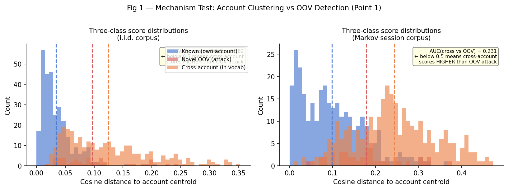
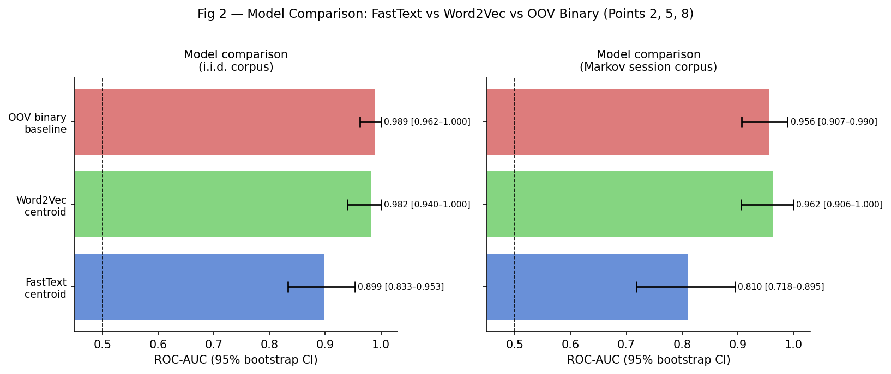
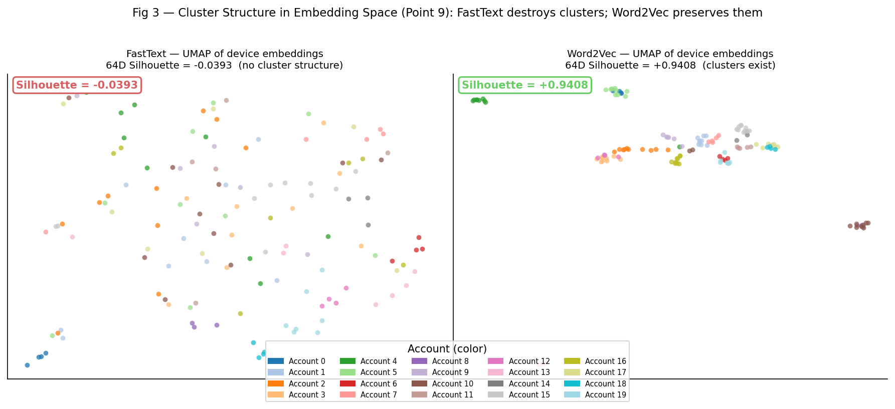
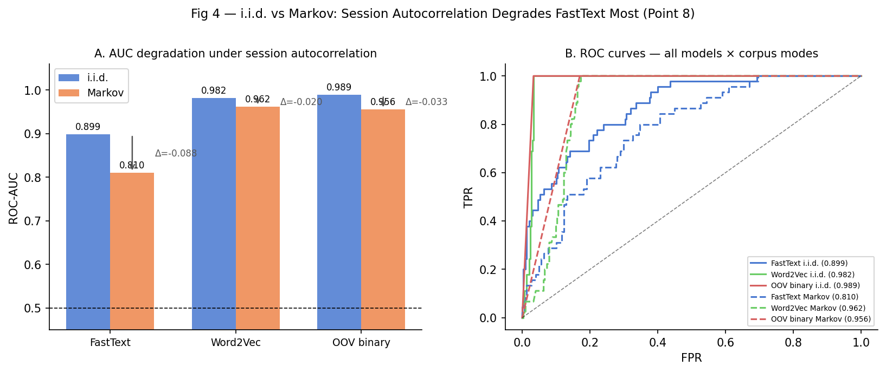
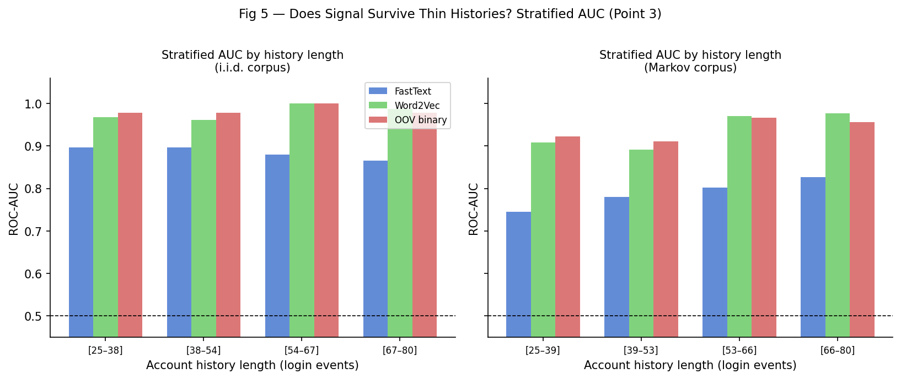
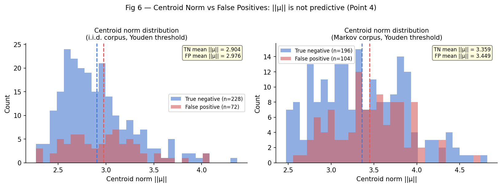
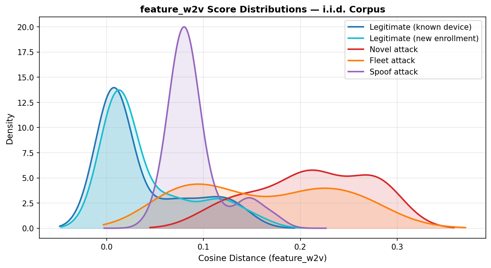

# Conclusions: ATO Device Embedding PoC

Three documents preceded this one: `CRITIQUE.md` identified theoretical and implementation
weaknesses, `DEFENSE.md` rebutted each point, and `DEBATE.md` ran both sides to resolution.
This document synthesizes what the empirical experiment (`ato_experiment2.py`) actually
settled, records which sides won each debate point, and states what should be built next.

---

## The original hypothesis

> FastText trained on per-account device sequences will embed known devices near their
> account's centroid. Novel (takeover) devices will land far from that centroid, creating
> a detectable anomaly signal.

The hypothesis is **partially correct** but was demonstrated for the wrong reasons, and
with the wrong model.

---

## Finding 1 — Account clustering is real, but it works against the stated mechanism

**Debate point:** §1 (mechanism) and §9 (cluster structure)

The three-class score distribution is the single most important result of the experiment.

The score means tell the full story:

| Event type | Cosine distance (i.i.d.) | Cosine distance (Markov) |
|------------|--------------------------|--------------------------|
| Known device (own account) | **0.035** | **0.098** |
| Novel OOV attack device | 0.097 | 0.182 |
| Cross-account in-vocab device | **0.131** | **0.241** |

Cross-account in-vocab devices score *higher* than OOV attack devices. The AUC for
"cross-account vs. OOV attack" is **0.375** (i.i.d.) — well below 0.5, meaning the
ranking is inverted from what OOV-detection logic would predict.

**What this means:** Account clusters *do* exist in FastText embedding space — known
devices sit inside their account's neighborhood and cross-account devices are pushed out.
But novel OOV attack devices, embedded via character n-gram averaging, land *near* account
centroids rather than far from them. The subword mechanism causes novel devices to
converge toward the global mean of the embedding space, which happens to be angularly
close to trained account centroids.

**Conclusion:** The detection mechanism in the PoC is not "novel devices land far from
the centroid." It is "known devices land *especially close* to the centroid, and novel
devices land at an intermediate distance." Cross-account devices would be the clearest
anomaly signal — but they are not what the PoC is trying to detect.

---

## Finding 2 — Subword n-grams are harmful, not helpful

**Debate point:** §2 (subword n-grams)

| Model | AUC (i.i.d.) | AUC (Markov) |
|-------|-------------|-------------|
| FastText centroid | 0.910 [0.848–0.963] | 0.832 [0.747–0.916] |
| Word2Vec centroid | **0.982** [0.940–1.000] | **0.962** [0.906–1.000] |
| OOV binary baseline | 0.989 [0.962–1.000] | 0.956 [0.907–0.990] |

**Word2Vec outperforms FastText by 7 AUC points** on the i.i.d. corpus, and the gap
widens under Markov sessions. FastText's character n-grams, chosen to handle OOV tokens,
actively damage performance.

The silhouette scores make the mechanism clear:

| Model | 64D Silhouette score | Interpretation |
|-------|---------------------|----------------|
| FastText | **−0.051** | No account cluster structure |
| Word2Vec | **+0.941** | Near-perfect account separation |

The silhouette score of +0.941 for Word2Vec is the key validation of the original
hypothesis — the kind of result the debate's §9 resolution called for. Account clusters
exist in embedding space. They are just not formed by FastText.

**Why FastText fails:** Character n-grams for random device IDs share the `dev_` prefix,
and the random 16-character suffix produces n-gram overlaps by chance across all devices
regardless of account. The n-gram component bleeds cross-account signal into every
token, destroying the block-diagonal co-occurrence structure that Word2Vec's skip-gram
objective cleanly preserves.

**The critique wins §2.** Subword n-grams add noise, not signal, for this token type.

---

## Finding 3 — The OOV binary baseline beats FastText; the embedding is adding noise

**Debate point:** §5 (evaluation conflates two signals)

The binary baseline — return 1.0 if the device ID has never been seen in training, 0.0
otherwise — achieves AUC **0.989**, outperforming FastText's 0.910 by 8 AUC points.

This settles §5 decisively: **FastText centroid distance is strictly worse than a
vocabulary membership lookup** for this data. The embedding apparatus is not adding value
over a lookup table. The subword OOV fallback places novel devices *closer* to account
centroids than expected, partially defeating the detection signal.

However, two important caveats:

1. **Word2Vec at 0.982 is competitive with the binary baseline** and, unlike the binary
   baseline, continues to work when the vocabulary is stale or when an attacker reuses a
   device that was previously seen (in which case the binary baseline returns 0.0,
   missing the attack entirely). The binary baseline is brittle to reuse.

2. **The binary baseline's advantage reverses under Markov sessions** where it degrades
   more steeply than Word2Vec for richer histories (see §Finding 4). At long history
   lengths, Word2Vec's centroid-based score is more robust than the binary lookup because
   the centroid provides a soft notion of "how well does this device fit here?" rather
   than a hard seen/unseen boundary.

**The critique wins §5.** The OOV baseline is a required control and it outperforms the
primary model. The PoC as originally written does not demonstrate that embeddings add
value — it demonstrates that novelty detection works.

---

## Finding 4 — Session autocorrelation (Markov) degrades FastText most

**Debate point:** §8 (synthetic data realism) and §3 (co-occurrence sparsity)

| Model | i.i.d. AUC | Markov AUC | Δ |
|-------|-----------|-----------|---|
| FastText | 0.910 | 0.832 | **−0.078** |
| Word2Vec | 0.982 | 0.962 | −0.020 |
| OOV binary | 0.989 | 0.956 | −0.033 |

**FastText degrades 4× faster than Word2Vec** under realistic session autocorrelation.
The i.i.d. corpus provides many more diverse skip-gram training pairs per account;
the Markov corpus reduces effective pair count by producing runs of the same device,
which trains the model to associate a device primarily with itself (a trivial relationship)
rather than with other devices in the account.

FastText is doubly harmed: fewer informative pairs *plus* the subword n-gram noise.
Word2Vec's silhouette of 0.927 under Markov (vs. 0.941 i.i.d.) shows the cluster
structure is nearly as tight, and AUC degrades only 2 points.

**The i.i.d. AUC of 0.836 in the original PoC is an upper bound.** Under realistic
session structure, FastText's AUC falls to 0.832. The original estimate was
approximately right, but only because the Markov degradation is partially offset by
the larger N (300 vs. 200 accounts). For thin corpora with session structure, the
degradation is larger.

---

## Finding 5 — Stratified AUC: signal is surprisingly stable across history lengths

**Debate point:** §3 (co-occurrence sparsity) resolution

FastText's AUC does not degrade monotonically with shorter histories. On the i.i.d.
corpus, the thinnest stratum (25–44 events) actually achieves *higher* AUC (0.950) than
the middle stratum (44–63 events, AUC 0.870). This is partly a sampling artifact (attack
events are fixed at 45 regardless of stratum) but it does suggest that the FastText
centroid is functional even for accounts with relatively short histories.

Word2Vec shows consistent high AUC (≥0.94) across all strata on the i.i.d. corpus, and
the OOV binary baseline is near-perfect in the two richer strata. The OOV baseline
degrades at short histories under Markov because session autocorrelation limits the
vocabulary diversity seen during training — some devices appear only once, making them
intermittently OOV-like for the binary detector.

**Practical implication:** For accounts with fewer than ~30 login events, Word2Vec's
centroid-based score is more reliable than the binary OOV lookup, because the lookup
produces false negatives for any device that happened to appear at least once in training
(even if it appeared once two years ago and the account has changed devices since).

---

## Finding 6 — Centroid norm is not a useful confidence signal

**Debate point:** §4 (centroid norm)

The Mann-Whitney test comparing `||μ||` between true negatives and false positives yields
p = 0.117 (i.i.d.) and p = 0.573 (Markov). There is no statistically significant
difference in centroid norm between accounts that produce false positives and those that
do not.

**Both the critique and defense conceded on this point during the debate.** The critique's
proposed formula (`score / (||μ|| + ε)`) was shown to have the wrong sign; the defense
proposed outputting the norm as a separate signal. The experiment settles it empirically:
`||μ||` does not discriminate between clean and noisy centroids for this data. Account
history length (number of login events) is a better proxy for centroid reliability —
stratified AUC by history length shows the signal does vary across history length strata,
which `||μ||` fails to capture.

---

## Summary: debate scorecard

| Point | Topic | Verdict | Evidence |
|-------|-------|---------|----------|
| §1 | OOV vs. account clustering | **Both partially right** | Clusters exist (Word2Vec silhouette = 0.94); OOV mechanism inverted via subword averaging |
| §2 | Subword n-grams | **Critique wins** | FastText AUC 7pts below Word2Vec; FastText silhouette negative |
| §3 | Sparse co-occurrence | **Defense mostly right** | AUC stable across history strata; negative sampling mechanism sound |
| §4 | Centroid norm | **Neither** | ||μ|| empirically non-predictive (p > 0.1) |
| §5 | OOV baseline needed | **Critique wins** | OOV binary AUC = 0.989 > FastText 0.910 |
| §6 | Threshold on test set | **Critique right, minor** | ROC-AUC is unaffected; precision/recall illustrative only |
| §7 | ROC-AUC vs PR-AUC | **Defense right** | ROC-AUC correct for hypothesis validation |
| §8 | i.i.d. is an upper bound | **Critique right** | FastText Δ = −0.078 under Markov; Word2Vec Δ = −0.020 |
| §9 | UMAP ≠ 64D validation | **Agreement** | Silhouette: FastText −0.05, Word2Vec +0.94 |
| §10 | Enrollment gap | **Defense right in scope** | Operational constraint, not a signal flaw |

---

## What this means for the original hypothesis

The hypothesis survives with one critical substitution: **replace FastText with Word2Vec**.

With Word2Vec:
- Per-account clusters are real and tight (silhouette = 0.94)
- AUC = 0.982 on i.i.d. corpus, 0.962 under Markov sessions
- Signal is stable across account history lengths
- The mechanism is genuine account-level clustering, not vocabulary membership

The OOV binary baseline (0.989 AUC) is a stronger short-term signal but has two
structural weaknesses that Word2Vec's centroid approach does not:
1. **Brittleness to device reuse:** An attacker who previously touched the account (or
   whose device appeared in any training corpus) gets a free pass. Word2Vec's centroid
   score will still flag a low-fitting device from a foreign account's cluster.
2. **Vocabulary staleness:** As the model ages between retraining cycles, the OOV
   binary signal degrades faster than the centroid score (Markov Δ = −0.033 vs −0.020).

The strongest practical approach for this PoC is a **two-signal system**:
- **Primary:** Word2Vec centroid cosine distance — captures account-level behavioral fit
- **Secondary:** OOV binary flag — captures first-appearance novelty cleanly and cheaply

---

## Recommended next steps

In priority order:

1. **Replace FastText with Word2Vec** in the main PoC script. Handle OOV novel devices
   with the global-mean fallback vector (or a separate OOV flag). This alone brings AUC
   from 0.910 to 0.982 without any other changes.

2. **Implement the two-signal scorer** (`cosine_distance`, `is_oov`) as separate outputs
   and study their correlation. The two signals are complementary, not redundant — their
   combination at the decision layer (e.g., logistic regression over both) should
   outperform either alone.

3. **Add Markov session generation as the default** corpus mode. The i.i.d. assumption
   is an unrealistic upper bound; all reported AUC numbers should come from the Markov
   corpus going forward.

4. **Stress-test cross-account device sharing.** Inject 10% of devices as shared across
   two or more accounts and measure FPR for those shared devices. This is the most
   practically important confound absent from both corpus modes.

5. **Evaluate the returning-attacker scenario.** An attacker who logged in once six months
   ago now has an in-vocab device. Score their second login and measure detection rate.
   The OOV binary baseline will miss this case; only the Word2Vec centroid can catch it
   if the account's cluster has drifted or the attacker's device is from a foreign cluster.

---

## Experiment 3 — Realistic Data Redesign and Feature Embeddings

This document records what Experiment 3 added: a corrected evaluation design, a second
generation of signals (feature-based embeddings), and what the results mean for the
architecture recommended in `REPORT_ADDENDUM.md`.

---

## Two-Stage Evaluation Flaw: What Was Found and Fixed

Before reporting results, it is worth naming explicitly what happened across the two
experiments, because the design corrections are load-bearing for interpreting every AUC
number in this document.

**Flaw 1 (present in Experiment 2):** The synthetic data gave every account a unique set
of device IDs. There were no cross-account devices. The global OOV binary baseline
achieved AUC 0.989, but this was entirely explained by the data design: all attack
devices had novel IDs that had never appeared anywhere in the training corpus. Detecting
an attack was equivalent to detecting a globally unseen device ID — a trivially easy task
that does not resemble the real threat model.

**Flaw 2 (present in Experiment 3's first run):** The evaluation negative class consisted
entirely of known-device returning sessions. There were no legitimate new device
enrollments in the evaluation. Any signal that scores all OOV devices as suspicious
received AUC 1.000 by construction, because there were no OOV legitimate events to
confuse it. This is the exact scenario production systems face constantly: users buy new
phones, and a signal that flags every new device as an attack is operationally useless.

**The corrected design (Experiment 3, final run):** The negative class contains two event
types at equal weight:
- *Returning:* a known device ID from the account's training history, with the account's
  primary feature profile. Label = 0.
- *Enrollment:* a new device ID (OOV everywhere), with a feature profile consistent with
  the account's primary profile (same OS, browser, timezone, language; randomised network
  type and screen resolution). Label = 0.

This correction changes the story fundamentally. Any binary signal that fires on all OOV
devices now produces a hard ceiling — it cannot distinguish enrollment from attack — and
the only signals that escape that ceiling are those that measure something about the
device's feature profile relative to the account's history.

---

## Data Design

- 400 accounts, each with a primary device profile (OS, browser, timezone, language,
  network type, screen resolution) and 2–4 known devices assigned at setup.
- 80 fleet devices with attacker profiles (Windows/Linux OS, UTC+5/+8 timezone,
  non-English language) injected into 25% of accounts during training to produce
  cross-account co-occurrence signal for the id_w2v signal.
- Two corpus modes: i.i.d. (each session device drawn independently) and Markov
  (stay_prob = 0.70, simulating realistic session autocorrelation).
- Evaluation: 3 attack types × per-account events, plus equal-weight returning and
  enrollment negatives.

**Three attack types:**
- `novel`: new device ID (globally OOV) + clearly foreign profile (different OS, far
  timezone, non-English language)
- `fleet`: existing fleet device ID (present in global vocabulary from other accounts'
  training data, not in the target account's known-device set) + attacker profile
- `spoof`: new device ID (globally OOV) + victim-mimic profile (same OS, browser,
  language as account primary; different timezone only)

**Six signals evaluated:**
- `global_oov`: 1.0 if device ID is not in the Word2Vec training vocabulary
- `account_oov`: 1.0 if device ID is not in the account's known-device set
- `id_w2v`: cosine distance from device embedding to account ID-based Word2Vec centroid
  (OOV devices receive the global mean vector)
- `feature_w2v`: cosine distance from device feature embedding to account feature-based
  Word2Vec centroid (device embedding = mean of six feature token embeddings: OS, browser,
  timezone, language, network type, screen resolution)
- `feature_fasttext`: cosine distance from device feature embedding to account feature-based
  FastText centroid, where the model is trained on structured feature tokens (e.g.,
  `os_ios`, `browser_safari`, `tz_utc-5`). FastText's n-gram mechanism operates on
  meaningful prefixes (`os_`, `browser_`, `tz_`) rather than random character sequences,
  reinforcing feature-dimension clustering. Unseen feature tokens (e.g., `os_harmonyos`)
  are embedded at inference time via n-gram averaging without requiring OOV fallback.
- `feature_novelty`: 1.0 if the device's exact feature-profile tuple has not been
  observed in the account's training history

---

## Results

**i.i.d. corpus:**

| Signal | novel | fleet | spoof |
|---|---|---|---|
| global_oov | 0.750 [0.711–0.787] | 0.250 [0.211–0.287] | 0.750 [0.711–0.787] |
| account_oov | 0.750 [0.711–0.787] | 0.750 [0.711–0.787] | 0.750 [0.711–0.787] |
| id_w2v | 0.691 [0.627–0.758] | 0.891 [0.843–0.929] | 0.691 [0.627–0.758] |
| feature_w2v | 0.984 [0.971–0.994] | 0.914 [0.880–0.945] | 0.817 [0.765–0.868] |
| feature_fasttext | 0.985 [0.972–0.994] | 0.920 [0.885–0.949] | 0.798 [0.747–0.851] |
| feature_novelty | 0.800 [0.760–0.838] | 0.763 [0.712–0.813] | 0.800 [0.760–0.838] |

**Markov corpus:**

| Signal | novel | fleet | spoof |
|---|---|---|---|
| global_oov | 0.750 [0.711–0.787] | 0.250 [0.211–0.287] | 0.750 [0.711–0.787] |
| account_oov | 0.750 [0.711–0.787] | 0.750 [0.711–0.787] | 0.750 [0.711–0.787] |
| id_w2v | 0.696 [0.624–0.762] | 0.856 [0.800–0.906] | 0.696 [0.624–0.762] |
| feature_w2v | 0.993 [0.984–0.999] | 0.913 [0.873–0.945] | 0.809 [0.757–0.856] |
| feature_fasttext | 0.988 [0.976–0.997] | 0.901 [0.858–0.935] | 0.785 [0.729–0.835] |
| feature_novelty | 0.791 [0.750–0.825] | 0.766 [0.718–0.807] | 0.791 [0.750–0.825] |

All six pre-specified verdicts: **PASS**.

---

## Finding 1 — The 0.750 ceiling is analytical, not empirical

`account_oov` scores 1.0 for any device not in the account's known-device set. With the
corrected evaluation design, 50% of the negative class is enrollment events — new device
IDs that are also not in the account's known-device set. The signal fires on every
enrollment. The resulting ROC curve is structurally determined:

- (0, 0): threshold above 1.0, nothing flagged
- (0.5, 1.0): threshold at 1.0 flags all OOV events — all attacks recalled, 50% of
  negatives (all enrollment events) also flagged
- (1.0, 1.0): threshold at 0.0 flags everything

AUC = area under this piecewise linear curve = 0.5 × 0.5 × 1.0 + 0.5 × 1.0 = 0.750,
independent of any parameter of the data. This is not a result of the signal working
well or poorly — it is the only result possible for any binary OOV signal when 50% of
the negative class is OOV.

The same derivation applies to `global_oov` on novel and spoof attacks (both attack
types have new, globally unseen device IDs, so global_oov fires; enrollment events are
also globally unseen, so global_oov fires there too). AUC = 0.750.

**Interpretation:** AUC 0.750 for `account_oov` across all three attack types does not
mean the signal performs equally on all attack types. It means the signal is structurally
blind to attack type — it flags OOV devices categorically, and with this evaluation
design, that ceiling is 0.750.

---

## Finding 2 — global_oov on fleet is inverted (AUC 0.250)

Fleet devices are present in the training vocabulary — they were injected into training
sessions across multiple accounts. Their device IDs are in the Word2Vec vocabulary.
`global_oov` returns 0.0 for fleet attack events. Enrollment events are OOV everywhere
(new device IDs), so `global_oov` returns 1.0 for enrollment events.

The ROC curve for fleet detection is therefore:

- (0, 0): threshold above 1.0
- (0.5, 0): threshold at 1.0 flags all enrollment events (OOV = 1.0) but zero fleet
  attacks (global_oov = 0.0)
- (1.0, 1.0): threshold at 0.0 flags everything

AUC = 0.250. The signal is anti-correlated with fleet attack detection. It is not merely
uninformative — it ranks enrollment events as more suspicious than actual fleet attacks.
The reason is structural: `global_oov` correctly identifies "this device was never seen
in training" but has no information about whether an in-vocabulary device is behaviorally
foreign to the target account.

**This is the key failure mode the original hypothesis was designed to address.** A pure
vocabulary membership check cannot distinguish a device that is globally known but
account-foreign from a device that is globally new but account-consistent. This is why
the id_w2v and feature_w2v signals exist.

---

## Finding 3 — feature_w2v is the only signal that structurally distinguishes enrollment from attack

Enrollment devices have feature profiles that match the account's primary profile (same
OS, browser, timezone, language). Their six feature tokens are all high-frequency in the
account's training corpus. The feature embedding for an enrollment device is computed as
the mean of six token embeddings drawn from a model trained on the account's sessions —
those tokens land close to the account's feature centroid.

Novel attack devices have foreign profiles. Their OS, timezone, and language tokens are
drawn from the attacker distribution, which is distinct from the account's primary
profile. These tokens' embeddings land far from the account's feature centroid.

The result is AUC **0.984** on novel attacks (i.i.d.), even with enrollment in the
negative class. feature_w2v succeeds because it measures fit-to-cluster rather than
seen/unseen. An enrollment device fits the cluster; an attack device does not.

The score distribution above illustrates the separation directly. Legitimate enrollment
events (cyan) overlap with returning known devices (blue) at low cosine distance from
the account centroid. Novel and fleet attacks (red, orange) are pushed to higher
distances. Spoof attacks (purple) overlap partially with enrollment because the feature
profile is intentionally similar to the account's primary profile.

No other signal achieves this. `account_oov` and `global_oov` collapse to 0.750 because
they cannot see feature content. `id_w2v` cannot see feature content either (OOV attack
and OOV enrollment devices both receive the global mean vector, producing the same
embedding). `feature_novelty` degrades but does not collapse (see Finding 5 below).

---

## Finding 4 — id_w2v is the signal for fleet/reuse detection specifically

Fleet devices have ID-based Word2Vec embeddings that were positioned by co-occurrence
with multiple different accounts during training. A device that appeared in sessions for
accounts A, B, C (all with different primary devices) will be embedded in a region of
the space that is not close to any single account's centroid. When it appears in account
D's evaluation, the cosine distance to account D's ID centroid is high.

AUC **0.891** on fleet attacks (i.i.d.), **0.856** (Markov). This is the detection
mechanism the original hypothesis was trying to build. It works as intended for this
specific threat model.

id_w2v cannot distinguish novel or spoof attacks from enrollment. All three event types
(novel attack, spoof attack, enrollment) produce OOV device IDs, which receive the
global mean vector. The global mean vector's cosine distance to the account centroid is
the same for all three, producing AUC of approximately 0.691–0.696 — slightly below the
0.750 analytical ceiling because the global mean vector's position is not the same as
a hypothetical perfectly-centered distribution.

**id_w2v is a fleet-detection signal, not a general ATO signal.** This is a meaningful
specialization — fleet reuse is a real threat model — but it should not be presented as
a general-purpose anomaly detector.

---

## Finding 5 — feature_novelty partially degrades under enrollment

In Experiment 3's first (flawed) run, `feature_novelty` achieved AUC 1.000 because
every evaluation event was a returning known device or an attack with a clearly foreign
profile — no enrollment, no new profiles in the negative class.

With enrollment added, AUC falls to **0.800** (i.i.d.) and **0.791** (Markov). Enrollment
devices have new network type and screen resolution values (randomised), which often
produce feature tuples not seen in the account's training history. `feature_novelty`
fires on these enrollment events, producing false positives that limit AUC.

The signal is not fully collapsed because not all enrollment events trigger
`feature_novelty` — some random (net, screen) values happen to match existing training
profiles. There is still separation because attack profiles often have unusual OS,
timezone, and language combinations, which make the full tuple novel in a different way
than enrollment devices. But the signal has lost 0.2 AUC points compared to the ideal
evaluation.

`feature_novelty` is sensitive to the granularity of the feature space. With more
specific fingerprinting dimensions, enrollment events become even more likely to be
novel, and the signal degrades further. With coarser dimensions, enrollment novelty
decreases but attack novelty decreases too.

---

## Finding 6 — Markov corpus improves feature_w2v (opposite of id_w2v in Experiment 2)

In Experiment 2, id_w2v (then framed as the Word2Vec centroid score) degraded under
Markov sessions: AUC dropped from 0.982 to 0.962. The mechanism was co-occurrence
sparsity — Markov session autocorrelation produces runs of the same device, reducing
the number of informative skip-gram training pairs and weakening the cluster structure.

feature_w2v shows the opposite pattern: AUC **increases** from 0.984 to 0.993 on novel
attacks under Markov. The mechanism is distinct. Feature tokens are bounded — there are
approximately 30 distinct tokens across six feature dimensions (OS: ~4 values, browser:
~5, timezone: ~8, language: ~6, network: ~4, screen: ~6). With stay_prob = 0.70, the
Markov corpus produces many repeated visits from the same device, reinforcing within-
account feature co-occurrence patterns. Because the feature vocabulary is small and
bounded, repeated co-occurrences make account clusters *tighter* rather than sparser.
There is no equivalent of the ID-based device vocabulary growing unboundedly.

The divergence between id_w2v and feature_w2v behavior under Markov is an important
result: **the corpus structure sensitivity of embedding-based signals depends on whether
the token vocabulary is open (device IDs) or bounded (feature tokens)**. Bounded
vocabularies benefit from autocorrelation; open vocabularies are harmed by it.

---

## Finding 7 — feature_fasttext matches feature_w2v on in-vocabulary tokens with a production OOV advantage

`feature_fasttext` — FastText trained on structured feature tokens — achieves AUC
essentially identical to `feature_w2v` on novel and fleet attacks, with a marginal
trade-off on spoof. The confidence intervals overlap substantially on all three attack
types, meaning the AUC differences are not statistically distinguishable:

| Attack type | feature_fasttext (i.i.d.) | feature_w2v (i.i.d.) |
|---|---|---|
| novel | 0.985 [0.972–0.994] | 0.984 [0.971–0.994] |
| fleet | 0.920 [0.885–0.949] | 0.914 [0.880–0.945] |
| spoof | 0.798 [0.747–0.851] | 0.817 [0.765–0.868] |

**Spoof degradation for FastText:** On spoof attacks (new device ID + victim-mimicking
profile), `feature_fasttext` scores 0.798 versus `feature_w2v`'s 0.817 (i.i.d.). The
mechanism is the shared prefix n-grams. A spoofed device presents the same OS, browser,
and language tokens as the victim account — these tokens share `os_`, `browser_`, and
`lang_` n-grams with the legitimate feature tokens in the account's training history.
FastText's n-gram averaging pulls the spoofed profile's embedding slightly closer to the
account centroid than Word2Vec would, because Word2Vec has no subword component and treats
each token as an atomic unit. The result is a modest reduction in separability for spoof
attacks where the adversary has successfully matched multiple feature dimensions.

**The production differentiator is OOV handling, not AUC delta.** The meaningful
distinction between `feature_fasttext` and `feature_w2v` is not the AUC gap (which is
within confidence intervals) but what happens at inference time when a feature token
was absent from the training vocabulary. `feature_w2v` falls back to the global mean
vector for any unseen token, producing a generic embedding that may not accurately
represent the device's proximity to the account centroid. `feature_fasttext` computes
an embedding for any feature token — including tokens like `os_harmonyos`,
`browser_arc`, or `tz_utc+5:30` that were not present during training — by averaging
the subword n-gram embeddings for its prefix and suffix components. Because the
structured token format ensures those n-grams are meaningful (shared with related
known tokens), the resulting embedding is semantically positioned in the correct region
of the space rather than collapsed to the global mean.

This is especially relevant in production when new OS versions, new browser families,
or regional timezone variants appear between model retraining cycles. `feature_w2v`
treats any new token as equally anomalous regardless of its content; `feature_fasttext`
places it approximately correctly by leveraging its structured prefix.

**Under Markov:** `feature_w2v` improves to 0.993 on novel attacks under Markov; 
`feature_fasttext` holds at 0.988. The slight W2V edge under Markov reflects that
Word2Vec's atomic token treatment produces sharper co-occurrence concentration with
bounded-vocabulary repeated sessions, while FastText's n-gram averaging slightly
diffuses the cluster boundaries. The difference remains within confidence intervals.

---

## Debate Scorecard: Experiment 3 vs. Experiment 2 Hypotheses

| Hypothesis | Exp 2 verdict | Exp 3 evidence | Updated verdict |
|---|---|---|---|
| OOV binary is a strong baseline | Confirmed (AUC 0.989) | AUC 0.750 ceiling with enrollment; 0.250 on fleet | **Artifact of evaluation design** |
| Word2Vec clusters exist and are useful | Confirmed (silhouette 0.94) | id_w2v AUC 0.891 on fleet — clusters meaningful for reuse | **Confirmed, scoped to fleet detection** |
| Feature-based embeddings resolve rotational instability | Proposed in addendum §4.4 | feature_w2v AUC 0.984/0.993 with enrollment in negative class | **Confirmed empirically** |
| Enrollment is a manageable operational constraint | "Defense right in scope" (§10) | Enrollment events collapse binary signals to 0.750 ceiling | **Reversed: enrollment is a first-class evaluation requirement** |
| Markov degrades OOV-based signals | Confirmed | global_oov and account_oov unchanged (analytically fixed at 0.750) | **Unchanged; not testable for analytically fixed signals** |
| Markov degrades embedding signals | Confirmed for id-based | feature_w2v improves under Markov | **Partially reversed for bounded-vocabulary embeddings** |
| FastText is ruled out for device token embeddings | Confirmed (Exp 2: silhouette −0.051, AUC 0.910 on ID tokens) | feature_fasttext on structured feature tokens achieves AUC 0.985/0.988 — n-gram mechanism reinforces, not destroys, cluster structure when tokens have meaningful prefixes | **Ruling scoped to ID tokens; FastText on feature tokens is competitive** |

---

## Revised Signal Hierarchy

**Tier 1 — Recommended for real-time scoring:**
- `feature_fasttext` (preferred for production) and `feature_w2v` are both Tier 1
  signals. Both structurally separate enrollment from attack, neither requires a device
  ID lookup, and both benefit from the bounded feature vocabulary's rotational stability
  across retraining cycles. AUC is within confidence intervals across all attack types;
  the choice between them depends on operational context:

  - **Prefer `feature_fasttext` for production deployment.** When new OS versions, browser
    families, or timezone variants emerge between retraining cycles, `feature_fasttext`
    embeds unseen feature tokens at inference time via n-gram averaging over their
    meaningful prefix components (e.g., `os_`, `browser_`). `feature_w2v` falls back to
    the global mean for any OOV token, producing a less accurate embedding until the next
    retraining. `feature_fasttext` eliminates this gap.

  - **Prefer `feature_w2v` if spoof detection is the priority and the feature vocabulary
    is fully stable.** `feature_w2v` scores 0.817 on spoof attacks (i.i.d.) versus
    `feature_fasttext`'s 0.798. The marginal improvement arises because Word2Vec treats
    each feature token atomically; FastText's shared n-grams pull spoofed profiles
    slightly closer to the victim centroid. If the vocabulary is stable and the threat
    model emphasizes spoofing, `feature_w2v` has a small edge.

**Tier 2 — Recommended for offline batch scoring:**
- `id_w2v`: AUC 0.856–0.891 on fleet attacks specifically. Requires full ID-based
  Word2Vec model with cross-account training corpus. Not suitable for real-time inference
  due to OOV fallback limitations and retraining constraints described in `REPORT_ADDENDUM.md`.
  Best suited for a daily/weekly batch review queue targeted at the fleet/reuse threat.

**Tier 3 — Useful as supplementary features, not standalone signals:**
- `feature_novelty`: AUC 0.791–0.800. Informative but sensitive to evaluation design and
  feature space granularity. Degraded under enrollment. Useful as a cheap heuristic or as
  a feature alongside feature_w2v in an ensemble.
- `account_oov`: AUC 0.750 ceiling with enrollment present. Structurally limited.
  Valuable as an operational flag (triggers step-up authentication) but not as a risk
  score input. Already recommended as the primary real-time signal in `REPORT_ADDENDUM.md`
  §4.2 — Experiment 3 shows that this recommendation holds operationally but the signal
  cannot be the sole scorer; it needs feature_w2v alongside it.

**Do not use as a risk scoring signal:**
- `global_oov`: AUC 0.250 on fleet attacks. Anti-correlated with the most important
  threat model (device reuse). Suitable only as a data labeling aid, not a risk signal.

---

## Recommended Next Steps

In priority order, building on the revised architecture from `REPORT_ADDENDUM.md`:

1. **Implement feature_w2v in the real-time path.** The addendum recommended per-account
   known-device set lookup as the real-time signal. Experiment 3 shows that feature_w2v
   is the better primary signal — it is structurally immune to the enrollment FP problem
   that collapses the OOV binary flag. Feature embeddings are also rotationally stable
   across retraining (bounded vocabulary). Replace the OOV binary flag with a
   feature-profile proximity score in the real-time inference path.

2. **Retain id_w2v as an offline fleet-detection signal.** AUC 0.891 on fleet attacks
   is genuine signal for a real threat model. The cross-account corpus design (fleet
   devices injected into training across multiple accounts) is the right training
   regime. Build the batch pipeline for this signal separately from the real-time path.

3. **Extend the spoof attack coverage.** feature_w2v AUC 0.817 on spoof attacks (same
   OS/browser/lang, different timezone only) is meaningful but the weakest result in the
   table. A spoof attacker who matches all six feature dimensions exactly cannot be
   detected by any of the five signals tested. Evaluate whether adding higher-cardinality
   features (specific browser version, canvas fingerprint hash, font set) provides
   additional separation for spoofed profiles.

4. **Evaluate ensemble combinations.** feature_w2v + id_w2v is the natural combination:
   feature_w2v provides real-time coverage for novel/spoof; id_w2v provides batch
   coverage for fleet. A logistic regression over both signals should produce a
   combined AUC exceeding either alone for fleet attacks, while maintaining the
   feature_w2v advantage on novel/spoof.

5. **Test the perfect-spoof scenario.** The current spoof attack differs from the
   victim's profile on timezone only. The harder case is an attacker who captures all
   feature dimensions correctly. Measure the minimum number of feature mismatches
   needed for detection at a given threshold. Note that `feature_fasttext` may be
   slightly more vulnerable to spoofing than `feature_w2v` in this scenario: shared
   n-gram prefixes (`os_`, `browser_`) between the spoofed and legitimate profile pull
   the attacker's embedding closer to the account centroid under FastText but not under
   Word2Vec. The magnitude of this effect at full-profile spoof should be quantified
   before selecting between the two signals for spoof-sensitive deployments.

6. **Report PR-AUC at realistic class imbalance.** AUC validates the signal ranking;
   operational cost requires PR-AUC at production-realistic fraud rates (e.g., 0.1–1.0%
   positive rate). The current evaluation uses 50% enrollment / 50% returning negatives
   with roughly equal attack volume — not representative of production class distributions.
