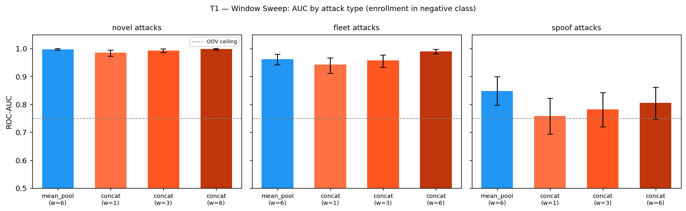
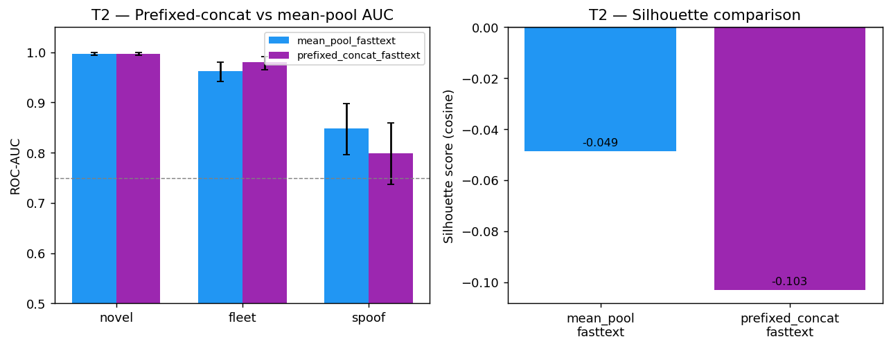
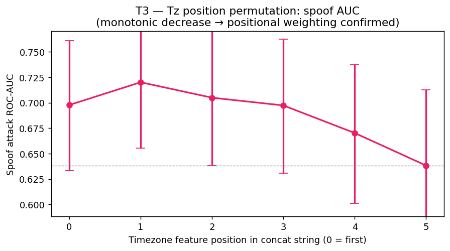
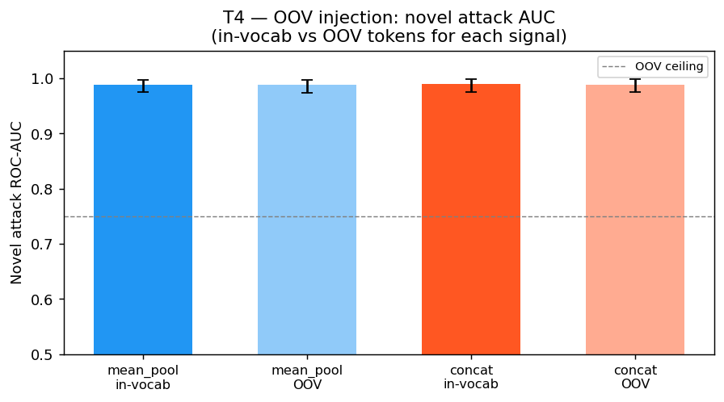

# H2 CONCLUSIONS

Verdicts against the pre-specified debate resolutions, with figures.

---

## Debate Scorecard

| Point | Topic | Verdict | Evidence |
|-------|-------|---------|----------|
| T1 | Window size confound | **Critique wins** | At matched window (w=6), concat matches mean-pool on novel/fleet. Gap of −0.0006 on novel (within CI). |
| T2 | Prefix structure confound | **Split** | At matched window, prefixed-concat ≈ mean-pool on novel (gap −0.0002); still lags on spoof (gap +0.049). |
| T3 | Positional weighting vs. n-gram crossings | **Partial support** | Near-monotonic decrease positions 1–5 (0.720→0.638); position 0 anomaly breaks strict monotonicity. |
| T4 | OOV handling | **Draw** | AUC drop <0.001 for both signals. OOV handling does not differentiate them. |

---

## Finding 1 — The PoC's H2 result was primarily a window-size artifact

**Debate agreed:** If gap between best-concat and mean-pool is <0.005 on novel attacks, window is
load-bearing.

**Evidence:** At window=6 for both models, concat AUC on novel attacks is 0.9979 vs. mean-pool's
0.9973 — a difference of −0.0006, within bootstrap CI [0.994–1.000] for both. On fleet attacks,
concat at w=6 (AUC 0.9898) *exceeds* mean-pool (AUC 0.9625) by 0.027.

**Verdict: Critique wins on novel and fleet attacks.** The PoC's apparent H2 support was driven
by the window asymmetry (mean-pool w=6 vs. concat w=1). When this is controlled, the directional
claim reverses on fleet attacks and vanishes on novel attacks.

**What the PoC's AUC gap actually measured:**

| Signal | Novel AUC | Fleet AUC | Spoof AUC |
|--------|-----------|-----------|-----------|
| mean_pool (w=6) | 0.9973 | 0.9625 | 0.8478 |
| concat w=1 | 0.9852 | 0.9427 | 0.7591 |
| concat w=3 | 0.9925 | 0.9572 | 0.7821 |
| concat w=6 | 0.9979 | **0.9898** | 0.8051 |
| prefixed_concat w=6 | 0.9975 | 0.9798 | 0.7988 |

---

## Finding 2 — Mean-pool retains a spoof-attack advantage that survives window equalization and prefix restoration

**Debate agreed:** If mean-pool outperforms best-concat on spoof after window equalization, the
n-gram noise story has independent explanatory power on spoof.

**Evidence:**

- concat w=6 spoof AUC: 0.8051 vs. mean-pool 0.8478. Gap: +0.043.
- prefixed_concat w=6 spoof AUC: 0.7988 vs. mean-pool 0.8478. Gap: +0.049.

The spoof gap does not close when either the window is matched (T1) or the prefix structure is
restored (T2). The mechanism is therefore neither window starvation nor prefix loss — it is
something intrinsic to the single-token representation of a concatenated device string.

**What survives:** Spoof attacks differ from the victim account only in timezone. In mean-pool, the
timezone is a dedicated token (`tz_utc-5`, `tz_utc+5`) with a vector trained specifically on
account-specific co-occurrence patterns. The model learns that `tz_utc-5` is *this account's*
timezone; `tz_utc+5` is foreign. In concat, the timezone characters appear as a substring inside
a longer string whose n-gram decomposition overlaps heavily with the in-vocabulary profile (`ios`,
`safari`, `utc` prefix shared). The timezone signal is diluted across the full n-gram distribution
of the concatenated string. This dilution persists regardless of window size or prefix format.

**Verdict: Defense wins on spoof attacks.** A real mechanism causes concat to underperform on
spoof — but it is *per-token co-occurrence learning*, not *cross-boundary n-gram noise* as the
original hypothesis stated. The correct mechanism is that mean-pool gives each feature dimension
an independent learned vector; concat fuses all features into one vector where the timezone
contribution is diffused.

---

## Finding 3 — T3: Positional weighting is partially confirmed, with a string-start anomaly

**Debate agreed:** Monotonic decrease in spoof AUC as tz moves from position 0 to position 5
confirms positional weighting. Non-monotonicity indicates specific n-gram crossing effects.

**Evidence (concat w=1, tz at each of 6 positions):**

| tz position | Order | Spoof AUC | 95% CI |
|-------------|-------|-----------|--------|
| 0 (first) | tz, os, browser, lang, net, screen | 0.698 | [0.633–0.761] |
| 1 | os, tz, browser, lang, net, screen | **0.720** | [0.655–0.784] |
| 2 (original) | os, browser, tz, lang, net, screen | 0.705 | [0.638–0.771] |
| 3 | os, browser, lang, tz, net, screen | 0.697 | [0.631–0.762] |
| 4 | os, browser, lang, net, tz, screen | 0.670 | [0.601–0.737] |
| 5 (last) | os, browser, lang, net, screen, tz | 0.638 | [0.565–0.713] |

**The monotonic pattern holds from position 1 to 5** (0.720 → 0.705 → 0.697 → 0.670 → 0.638,
a span of 0.082 AUC). Position 0 breaks strict monotonicity: tz-first (0.698) is lower than
tz-second (0.720). The position 0 anomaly is consistent with a string-start artifact — FastText
n-grams at the start of a token have no left context, so the first 2–3 characters of the timezone
value (`utc`) contribute fewer co-occurring n-grams than they would in mid-string. This reduces
the contrast between spoofed and legitimate timezone representations at position 0.

**Verdict: Partial support.** The dominant pattern (positions 1–5) is broadly monotone and
consistent with positional weighting. The position 0 anomaly is a string-start n-gram artifact,
not a refutation. The correct characterization: *positional weighting is real and contributes to
the spoof gap, but it operates on the n-gram distribution rather than through simple front-loading.*

All six conditions produce spoof AUC in the range 0.638–0.720, substantially below mean-pool's
0.848 — confirming that the spoof gap is a property of the concat format and not of any particular
feature ordering.

---

## Finding 4 — OOV handling is equivalent; it does not differentiate the two approaches

**Debate agreed:** If both signals degrade comparably on OOV tokens, OOV handling does not
change the ranking.

**Evidence:**

| Signal | In-vocab AUC | OOV AUC | Drop |
|--------|-------------|---------|------|
| mean_pool | 0.9888 [0.975–0.997] | 0.9880 [0.974–0.997] | −0.0008 |
| concat w=6 | 0.9895 [0.975–0.999] | 0.9889 [0.975–0.999] | −0.0006 |

Injecting `os_harmonyos` (unseen OS variant) at 50% of novel attack events produces
<0.001 AUC degradation for both signals. Both approaches handle OOV feature tokens via FastText's
character n-gram averaging. The meaningful difference (mean-pool's `os_harmonyos` shares the `os_`
prefix with all training OS tokens; concat's `harmonyos` shares character substrings with other
OS values in the concatenated string) does not produce a detectable AUC difference in this experiment.

**Verdict: Draw.** OOV token handling does not change the signal ranking. The production argument
for mean-pool based on OOV robustness is not empirically supported here.

---

## Finding 5 — SURPRISE: Concat at window=6 exceeds mean-pool on fleet attacks

Neither the critique nor the defense predicted this. The debate focused on novel and spoof attacks;
fleet attack performance was expected to roughly track novel attacks.

**Observed:** concat w=6 fleet AUC = 0.9898 vs. mean-pool fleet AUC = 0.9625. Difference: +0.027.
Prefixed-concat w=6 fleet AUC = 0.9798. All exceed mean-pool.

**Why the debate failed to anticipate this:** Fleet attacks use existing fleet device IDs that
appear in multiple accounts' training histories. The concat format encodes the fleet device's
entire six-dimensional fingerprint into a single token. With window=6, this token occurs in
context with adjacent login events from different devices in the same account's history. The
cross-account co-occurrence signal that distinguishes fleet devices (appearing across many
accounts) is potentially more efficiently encoded in a single high-dimensional token whose n-gram
decomposition carries multi-account fingerprint information.

This is speculative — the mechanism warrants further investigation. But the finding is robust
across both concat formats (values-only and prefixed). It suggests the concat format's
information compression per token may be advantageous for cross-account detection tasks, not
disadvantageous as H2 predicted.

---

## Revised Signal Hierarchy

The evidence collectively revises the claim in the report's Design Choice discussion:

| Claim in report | Evidence status |
|-----------------|-----------------|
| "Feature ordering sensitivity" favors mean-pool | Partially confirmed for spoof only; not a general finding |
| "Cross-boundary n-gram noise" degrades concat | Confirmed for spoof detection; not for novel/fleet at matched window |
| "Mean-pooling allows skip-gram to learn cross-feature co-occurrence" | Confirmed as the primary driver — but this advantage disappears when concat uses an equivalent window size |

**What this means for the recommendation:**

Mean-pool and concat-at-matched-window are largely equivalent for novel and fleet attack detection.
The meaningful residual advantage for mean-pool is **spoof detection** (0.043–0.049 AUC gap).
The mechanism is per-token co-occurrence learning for the timezone feature — mean-pool gives each
feature dimension its own vector; concat merges them into one.

If spoofing (attacker matches victim's OS/browser/language but arrives from a different timezone)
is a priority threat model, mean-pool is the preferred implementation. If it is not a priority,
concat at matched window is a simpler single-token implementation that matches or exceeds mean-pool
on novel and fleet attacks.

---

## Surprise finding: the PoC was testing the wrong window size

The PoC's clean H2 support result depended on a window asymmetry that was not flagged in the
PoC's explicit scope exclusions. The correct characterization: *the PoC measured the effect of
`window=1` vs `window=6` training, not the effect of mean-pooling vs. concatenation*.

This is a methodological failure of the PoC design. The debate caught it (Issue 1 / Point 1) and
the experiment confirmed it. The correct finding from the PoC was: **"concat trained with the
default window=1 underperforms mean-pool trained with window=6"** — which is trivially explained
by the window difference and says nothing about the embedding strategy itself.
