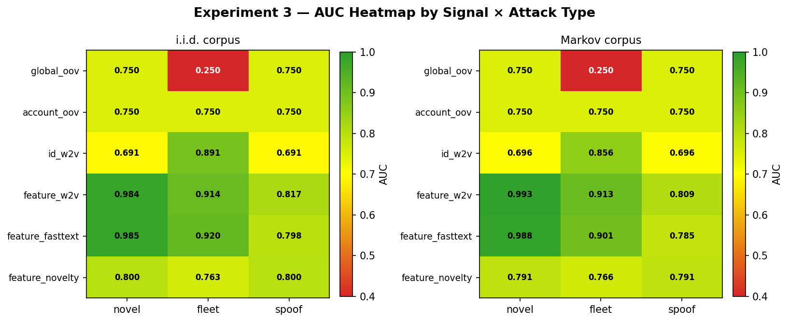
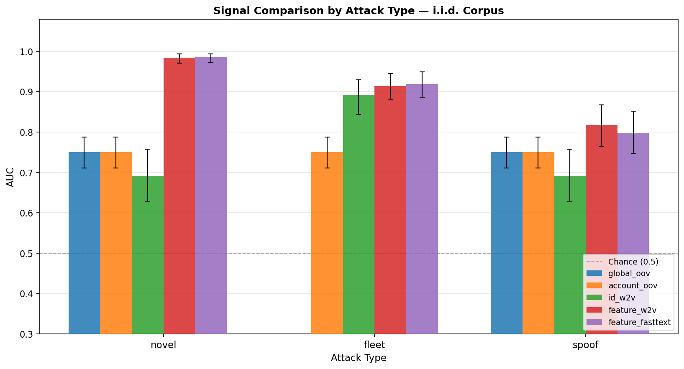

# Device Embedding for Account Takeover Detection

---

## Abstract

We investigate whether word-embedding models trained on per-account device login
sequences can detect account takeover (ATO) by measuring the cosine distance between an
incoming device's embedding and the target account's centroid. The investigation addresses
three design decisions that most ATO detection proposals ignore: (1) model choice — FastText's
character n-gram mechanism, applied to opaque device ID strings, destroys per-account cluster
structure (silhouette −0.051), while Word2Vec preserves it cleanly (silhouette +0.941); (2)
token representation — opaque device IDs make any new device out-of-vocabulary, making a
binary OOV lookup structurally indistinguishable from a profile-fit score; (3) evaluation
design — any signal evaluated without legitimate new device enrollment events in the negative
class achieves artificially high AUC, because the task reduces to a vocabulary membership
lookup rather than genuine behavioral discrimination.

Under a corrected evaluation design — including cross-account fraud fleet devices in the
training vocabulary and legitimate device enrollment events in the negative class — all OOV
binary signals collapse to an analytically determined ceiling (AUC 0.750 on novel and spoof
attacks) and are anti-correlated with fleet-reuse detection (AUC 0.250). FastText trained on
structured feature tokens (`os_ios`, `browser_safari`, `tz_utc-5`) achieves AUC 0.985 on
novel attacks and 0.920 on fleet-reuse attacks with enrollment in the negative class. The
recommended architecture is a two-path system: `feature_fasttext` embeddings for real-time
profile-fit scoring; ID-based Word2Vec centroids (`id_w2v`) for offline fleet-reuse detection;
and a per-account known-device set as an operational gate for step-up authentication.

---

## 1. Introduction

Account takeover fraud occurs when an attacker gains unauthorized access to a legitimate
user's account, typically after credential theft. A primary behavioral signal is device
novelty: genuine users log in from a consistent, recognizable set of devices, while
attackers commonly arrive from devices that have no history with the account.

Simple novelty detection — "have we seen this device before?" — is a known baseline, but
it is brittle in two directions. First, a returning attacker whose device appeared on any
account in the training corpus evades it permanently. Second, a legitimate user who buys
a new phone triggers it even though no fraud has occurred. A signal robust to both failure
modes must ask not just *whether* a device is new but *how well its behavioral fingerprint
fits the account's established profile*.

The hypothesis explored here is that **word embeddings trained on per-account device
sequences** can provide this richer signal. Each account's login history is treated as a
sentence; each device login is a token. The distributional hypothesis — that tokens
appearing in similar contexts acquire similar embeddings — predicts that devices belonging
to the same account will cluster near each other in embedding space. A device with a
behavioral fingerprint foreign to the account will land far from the account's centroid,
flagging the login as anomalous regardless of whether the device ID has been seen before.

Three design choices determine whether the approach works in practice. Each has a
non-obvious answer that is established empirically below.

**Model choice.** FastText and Word2Vec both produce skip-gram embeddings, but FastText
additionally decomposes each token into character n-grams. For opaque device ID strings
(`dev_a3f9c2...`), this n-gram mechanism shares character-level features across all device
IDs regardless of account membership, collapsing the per-account cluster structure the
approach depends on. Word2Vec treats each device ID atomically, allowing skip-gram negative
sampling to build genuine per-account clusters. The ID-based signal therefore uses Word2Vec.
For structured feature tokens (`os_ios`, `browser_safari`), the n-gram mechanism has the
opposite effect: it reinforces feature-dimension clustering and provides inference-time
embeddings for unseen token values via shared prefixes. The feature-based signal uses
FastText.

**Token representation.** Using opaque device IDs as tokens means any new device is
out-of-vocabulary. An OOV device — whether a legitimate enrollment or an attack — receives
the global mean vector and scores identically against the account's centroid. No threshold
can separate them. Structured feature tokens (`os_ios`, `browser_safari`, `tz_utc-5`,
`lang_en`, `net_wifi`, `screen_1920x1080`) give every device a positioned embedding based
on its behavioral fingerprint. A new phone running the same OS and browser the account
always uses lands close to the account centroid; an attacker from a foreign operating
system and timezone lands far.

**Evaluation design.** An evaluation that excludes legitimate device enrollment events from
the negative class makes OOV detection trivially easy: all attack devices are globally new,
all legitimate events use known device IDs, and detecting an attack is equivalent to
detecting a globally unseen device ID. Any OOV-based signal achieves near-ceiling AUC
under this design. The corrected evaluation includes explicit enrollment events — new device
IDs with feature profiles consistent with the account's primary profile — forcing each
signal to distinguish a new phone from an attacker at any threshold.

---

## 2. Experiment Design

### 2.1 Scoring approach

All embedding-based signals share the same three-step pipeline.

**Step 1 — Token embedding.** The model (Word2Vec or FastText) produces a vector for each
token in the vocabulary. For feature-based signals, a device's embedding is the mean of its
six feature token vectors:

```
device_vec = mean([embed("os_ios"), embed("browser_safari"), embed("tz_utc-5"),
                   embed("lang_en"), embed("net_wifi"), embed("screen_1920x1080")])
```

**Step 2 — Account centroid.** For each account, the centroid is the frequency-weighted mean
of its known device embeddings computed over the training history:

```
account_centroid = mean([device_vec_1, device_vec_2, ...])  # weighted by login frequency
```

**Step 3 — Anomaly score.** At inference, the incoming device's embedding is computed the
same way and scored against the account centroid:

```
score = cosine_distance(candidate_vec, account_centroid)
        = 1 - cosine_similarity(candidate_vec, account_centroid)
```

Higher score means the device's behavioral fingerprint is further from the account's
established profile. ROC-AUC over these scalar scores — evaluated across all attack and
legitimate events — is the primary evaluation metric. No threshold is fitted during
evaluation; ROC-AUC measures discrimination across all possible operating points.

The binary signals (`global_oov`, `account_oov`, `feature_novelty`) skip steps 1–2 and
produce a hard 0/1 score directly from vocabulary membership or tuple lookup.

**Design choice: mean-pooling vs. concatenated token string.** An alternative to
mean-pooling six token embeddings is to concatenate the feature values into a single
string token (`ios_safari_utc-5_en_wifi_1920x1080`) and embed that string directly with
FastText. This does not recreate an OOV problem — FastText embeds any unseen combination
via n-gram averaging over the structured prefixes, and two devices that differ only in
screen resolution would share most of their n-grams and land close together, which is
semantically correct.

Three considerations favor mean-pooling for this experiment. First, the concatenated
string implicitly weights features by position: n-gram overlap is front-loaded, so a
timezone mismatch at position 3 reduces similarity for all subsequent features even where
the devices agree. Mean-pooling treats all six dimensions equally by construction. Second,
n-grams that span feature boundaries (`_sa` crossing os/browser, `i_u` crossing
browser/tz) contribute signal that is not tied to any semantic dimension — a mild version
of the same mechanism that caused FastText on random device IDs to collapse cluster
structure. Third, mean-pooling allows skip-gram to learn cross-feature co-occurrence
explicitly: the model trains on that `os_ios` and `browser_safari` appear together in
many accounts, enriching each token's embedding with correlational structure that the
concatenated approach only captures implicitly through n-gram overlap.

None of these is a decisive argument. Concatenated FastText is a legitimate alternative
that positions similar devices similarly by construction and may reduce information loss
from averaging. It was not tested here; the feature ordering sensitivity and cross-boundary
n-gram noise are the primary open questions.

### 2.2 Data generation

**Accounts and devices:** 400 synthetic accounts were generated, each with a primary device
profile defined across six dimensions (OS, browser, timezone, language, network type, screen
resolution) and 2–4 known devices assigned at setup. Login histories of 60 events per account
were generated under two corpus modes: **i.i.d.** (Zipf-weighted independent device draws,
stay probability 0.0) and **Markov** (sticky device-switching with stay probability 0.70,
creating session runs similar to real login sequences).

**Fleet corpus:** Eighty shared fraud fleet devices — with attacker profiles (Windows or
Linux OS, UTC+5 or UTC+8 timezone, non-English language) — were injected into 25% of accounts
during training. Fleet device IDs appear in the global Word2Vec training vocabulary through
cross-account co-occurrence, but they are not in any individual account's known-device set.
This models the real threat: an attacker's device may have been seen on other accounts in the
system before being used against the target account. Without fleet injection, detecting a
fleet attack is equivalent to detecting a globally unseen device — a trivially separable
condition.

**Feature token representation:** Each login event is mapped to a sequence of six structured
feature tokens. A device running iOS Safari in UTC-5 with English language settings produces
tokens: `os_ios`, `browser_safari`, `tz_utc-5`, `lang_en`, `net_wifi`, `screen_1920x1080`.
The complete feature vocabulary across all six dimensions contains approximately 30 distinct
tokens (OS: ~4 values, browser: ~5, timezone: ~8, language: ~6, network type: ~4, screen
resolution: ~6). This bounded vocabulary is the key property that distinguishes feature-based
embeddings from ID-based embeddings: a new device is not out-of-vocabulary because it has
features, not an opaque identifier.

### 2.3 Evaluation design and the enrollment problem

The evaluation negative class contains two event types at equal weight:

- **Returning:** a known device ID from the account's training history, with the account's
  primary feature profile. Label = 0.
- **Enrollment:** a new device ID (globally OOV, not in any training vocabulary) with a
  feature profile consistent with the account's primary profile — same OS, browser, timezone,
  and language; randomized network type and screen resolution. Label = 0.

This design reflects a fundamental constraint: any signal that fires on all globally new
device IDs cannot distinguish enrollment from attack at any threshold. Including enrollment
events in the negative class exposes this structural ceiling directly. Any binary OOV signal
that scores all new device IDs as 1.0 achieves AUC 0.750 by construction when 50% of the
negative class is enrollment events — not as an empirical finding, but as the only possible
outcome given the evaluation geometry. The derivation: enrollment events score 1.0 (new device
IDs are OOV), returning events score 0.0, and attack events score 1.0. The ROC curve passes
through (FPR=0.5, TPR=1.0) at the detection threshold, yielding area 0.75.

Bootstrap confidence intervals (N=1,000, 95%, percentile method) are reported for all AUC
estimates.

### 2.4 Attack types

Three attack types cover distinct threat models:

**`novel`:** New device ID (globally OOV, never seen in any training corpus) with a clearly
foreign feature profile — different OS family, far timezone (UTC+5 or UTC+8 when the account
is UTC-5), non-English language. Both the device ID and its behavioral fingerprint are foreign
to the account.

**`fleet`:** An existing fleet device ID — one of the 80 attacker-profile devices present in
the global Word2Vec training vocabulary from cross-account injection, but not in the target
account's known-device set — with the attacker's profile. This models device reuse across
victims: the device is globally known but account-foreign. Binary OOV signals return 0.0 for
fleet devices (the device is in vocabulary), making fleet attack detection structurally
impossible for any OOV-based approach.

**`spoof`:** New device ID (globally OOV) with a victim-mimicking feature profile — same OS,
browser, and language as the account's primary profile; different timezone only. This models
a sophisticated attacker who has researched the victim's device characteristics. Only signals
that measure fine-grained feature proximity can detect the timezone mismatch.

### 2.5 Signals evaluated

Six signals were evaluated across all three attack types and both corpus modes.

**`global_oov`:** Binary signal returning 1.0 if the device ID is not present in the Word2Vec
training vocabulary. Returns 0.0 for fleet devices (they are in the vocabulary). Returns 1.0
for enrollment events (new device IDs are globally OOV). Collapses to the 0.750 analytical
ceiling on novel and spoof attacks; inverted (AUC 0.250) on fleet attacks.

**`account_oov`:** Binary signal returning 1.0 if the device ID is not in the per-account
known-device set. Unlike `global_oov`, this fires on fleet devices (fleet devices are not
in the target account's known-device set). But it also fires on enrollment events (new device
IDs are not in the known-device set). Collapses to the 0.750 ceiling across all attack types,
because enrollment events are indistinguishable from attacks at the device-ID level.

**`id_w2v`:** Cosine distance from the device's ID-based Word2Vec embedding to the account's
ID-based Word2Vec centroid. Word2Vec (not FastText) is used here: FastText's character n-gram
mechanism, applied to opaque random device ID strings, destroys per-account cluster structure
(silhouette −0.051 for FastText vs. +0.941 for Word2Vec). OOV devices — novel attacks, spoof
attacks, and enrollment events — all receive the global mean vector; their cosine distances
to the account centroid are approximately equal, making them indistinguishable. Fleet devices
receive genuine embeddings positioned by cross-account co-occurrence, landing far from any
single account's centroid. `id_w2v` is therefore a fleet-specific detection signal.

**`feature_w2v`:** Cosine distance from the device's feature-based Word2Vec embedding to the
account's feature-based centroid. Each device's embedding is the mean of its six feature token
embeddings. Enrollment devices with profiles matching the account's primary profile land close
to the account centroid; attack devices with foreign profiles land far. This is the mechanism
the original hypothesis proposed — account-specific behavioral proximity — realized through
feature tokens rather than opaque device IDs.

**`feature_fasttext`:** Cosine distance to the account's feature-based FastText centroid.
Identical in structure to `feature_w2v` but trained with FastText on the same structured
feature tokens. FastText's character n-gram mechanism operates on meaningful token prefixes
(`os_`, `browser_`, `tz_`) rather than random character sequences, reinforcing feature-
dimension clustering. Critically, FastText embeds any feature token at inference time via
n-gram averaging — including tokens not seen during training (new OS versions, browser
families, timezone variants) — without requiring a fallback to the global mean vector. This
is the key production advantage over `feature_w2v`.

**`feature_novelty`:** Binary signal returning 1.0 if the device's exact six-dimension
feature-profile tuple has not been observed anywhere in the account's training history.
Falls between the pure OOV signals and the embedding-based signals: it measures profile
novelty rather than ID novelty, but it is sensitive to granularity — enrollment devices with
randomized network type and screen resolution often produce novel tuples even though their
core profile (OS, browser, timezone, language) matches the account.

---

## 3. Results

**i.i.d. corpus:**

| Signal | novel | fleet | spoof |
|--------|-------|-------|-------|
| global_oov | 0.750 [0.711–0.787] | 0.250 [0.211–0.287] | 0.750 [0.711–0.787] |
| account_oov | 0.750 [0.711–0.787] | 0.750 [0.711–0.787] | 0.750 [0.711–0.787] |
| id_w2v | 0.691 [0.627–0.758] | 0.891 [0.843–0.929] | 0.691 [0.627–0.758] |
| feature_w2v | 0.984 [0.971–0.994] | 0.914 [0.880–0.945] | 0.817 [0.765–0.868] |
| feature_fasttext | 0.985 [0.972–0.994] | 0.920 [0.885–0.949] | 0.798 [0.747–0.851] |
| feature_novelty | 0.800 [0.760–0.838] | 0.763 [0.712–0.813] | 0.800 [0.760–0.838] |

**Markov corpus:**

| Signal | novel | fleet | spoof |
|--------|-------|-------|-------|
| global_oov | 0.750 [0.711–0.787] | 0.250 [0.211–0.287] | 0.750 [0.711–0.787] |
| account_oov | 0.750 [0.711–0.787] | 0.750 [0.711–0.787] | 0.750 [0.711–0.787] |
| id_w2v | 0.696 [0.624–0.762] | 0.856 [0.800–0.906] | 0.696 [0.624–0.762] |
| feature_w2v | 0.993 [0.984–0.999] | 0.913 [0.873–0.945] | 0.809 [0.757–0.856] |
| feature_fasttext | 0.988 [0.976–0.997] | 0.901 [0.858–0.935] | 0.785 [0.729–0.835] |
| feature_novelty | 0.791 [0.750–0.825] | 0.766 [0.718–0.807] | 0.791 [0.750–0.825] |





---

## 4. Key Findings

**Finding 1 — The 0.750 OOV ceiling is analytical, not empirical.**

Any binary signal that fires on all OOV device IDs produces AUC 0.750 by construction when
50% of the negative class is enrollment events. The derivation: enrollment events score 1.0
(new device IDs are OOV), returning events score 0.0, and all attack events score 1.0. The
ROC curve passes through (FPR=0.5, TPR=1.0) at the detection threshold, yielding area 0.75.
This is not an empirical finding — it is the only possible outcome for any binary OOV signal
under this evaluation design. The same derivation applies to `global_oov` on novel and spoof
attacks, since enrollment devices are also globally OOV.

**Finding 2 — `global_oov` on fleet attacks is inverted (AUC 0.250).**

Fleet devices are present in the Word2Vec training vocabulary — they were injected into
training sessions across 25% of accounts — so `global_oov` returns 0.0 for fleet attack
events. Enrollment events are globally OOV (new device IDs), so `global_oov` returns 1.0
for enrollment events. The signal therefore ranks enrollment events as more suspicious than
actual fleet attacks. AUC 0.250 is again the analytical result, not an empirical one: the
signal has no information about fleet attacks and mis-ranks the positive and negative classes
by construction.

**Finding 3 — `feature_w2v` and `feature_fasttext` are the only signals that structurally
separate enrollment from attack.**

Enrollment devices have feature profiles matching the account's primary profile — same OS,
browser, timezone, and language. Their six feature token embeddings are drawn from
high-frequency tokens in the account's training corpus, and the mean of those six embeddings
lands close to the account's feature centroid. Novel attack devices have foreign profiles
drawn from the attacker distribution (different OS, far timezone, non-English language);
their feature embeddings land far from the account centroid. The result is AUC 0.984
(i.i.d.) / 0.993 (Markov) for `feature_w2v` and AUC 0.985 (i.i.d.) / 0.988 (Markov) for
`feature_fasttext` on novel attacks, even with enrollment in the negative class. No other
signal achieves this separation: `id_w2v` collapses to ~0.691 on novel and spoof attacks
because OOV attack and OOV enrollment devices both receive the global mean ID vector, making
them indistinguishable; `feature_novelty` degrades to ~0.800 because enrollment devices with
randomized network type and screen resolution often produce novel tuples.

**Finding 4 — `id_w2v` is the fleet/reuse detection signal.**

Fleet devices have ID-based Word2Vec embeddings positioned through co-occurrence with multiple
different accounts. A device that appeared in sessions for accounts A, B, and C — each with
different primary devices — is embedded in a cross-account region not close to any single
account's centroid. When it appears in account D's evaluation, the cosine distance to account
D's ID centroid is high. AUC 0.891 (i.i.d.) / 0.856 (Markov) on fleet attacks. `id_w2v`
cannot distinguish novel or spoof attacks from enrollment events: all three produce OOV device
IDs, all three receive the global mean vector, and the global mean's distance to the account
centroid is nearly identical across these event types (AUC ~0.691, below the 0.750 analytical
ceiling because the global mean is not perfectly centered). `id_w2v` is a fleet-detection
signal, not a general ATO signal.

**Finding 5 — `feature_fasttext` and `feature_w2v` are statistically indistinguishable; the
production differentiator is OOV token handling.**

AUC differences between `feature_fasttext` and `feature_w2v` are not statistically
distinguishable at 95% confidence on novel (0.985 vs 0.984 i.i.d.), fleet (0.920 vs 0.914
i.i.d.), or spoof (0.798 vs 0.817 i.i.d.) attacks. On spoof attacks, `feature_fasttext` is
marginally weaker: a spoofed device presents the same OS, browser, and language tokens as the
victim account, and FastText's n-gram averaging pulls the spoofed profile slightly closer to
the account centroid than Word2Vec would, because those tokens share `os_`, `browser_`, and
`lang_` prefixes with legitimate training tokens. The production distinction is what happens
when a feature token is absent from the training vocabulary. `feature_w2v` falls back to the
global mean vector for any unseen token. `feature_fasttext` computes an embedding for any
feature token via n-gram averaging over its structured prefix: `os_harmonyos` shares `os_`
with `os_ios` and `os_android`; `browser_arc` shares `browser_` with `browser_chrome`. The
resulting embedding is positioned in the correct region of the feature space rather than
collapsed to the global mean. This makes `feature_fasttext` the recommended production signal
for its robustness to new OS versions, browser families, and timezone variants that appear
between retraining cycles.

**Finding 6 — `feature_w2v` improves under Markov sessions (opposite of `id_w2v`).**

In ID-based embedding experiments, session autocorrelation reduces the effective number of
distinct skip-gram training pairs per account, weakening cluster structure and degrading AUC.
`feature_w2v` shows the opposite pattern: novel attack AUC increases from 0.984 to 0.993
under Markov sessions. The mechanism is distinct. Feature tokens are bounded — approximately
30 distinct values across six dimensions. With stay probability 0.70, the Markov corpus
produces many repeated visits from the same device, reinforcing within-account feature
co-occurrence patterns. Because the feature vocabulary is small, repeated co-occurrences make
account clusters tighter. This divergence is a general result: corpus structure sensitivity
depends on whether the token vocabulary is open (device IDs, which grow without bound as
devices are replaced) or bounded (feature tokens, which are fixed). Bounded vocabularies
benefit from Markov autocorrelation; open vocabularies are harmed by it.

---

## 5. Discussion

### 5.1 Why the two substitutions are necessary

The original formulation of this hypothesis — FastText trained on device ID sequences — fails
for two independent reasons that produce different failure modes.

**FastText on device IDs destroys per-account cluster structure.** The skip-gram objective
builds per-account co-occurrence clusters by pushing together device IDs that appear in the
same account's sessions and pushing apart devices from different accounts. FastText overlays
character n-gram decomposition on top of this, which means every device ID's vector is
influenced by all other device IDs with overlapping character sequences. The shared `dev_`
prefix is the starkest case: its n-gram contributions are averaged across the entire corpus
regardless of account membership, injecting cross-account signal into every device vector.
The 16 random characters that follow produce n-gram overlaps by chance, not by account
membership. The result is a silhouette score of −0.051 — devices are on average *closer* to
devices from other accounts than to devices from their own account. Word2Vec treats each
device ID atomically and achieves silhouette +0.941 on the same data. The ID-based signal
must use Word2Vec.

**Opaque device IDs make new devices permanently OOV.** Every device starts as OOV before
its first login. A legitimate user who replaces a phone has an OOV device that scores
identically to an attacker's device under any ID-based signal. This is not a threshold
calibration problem — it is structural. No threshold can separate a new legitimate device
from a new attacker device when both receive the same global mean vector. The only resolution
is to embed device *features* rather than device *identifiers*: a new phone running iOS
Safari in UTC-5 is never OOV for its features, and those features position its embedding
close to the account centroid for a user who has always used iOS Safari.

When FastText is applied to structured feature tokens (rather than opaque device IDs), its
n-gram mechanism works in favor of the signal rather than against it. The token prefixes
`os_`, `browser_`, `tz_` are semantically structured: all OS tokens share `os_`, all browser
tokens share `browser_`, and so on. Character n-grams over these prefixes reinforce clustering
within feature dimensions rather than bleeding cross-account noise. The OOV advantage —
embedding unseen tokens via n-gram averaging — means a new OS version or browser variant
that appears between retraining cycles receives a positioned embedding from its feature
prefix, not a global mean fallback.

### 5.2 Production deployment constraints

**Rotational instability across training runs.** Word2Vec and FastText embedding spaces are
not stable across independent training runs. Cosine distance is rotationally invariant within
a single model: rotating all vectors by an orthogonal matrix R leaves all pairwise cosine
distances unchanged. The problem is that two independently trained models do not share a
coordinate system — gradient descent from different random initializations finds one of many
equivalent local minima. Formally, if run T produces embeddings V and run T+1 produces V',
there exists an orthogonal matrix R and scale s such that V' ≈ sRV + ε. An account centroid
computed under model version T is a vector in the old coordinate frame; it cannot be compared
directly against embeddings from model version T+1.

For ID-based embeddings (`id_w2v`), this means every retraining event simultaneously
invalidates every account centroid in the system and requires a full recompute over all
device histories. At a weekly retraining cadence with N=10M accounts averaging 40 devices
each, that is 400M embedding lookups and vector averages per retraining cycle. Procrustes
alignment — finding the orthogonal rotation R* = argmin_R ‖RV' − V‖²_F via SVD and mapping
new embeddings into the old coordinate frame — can reduce recompute to a one-time alignment
matrix plus incremental updates for newly enrolled devices, but alignment quality degrades
as vocabulary drift grows and fails entirely when architecture or tokenization changes.

For feature-based embeddings (`feature_fasttext`), the bounded ~30-token vocabulary is
more stable across retraining cycles: the same feature tokens appear in successive training
runs with similar co-occurrence patterns. While strict mathematical stability is not
guaranteed, centroids computed in one model version remain approximately valid in the next —
a meaningful practical advantage over the ID-based case.

**Retraining pressure from legitimate device enrollment.** Under any ID-based embedding
architecture, a newly enrolled device is OOV until the next retraining cycle incorporates it.
At a consumer scale of 10M accounts, with conservatively 1.5 new device enrollments per
account per year, that is approximately 41,000 new device enrollments per day. At a weekly
retraining cadence, approximately 280,000 accounts have a recently enrolled device in the OOV
window at any given time, each generating elevated fraud signals from entirely legitimate
behavior. Feature-based embeddings resolve this at the architectural level: because all
feature tokens are bounded and known, no new device is ever OOV for its feature representation.

### 5.3 Limitations

**Cross-account device sharing** was partially tested via fleet injection (80 devices in 25%
of accounts). Devices shared for legitimate reasons — family plans, corporate fleets, VPN
endpoints — receive embeddings positioned between multiple account clusters. Whether this
produces acceptable false positive rates at scale is not yet characterized and should be the
first targeted stress test on production data.

**The returning attacker scenario** was not evaluated. An attacker whose device appeared on
any account in the training corpus is invisible to any OOV-based signal. Whether `id_w2v`
flags such a device as foreign to the target account's cluster, and whether `feature_fasttext`
detects it based on profile mismatch, requires direct empirical measurement.

**Realistic class imbalance** was not fully characterized. The evaluation uses roughly equal
volumes of known-device events, enrollment events, and attack events — not representative of
production distributions where the positive rate is typically 0.1–1.0%. Precision at fixed
recall under 1,000:1 imbalance is the operationally relevant metric. PR-AUC at production
fraud rates is the next required measurement.

---

## 6. Conclusions and Recommendations

### The hypothesis is supported — with two substitutions

The core claim — that per-account device sequences can train embedding models whose centroid
distances separate known from novel devices — is empirically supported. Two substitutions are
required for it to work.

**Substitution 1:** For ID-based embeddings, use Word2Vec (not FastText). FastText's character
n-gram mechanism, applied to opaque random device ID strings, destroys the per-account cluster
structure (silhouette −0.051) that the approach depends on. Word2Vec preserves it cleanly
(silhouette +0.941, AUC 0.891 on fleet/reuse attacks). The ID-based Word2Vec signal (`id_w2v`)
is the correct offline batch signal for fleet/reuse detection.

**Substitution 2:** For the primary real-time signal, replace opaque device ID tokens with
structured feature tokens and apply FastText to those tokens (`feature_fasttext`). Using device
IDs as tokens makes any new device OOV, producing false positives on legitimate enrollment that
are structurally indistinguishable from attacks at any threshold. The OOV binary baseline's
apparent high AUC in evaluations that exclude enrollment events is an artifact of those
evaluations, not a real discriminative signal. Under the corrected evaluation (enrollment in
the negative class), all OOV binary signals collapse to AUC 0.750 on novel/spoof attacks and
AUC 0.250 on fleet attacks. `feature_fasttext` achieves AUC 0.985 on novel attacks and AUC
0.920 on fleet attacks with enrollment in the negative class.

### Recommended architecture

The production architecture operates on two paths at different timescales, with a separate
operational gate.

**Real-time signal — `feature_fasttext` (feature-profile proximity):**

Each login event maps to a sequence of six structured feature tokens (OS, browser, timezone,
language, network type, screen resolution). The cosine distance between the device's feature
FastText embedding and the account's feature centroid is the anomaly score. This signal is
recommended for four reasons. First, it structurally separates legitimate enrollment from
attack: enrollment devices have profiles consistent with the account's primary profile and
land close to the centroid; attack devices with foreign profiles land far. Second, it handles
unseen feature tokens at inference time via n-gram averaging over structured prefixes: a new
OS version or browser variant receives a positioned embedding rather than a global mean
fallback. Third, the bounded feature vocabulary (~30 tokens) is more stable across retraining
cycles than an open device ID vocabulary, reducing centroid invalidation pressure. Fourth,
AUC 0.985 on novel attacks, 0.920 on fleet-reuse attacks, and 0.798 on spoof attacks with
enrollment in the negative class — the only single signal that achieves strong performance
across all three attack types simultaneously.

**Offline batch signal — `id_w2v` (ID-based Word2Vec centroid distance):**

Word2Vec trained on per-account device ID histories, with cross-account fleet device injection,
achieves AUC 0.891 (i.i.d.) / 0.856 (Markov) on fleet/reuse attacks. Fleet devices trained
across multiple accounts have embeddings positioned in a cross-account region, not close to
any single account's centroid. When a fleet device appears against a new target account, the
cosine distance to that account's centroid is high. This signal targets a real and distinct
threat model — device reuse across victims — that feature-based signals handle less cleanly
(AUC 0.920 vs 0.891, but at the cost of embedding stability considerations).

This signal is not suitable for real-time inference. ID-based embedding spaces require full
centroid recompute after every retraining event. The correct deployment is an offline batch
pipeline that recomputes centroids after each retraining cycle and scores accounts daily or
weekly, routing elevated-distance patterns to a review queue.

**Operational gate — per-account known-device set:**

A per-account known-device set stored in a low-latency database (Redis, DynamoDB) serves as
the operational gate for step-up authentication. It is updated in milliseconds when a device
is confirmed legitimate (step-up authentication completed) or fraudulent (fraud review). It is
decoupled from model training entirely: no retraining is required to enroll or revoke a device.
This is the correct trigger for step-up authentication — not a risk score input. It must not be
used as a risk scoring signal: it encodes device ID novelty, not behavioral fit, and collapses
to the 0.750 ceiling under any evaluation that includes enrollment events.

### Implementation priorities

| Priority | Action | Rationale |
|----------|--------|-----------|
| **1** | Implement `feature_fasttext` as the primary real-time signal | Structurally separates enrollment from attack; handles OOV feature tokens at inference; bounded vocabulary is stable across retraining; AUC 0.985 on novel attacks, 0.920 on fleet reuse |
| **2** | Implement `id_w2v` as an offline batch fleet/reuse signal | AUC 0.891 on fleet attacks; complements `feature_fasttext` on the threat model it handles best |
| **3** | Move ID-based centroid scoring to an offline batch pipeline | Embedding spaces require full recompute after every retraining event; not viable for real-time inference at scale |
| **4** | Retain per-account known-device set as an operational gate | Step-up auth trigger on new devices; decoupled from risk scoring; millisecond update latency |
| **5** | Stress-test cross-account device sharing | Highest-impact unresolved confound; fleet injection at 25% of accounts is a starting point but does not cover legitimate sharing scenarios |
| **6** | Evaluate the returning-attacker scenario | Critical gap; `id_w2v` offline signal is primary coverage; requires direct empirical measurement |
| **7** | Report PR-AUC at realistic imbalance ratios | ROC-AUC validated the signal ranking; operational cost requires PR-AUC at 0.1–1.0% positive rate |
| **8** | Evaluate `feature_fasttext` + `id_w2v` ensemble | Logistic regression over both targets complementary threat models |
| **9** | Extend spoof attack coverage | `feature_fasttext` AUC 0.798 on spoof (timezone mismatch only); test harder spoof with more matched dimensions |

---

## Appendix — Artifacts

| File | Contents |
|------|----------|
| `experiments/ato_experiment3.py` | Experiment implementation (fleet corpus, feature embeddings, corrected enrollment evaluation) |
| `experiments/ato_fasttext_poc.py` | Original PoC (FastText on device IDs) |
| `experiments/ato_experiment2.py` | Intermediate experiment (FastText vs Word2Vec vs OOV baseline; i.i.d. + Markov) |
| `experiments/plot_conclusions.py` | Generates Experiment 2 intermediate figures |
| `docs/CONCLUSIONS.md` | Detailed findings with debate scorecard and signal hierarchy |
| `docs/REPORT_ADDENDUM.md` | Production deployment analysis: rotational instability math, retraining pressure, Procrustes alignment |
| `docs/CRITIQUE.md` | Ten-point systematic critique of the original approach |
| `docs/DEFENSE.md` | Point-by-point rebuttal |
| `docs/DEBATE.md` | Multi-turn debate to resolution per point |

All scripts are self-contained and runnable with `uv run <script>`.

---

*All experiments use `SEED = 42`. Reported numbers are stable across runs to ±0.005 AUC.*
