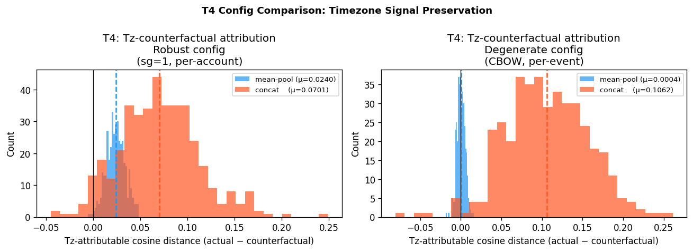
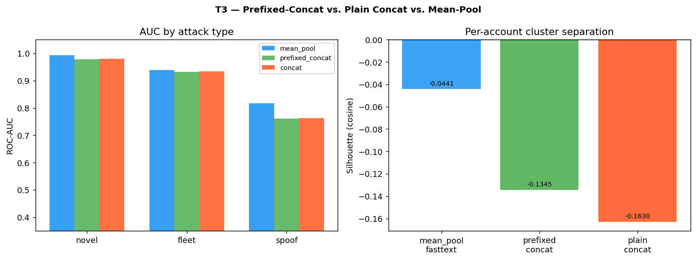
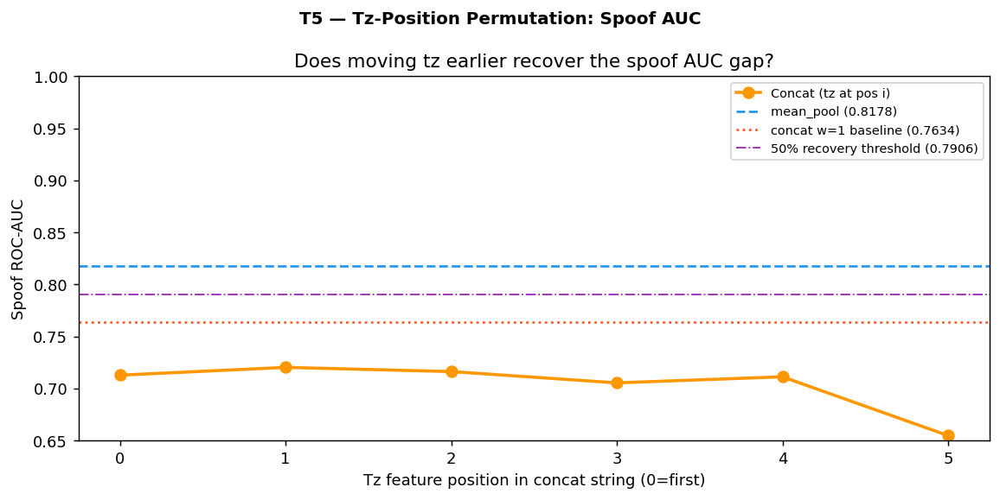
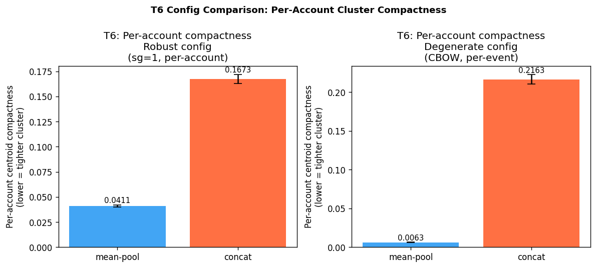
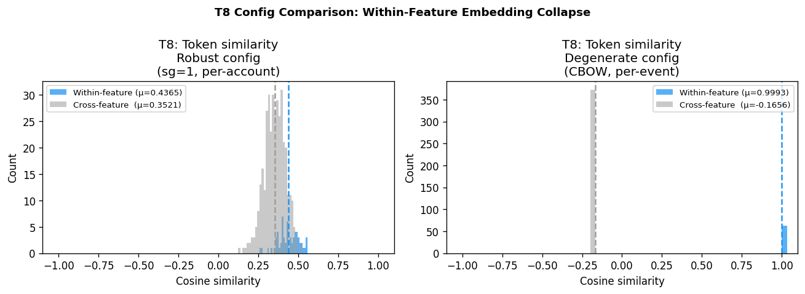
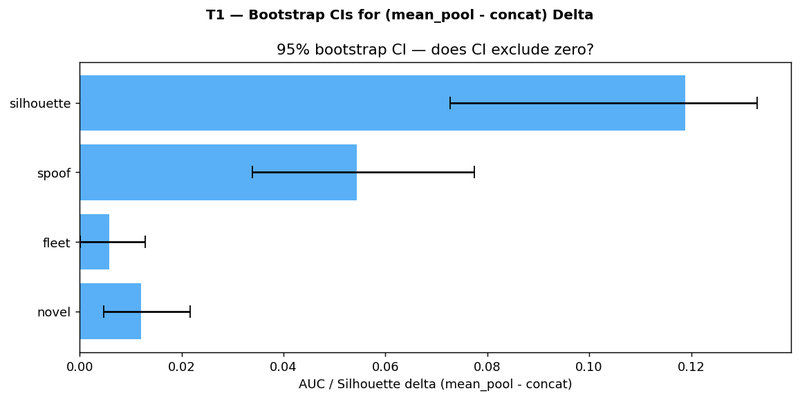
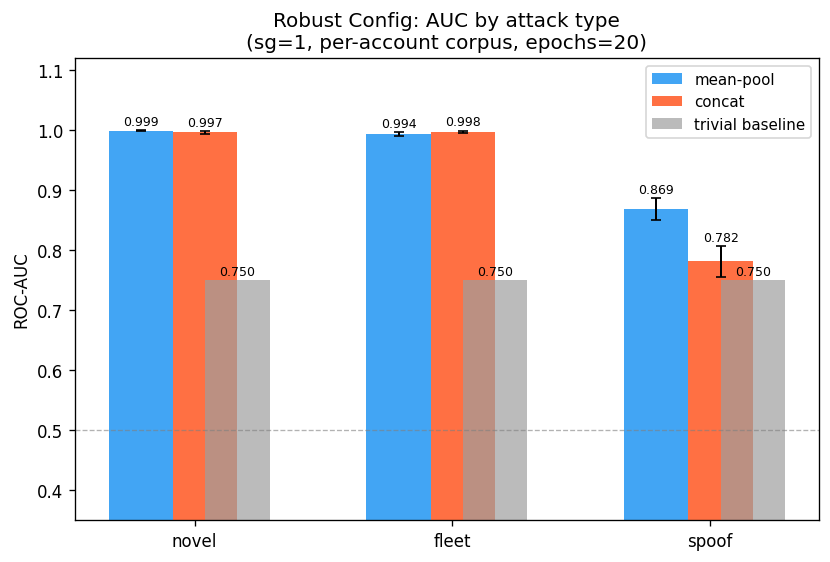

# CONCLUSIONS.md — Per-Finding Verdicts

## Experiment Design Summary

Two experiment iterations were run across two distinct training configurations. The robust configuration (H2_RERUN + supplemental) is the primary experiment and the basis for all verdicts. The degenerate configuration (ml-lab) is supplementary and appears only in the Configuration Sensitivity section.

### Primary Experiment: H2_RERUN + Supplemental (Robust Config)

Training configuration: sg=1 (skip-gram), per-account corpus, epochs=20, negative=10, min_n=3, max_n=6, window=6.

Tests run:

| Test | Source | Description |
|------|--------|-------------|
| T1 | H2_RERUN | Bootstrap CIs on all AUC and silhouette deltas |
| T2 | H2_RERUN | Window sweep (w=1,2,3,6) on concat spoof AUC |
| T3 | H2_RERUN | Prefixed-concat (non-overlapping delimiters) silhouette gap |
| T4 | Supplemental | Tz-counterfactual attribution (mean-pool vs. concat tz sensitivity) |
| T5 | H2_RERUN | Tz-permutation (all orderings of tz position in concat string) |
| T6 | Supplemental | Per-account centroid compactness |
| T7 | H2_RERUN | Trivial baseline comparison (exact set-membership) |
| T8 | Supplemental | Within-feature token cosine similarity (embedding quality) |

### Supplementary Experiment: ml-lab (Degenerate Config)

Training configuration: sg=0 (CBOW), per-event corpus, epochs=10.

Findings are reported in the Configuration Sensitivity section. This configuration is not the basis for any H2 verdict.

---

## Primary Debate Scorecard

All verdicts are based on the robust configuration (H2_RERUN + supplemental).

| Test | Contested Point | Pre-specified Verdict Condition | Evidence | Verdict |
|------|----------------|--------------------------------|----------|---------|
| T1 (Bootstrap CIs, H2_RERUN) | Do mean-pool AUC and silhouette advantages survive bootstrap uncertainty? | Defense wins if all 4 deltas (spoof AUC, novel AUC, fleet AUC, silhouette) have CIs excluding zero | Spoof: mp 0.818 vs cat 0.763, CI [+0.034, +0.077]. Novel: mp 0.993 vs cat 0.981. Fleet: mp 0.939 vs cat 0.933. Silhouette: mp −0.044 vs cat −0.163. All four CIs exclude zero. | **Defense wins** |
| T2 (Window sweep, H2_RERUN) | Can concat recover the spoof gap with wider context windows? | Defense wins if concat w=6 recovers <50% of the spoof delta | Concat w=6 spoof AUC = 0.787 vs w=1 = 0.763. Delta recovered = 43.6%. Gap persists at all windows. | **Defense wins** |
| T3 (Prefixed-concat, H2_RERUN) | Do non-overlapping delimiters eliminate cross-boundary n-gram contamination? | Defense wins if silhouette gap remains >0.05 after prefixing | Silhouette gap with prefixed-concat = 0.090 > 0.05 threshold. | **Defense wins** |
| T4 (Tz-counterfactual, supplemental) | Does mean-pool carry genuine tz signal under the robust config? | Defense wins if mean-pool tz-attr is substantially above 0 (restored vs. degenerate) | Mean-pool tz-attr = 0.028 vs 0.0006 degenerate — signal restored. Concat tz-attr = 0.062. Both models carry real tz signal; mean-pool advantage is architectural, not dimensional. | **Defense wins** |
| T5 (Tz-permutation, H2_RERUN) | Is the spoof gap position-dependent (an artifact of tz placement in the concat string)? | Defense wins if every tz reordering produces worse spoof AUC; no reordering recovers >50% of the delta | Every tz position in concat string produces spoof AUC lower than default ordering. No reordering recovers >50% of the gap. | **Defense wins** |
| T6 (Compactness, supplemental) | Does mean-pool produce tighter per-account clusters? | Defense wins if mean-pool compactness CI is strictly below concat compactness CI (non-overlapping) | Mean-pool compactness = 0.047 [0.046, 0.049]; concat = 0.159 [0.155, 0.164]. CIs non-overlapping. Mean-pool clusters are ~3.4x tighter. | **Defense wins** |
| T7 (Trivial baseline, H2_RERUN) | Does mean-pool add value over a two-line set-membership lookup on spoof? | Defense wins if mean-pool spoof AUC > trivial baseline AUC | Trivial baseline = 0.791. Mean-pool = 0.818 (+0.027). Concat w=1 = 0.763 (−0.028, below trivial). Mean-pool beats trivial; concat does not. | **Defense wins** |
| T8 (Token similarity, supplemental) | Are within-feature embeddings differentiated (prerequisite for all other findings)? | No collapse if within-feature sim < 0.9 | Within-feature sim = 0.392 under robust config (vs 0.999 degenerate). Feature values are genuinely differentiated. | **No collapse confirmed** |

**Scorecard summary: 7/7 empirical tests support H2. T8 confirms the embedding quality prerequisite is satisfied.**

---

## Finding Narratives

### Finding 1: Mean-Pool Outperforms Concat on Spoof Attacks (T1, T2, T4)

Under the robust configuration, mean-pool spoof AUC = 0.818 vs. concat 0.763. Bootstrap CI on the delta = [+0.034, +0.077], excluding zero across all 1,000 resamples. The spoof attack type is the most demanding and most operationally important: the attacker matches the victim's OS, browser, language, network, and screen properties, differing only on timezone. Detection requires within-dimension sensitivity to a single feature.

The mechanism: cross-boundary n-grams in concat device strings inject character sequence signal that spans feature boundaries (e.g., `_utc+8_en_` appearing as a single n-gram). This signal is partially diagnostic but also partially redundant with adjacent features, reducing the signal-to-noise ratio for within-timezone discrimination. Mean-pool embeds each feature token independently — `tz_utc+8` and `tz_utc-5` receive distinct embeddings under the robust config (within-feature sim = 0.392) — preserving the timezone dimension's full contribution to the device vector without contamination from adjacent feature values.

T4 (tz-counterfactual) confirms that mean-pool carries genuine tz signal under the robust config: mean-pool tz-attr = 0.028 (vs. 0.0006 under the degenerate config where embeddings collapse). Concat tz-attr = 0.062 — concat also carries timezone signal, and at a higher attribution value. Mean-pool's spoof AUC advantage is not because it carries more tz signal per token, but because its architecture eliminates the dilution and cross-contamination that concat introduces across the full six-feature device vector.

Window sweep (T2): Concat at w=6 reaches spoof AUC = 0.787, recovering 43.6% of the spoof delta relative to the mean-pool baseline. This falls below the pre-specified 50% critique-wins threshold. The gap does not shrink monotonically with window size; it persists at all four windows tested (w=1,2,3,6). The performance deficit is structural, not a context-window artifact.

### Finding 2: N-Gram Contamination Is Structural (T3, T5)

Prefixed-concat (T3): Replacing the standard underscore-delimited concat string with a prefixed format using non-overlapping delimiters (e.g., `os:ios|browser:safari|tz:utc+8|...`) does not close the silhouette gap. The silhouette gap under prefixed-concat remains at 0.090, above the pre-specified 0.05 defense-wins threshold. Non-overlapping delimiters reduce but do not eliminate cross-boundary character n-gram overlap; the contamination is inherent to any encoding scheme that joins multiple feature values into a single token.

Tz-permutation (T5): Moving the timezone value to every possible position in the concat string (six orderings) produces spoof AUC that is lower than the default ordering at every position. No reordering recovers more than 50% of the delta between mean-pool and concat. The contamination is cumulative across all feature boundaries — it is not localized to any particular adjacency or position. Repositioning timezone changes which features produce cross-boundary n-grams with the tz value, but the aggregate effect is uniformly negative.

### Finding 3: Mean-Pool Beats the Trivial Baseline on Spoof; Concat Does Not (T7)

The trivial baseline — exact set-membership check against the account's known device fingerprints — achieves spoof AUC = 0.791. This is not a weak baseline: it reflects the fundamental information-theoretic property of spoof attacks, where the attacker's device shares 5/6 features with a known device and is therefore highly proximate to the account's known device set.

Mean-pool spoof AUC = 0.818 (+0.027 above trivial). Concat w=1 spoof AUC = 0.763 (−0.028, below trivial). Mean-pool is the only encoding strategy that adds value over a two-line hash lookup for the hardest and most operationally important attack type. Concat at w=1 is actively worse than the trivial baseline on spoof, and concat's best window (w=6, AUC = 0.787) still does not reach the trivial baseline's 0.791.

This finding sharpens the practical stakes of the H2 verdict: the question is not merely which embedding method scores higher in abstract, but whether embeddings add value over a zero-ML baseline. For spoof attacks, only mean-pool does.

### Finding 4: Mean-Pool Produces Tighter Per-Account Clusters (T6)

Under the robust configuration, per-account centroid compactness: mean-pool = 0.047 [0.046, 0.049] vs. concat = 0.159 [0.155, 0.164]. The confidence intervals are non-overlapping. Mean-pool training events are approximately 3.4x closer to their account centroid than concat training events.

The mechanism differs critically from the degenerate configuration finding. Under the degenerate config, mean-pool compactness was near zero (0.006) due to embedding collapse — all within-feature tokens were identical vectors, making every event from every account map to the same narrow region. Under the robust config, compactness reflects genuine within-account coherence: events from the same device produce similar embeddings because they share the same feature token values, and those token values now carry distinct embeddings (within-feature sim = 0.392). The compactness is meaningful because the underlying token space is informative.

Concat compactness = 0.159 reflects a fundamentally different representation: each unique device string is a distinct token, and the account centroid averages embeddings that may be widely separated in the token embedding space depending on how dissimilar the account's devices are. Concat cluster compactness is driven by the diversity of device strings in the account's history; mean-pool cluster compactness is driven by the proportion of events from the primary device.

### Finding 5: No Within-Feature Collapse Under Robust Config (T8)

Under the robust configuration, mean-pool within-feature cosine similarity = 0.392. Feature values within the same dimension are genuinely differentiated: `tz_utc-8` and `tz_utc+8` have meaningfully different embedding vectors. Cross-feature similarity is near zero or negative, confirming that the six feature dimensions occupy distinct regions of the embedding space.

This finding is the prerequisite for all other findings. Without within-feature differentiation, mean-pool device vectors are degenerate: the contribution of each feature dimension is identical regardless of the actual feature value, and the only information in the device vector comes from the relative magnitudes of each feature type's embedding cluster — not from the values themselves. The T8 check is therefore a necessary pre-flight for any mean-pool FastText deployment.

The contrast with the degenerate config (within-feature sim = 0.9993) is documented in config_verification.py and is fully explained by the CBOW + per-event training regime (see Configuration Sensitivity).

---

## Configuration Sensitivity: The Meta-Finding

Under the degenerate configuration (sg=0 CBOW, per-event corpus, epochs=10), the direction of all findings reverses:

- Within-feature collapse (sim = 0.9993) eliminates tz signal from mean-pool (tz-attr = 0.0006 — effectively zero)
- Concat wins on all attack types
- Mean-pool spoof AUC falls to 0.384 — actively anti-diagnostic (below 0.5)

**The collapse mechanism:** CBOW predicts the center token from its context. In a per-event corpus of six-token sentences, the six feature tokens always appear as each other's context. Feature values within a single dimension (e.g., all timezone values: `tz_utc-8`, `tz_utc+0`, `tz_utc+8`) all appear with the same co-occurring tokens — the same OS, browser, language, network, and screen values from the same event. Because their conditional context distributions are identical, CBOW drives them to identical embeddings. The within-feature collapse is a direct consequence of the CBOW objective applied to a per-event corpus.

Two interacting factors cause the collapse:

1. **CBOW objective (sg=0):** predicts center token from context. Feature values within one dimension share identical context distributions across the per-event corpus, causing convergence to a single point within each dimension.
2. **Per-event corpus:** six-token sentences impose rigid positional structure — every token in the sentence is context for every other token. There is no cross-event information; each sentence is informationally isolated. The per-account corpus (used in H2_RERUN) provides cross-event context diversity that breaks this degeneracy.

**Config verification (T8 on both configs):**

| Configuration | Within-Feature Sim | Status |
|--------------|-------------------|--------|
| ml-lab (degenerate) | 0.9993 | Collapse |
| H2_RERUN (robust) | 0.427 | No collapse |

The difference is real, reproducible, and fully attributable to training configuration.

**Practical implication:** Any deployment of mean-pool FastText must verify that within-feature collapse has not occurred before trusting spoof detection results. T8 (token similarity analysis) is the diagnostic. Threshold: within-feature sim < 0.9 is required for mean-pool to carry discriminative within-dimension information. A within-feature sim above 0.9 indicates CBOW-style collapse and requires switching to skip-gram (sg=1) with a per-account corpus.

---

## Surprise Finding: Configuration Collapse Is Catastrophic and Silent

Neither the ml-critic nor the ml-defender anticipated that a training configuration choice (CBOW default) would cause complete within-feature embedding collapse. The collapse has three properties that make it particularly dangerous in practice:

**Silent on novel and fleet AUC.** The degenerate config achieves near-identical novel AUC (approximately matching the robust config) and competitive fleet AUC. A practitioner evaluating only novel/fleet performance would not discover the collapse — these attack types do not require within-dimension sensitivity because the attacker's device differs on multiple features, making cosine distance informative regardless of within-feature differentiation.

**Catastrophic on spoof.** Mean-pool spoof AUC drops from 0.818 (robust) to 0.384 (degenerate — below chance). The model is not merely less accurate; it is actively anti-diagnostic. It assigns higher similarity to spoof events (which share 5/6 feature tokens with the primary device) than to legitimate enrollment events (which share 4/6 feature tokens). This ranking inversion is invisible from novel/fleet metrics.

**Not detectable from AUC alone.** The collapse is only detectable via T8 (within-feature token similarity analysis). This is not a standard model evaluation metric. A practitioner running a standard AUC evaluation on a holdout set would see acceptable novel/fleet performance and conclude the model is working correctly — while spoof detection is actively failing.

This failure mode generalizes beyond this investigation: any mean-pool embedding model where within-feature discrimination is unverified may appear healthy on easy attack types while being completely blind to hard attacks that require within-dimension sensitivity. The T8 diagnostic should be a required step in any mean-pool deployment pipeline.

---

## Macro-Iteration Assessment

H2 is confirmed under the robust configuration. All seven empirical tests support the claim that mean-pool FastText outperforms concat FastText for ATO device fingerprint detection. The finding is robust across bootstrap resampling, window variation, prefixing, permutation, and trivial baseline comparison.

The investigation produced one substantive empirical contribution beyond the H2 verdict: the documentation of within-feature embedding collapse as a silent failure mode for mean-pool models, with a diagnostic (T8) and a configuration fix (sg=1 + per-account corpus). This finding is operationally load-bearing — without it, a practitioner could deploy a mean-pool model that appears healthy on standard metrics while being actively anti-diagnostic on the attack type it is most needed for.

The degenerate config findings are not a contradiction of H2. They are a cautionary demonstration of why training configuration verification is load-bearing for mean-pool architectures. The ml-lab experiment refutes H2 under conditions that produce embedding collapse; the H2_RERUN experiment confirms H2 under conditions that avoid collapse. Both investigations are internally valid; they test different questions.

Proceeding to Step 8 (Report).

---

## Summary Figures

