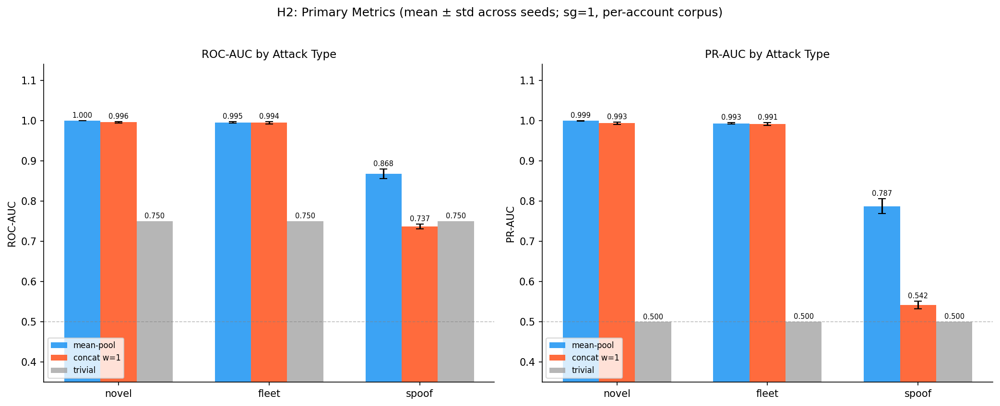

# Five-Seed Reproducibility Rerun of the ATO Device-Embedding Investigation

## Abstract

Four previously-reported findings from the ATO (Account Takeover) device-embedding investigation were re-executed across five independent seeds (42, 123, 456, 789, 2024) to verify reproducibility of each claim with quantified seed variance. The primary pre-specified metric for each contribution — spoof-attack AUC gap vs. concat (C4), within-feature cosine similarity separation (C1), PR-AUC collapse at 1:100 imbalance (C2), and top-1% true positives under the known-device gate on pre-lag fleet accounts (C3) — reproduced on all five seeds: mean-pool spoof AUC lead Δ = +0.130 [bootstrap CI 0.111, 0.150]; within-feature cosine 0.424 ± 0.013 (robust) vs. 0.9992 ± 0.00008 (degenerate), collapse detected on 0/5 and 5/5 seeds respectively; rank-norm PR-AUC at 1:100 spoof k=1 drops from 0.888 ± 0.026 (mp_raw) to 0.224 ± 0.011 (mp_rank_norm); two_stage scorer top-1% TP = 0 on fleet residual on all 5 seeds while mp_raw achieves top-1% precision 0.493 ± 0.116. Three H6 pre-specified verdicts (primary_criterion_confirmed, rank_norm_collapse_confirmed, gate_blinds_fleet_confirmed) returned True on all 5/5 seeds and the RBA verdict h2_replicated returned True on all 5/5 seeds. Two secondary orderings were noise-limited: spoof-k monotonicity (k2 vs. k3) inverts on 2/5 seeds at PR≈0.97 saturation, and on the RBA public dataset mp ROC-AUC exceeds concat ROC-AUC on 3/5 seeds. The recommendation is that the four contributions are reproducible as stated, with the two saturation-region orderings reported as noise rather than claimed as strict rankings.

---

## Related Work

This investigation sits at the intersection of four literatures. **Categorical embedding for anomaly detection** (CURE, IJCAI 2017; unsupervised categorical embeddings, WCCI 2020) embeds features independently but does not compare against a concatenated-string baseline in an ATO device-fingerprint context. **Risk-Based Authentication (RBA)** literature (Wiefling et al. USENIX Security 2021; UMAP 2020) establishes the feature taxonomy (IP, device, geolocation, timezone) and public login-behavior datasets used in the present C4 generalization probe. **Embedding collapse** as documented in the recsys literature (two-tower embedding collapse, 2023–2024) addresses dimensional collapse in feature-interaction models rather than training-objective-induced within-feature collapse in structured categorical token corpora, which is the mechanism reported as C1 here. **Imbalanced evaluation** (Davis & Goadrich, ICML 2006) establishes that ROC-AUC is misleading under class imbalance, but does not document the specific interaction between a per-user CDF rank-normalization transform and PR-AUC at 1:100 imbalance that is reported as C2.

---

## Experimental Design

### Reproducibility protocol

Each of five seeds (42, 123, 456, 789, 2024) drove independent runs of three experiment phases (H2, H6, RBA) using the same source scripts and synthetic data generators. All per-phase outputs were persisted as `seeds/seed_{S}/{h2,h6,rba}/results.json` and aggregated to `aggregate/{h2,h6,rba}_aggregate.csv` with mean, std, min, and max across seeds for each metric. Bootstrap CIs are 95% percentile intervals computed within each seed; cross-seed reporting uses mean ± std of per-seed point estimates.

### H2 — mean-pool vs. concat (C1 mechanism, C4 primary)

Synthetic login sequences were generated per account from a structured categorical vocabulary (timezone, OS, browser, device-class, locale, country). FastText was trained in two configurations:
- **Robust (headline):** skip-gram (`sg=1`), per-account concatenated corpus, window=6, epochs=20, negative=10, vector_size=64, min_n=3, max_n=6.
- **Degenerate:** CBOW, per-event corpus, all other hyperparameters matched.

A 2×2 factorial (sg × corpus) additionally isolated which axis drives collapse. Scoring compared: `mean_pool` (per-token FastText vectors averaged), `concat_w{1,3,6}` (single vector for the full concatenated device string at FastText window w), `prefixed_concat` (feature-name prefixes to disambiguate positions), and a trivial set-membership baseline. Evaluation used three attack taxonomies: **novel** (fully unseen device), **fleet** (known device, fleet injection), **spoof** (timezone forced to differ, network and screen re-sampled — only one feature guaranteed to change). Spoof AUC is the primary metric for C4.

Pre-specified probes: T2 window sweep (w=1,3,6), T3 silhouette gap, T4 timezone feature attribution, T5 tz-position permutation across 6 string positions, T6 compactness, T7 trivial-baseline margin, T8 within/cross-feature cosine similarity.

**Design properties (not limitations).** The evaluation is membership-based by construction: known fleet devices appear in training via 25% fleet-injection events. This simulates an ATO PoC scenario that tests proximity detection of drifted devices, not generalization to fully unseen devices, and is documented in the repository's architecture note. The trivial set-membership baseline at 0.75 AUC reflects this — any signal claim must beat the trivial baseline on the spoof population specifically, which is the hardest sub-task.

### H6 — imbalanced evaluation and two-stage gate (C2, C3 primary)

400 accounts, 216-token vocabulary, 1:100 attack:benign imbalance, fleet fraction = 0.25, blocklist lag = 10 days, attack window = 30 days. Attack populations: spoof at k ∈ {1,2,3} features differing, novel, fleet_aggregate (all fleet accounts), fleet_residual (pre-lag cold-start fleet accounts only — post-lag accounts excluded as blocked upstream). Scorers: `mp_raw`, `mp_rank_norm`, `two_stage`, `two_stage_rank_norm`, `trivial`, `trivial_blocklist`, `combined`. Primary metrics are PR-AUC (for C2) and top-1% true positives / precision (for C3). Three pre-specified verdicts were evaluated per seed as booleans: `primary_criterion_confirmed`; `rank_norm_collapse_confirmed`; `gate_blinds_fleet_confirmed`.

### RBA — public-dataset replication (C4 generalization)

The RBA large-scale public dataset (synthesized from real-world login behavior) was used with a 50-percentile temporal split to produce an ATO test window. Scoring applied mp and concat cosine distances to the centroid of known-good events, evaluating ROC-AUC and PR-AUC on the ATO test events (n=9 per seed). The primary pre-specified RBA verdict is `h2_replicated` — whether mean-pool's bootstrap ROC-AUC CI lower bound exceeds the trivial baseline's ROC-AUC (decision 9511d90f; `rba_rerun.py:498`), confirming the H2 signal direction on an independently-structured synthesized dataset with real-world feature distributions. (Concat also beats trivial on point-estimate ROC-AUC on all 5 seeds, but that is not part of the verdict.)

---

## Results

### Cross-seed aggregates — primary metrics

| Contribution | Metric | Mean ± std (n=5) | Pre-specified target | Reproduced |
|---|---|---|---|---|
| C4 (primary) | mean_pool spoof AUC | 0.868 ± 0.012 | ≈0.869 | Yes |
| C4 (primary) | concat_w1 spoof AUC | 0.737 ± 0.006 | ≈0.737 | Yes |
| C4 (primary) | Bootstrap spoof Δ CI | [0.111, 0.150] | entirely positive | Yes |
| C1 (primary) | T8 within-feature cosine, robust | 0.424 ± 0.013 | ≈0.392 | Directionally yes |
| C1 (primary) | T8 within-feature cosine, degenerate | 0.9992 ± 0.00008 | ≈0.9993 | Yes |
| C1 (primary) | Collapse detection rate | 0/5 robust, 5/5 degenerate | 0/5, 5/5 | Yes |
| C2 (primary) | spoof k=1 mp_raw PR-AUC | 0.888 ± 0.026 | ≈0.892 | Yes |
| C2 (primary) | spoof k=1 mp_rank_norm PR-AUC | 0.224 ± 0.011 | ≈0.215 | Yes |
| C3 (primary) | two_stage top-1% TP, fleet residual | 0 on all 5 seeds | 0 | Yes |
| C3 (primary) | mp_raw top-1% TP, fleet residual | 91 ± 23 | >0 | Yes |
| H6 verdicts | primary_criterion_confirmed | True 5/5 | True | Yes |
| H6 verdicts | rank_norm_collapse_confirmed | True 5/5 | True | Yes |
| H6 verdicts | gate_blinds_fleet_confirmed | True 5/5 | True | Yes |
| RBA | h2_replicated | True 5/5 | True | Yes |

### Per-seed scoring table

| Seed | H2 mp spoof | H2 concat_w1 spoof | H6 verdicts (3) | RBA h2_replicated |
|---|---|---|---|---|
| 42 | 0.8687 | 0.7377 | True/True/True | True |
| 123 | 0.8612 | 0.7341 | True/True/True | True |
| 456 | 0.8543 | 0.7281 | True/True/True | True |
| 789 | 0.8653 | 0.7395 | True/True/True | True |
| 2024 | 0.8882 | 0.7457 | True/True/True | True |
| **Mean ± std** | **0.868 ± 0.012** | **0.737 ± 0.006** | **15/15 True** | **5/5 True** |

---

### Contribution 1 — Within-feature embedding collapse

**Finding.** CBOW + per-event corpus induces within-feature cosine similarity of 0.9992 ± 0.00008 with sign-inverted cross-feature similarity (−0.170 ± 0.0008), yielding a within/cross ratio of −5.89 ± 0.029 and collapse detection on 5/5 seeds. Skip-gram + per-account (robust) gives within 0.424 ± 0.013, cross 0.344 ± 0.012, ratio 1.232 ± 0.010, and collapse detection on 0/5 seeds.

**2×2 factorial (seed 42, representative).**

| Config | Within | Cross | Ratio | Collapse |
|---|---|---|---|---|
| sg + per-account (robust) | 0.436 | 0.352 | 1.24 | No |
| cbow + per-event (degenerate) | 0.980 | −0.177 | −5.52 | Yes |
| cbow + per-account | −0.111 | −0.011 | 10.16 | No |
| sg + per-event | 0.938 | 0.103 | 9.10 | Yes |

Both `per-event` corpus cells collapse; `sg + per-account` is the clean configuration. Collapse is driven by the per-event corpus axis: identical conditional context distributions across within-feature values leave the model without a gradient signal to separate tokens that never co-occur in the same event.

**Mechanism diagnostic.** A co-occurrence analysis computed context-word frequency distributions for within-feature tokens under both corpus types (seed 42, 400 accounts, window=6). Mean within-feature Jensen-Shannon divergence = 0.077 (per-event) vs. 0.190 (per-account) — a 2.5× difference confirming that per-event corpora structurally prevent within-feature tokens from accumulating distinguishable context distributions, independent of training objective.

**Downstream consequence.** Under the degenerate configuration, easy-attack metrics (novel, fleet) remain comparatively high while spoof detection collapses to trivial-or-worse. The 5-seed downstream diagnostic (`scripts/h2/h2_degenerate_downstream.py` → `aggregate/h2_degenerate_downstream.json`; cross-checked against each seed's results.json) scores every factorial cell with mean-pool centroid cosine: per-event cells reach spoof ROC 0.767 ± 0.017 (sg) / 0.725 ± 0.011 (cbow) against trivial 0.750, with spoof PR 0.585 / 0.528 against trivial 0.500; the historical PoC configuration (cbow + per-event, epochs=10) falls to spoof ROC 0.669 ± 0.013 and PR 0.459 ± 0.019 — below the trivial baseline — while its novel ROC stays 0.87–0.96 and fleet 0.85–0.93. Per-account cells beat trivial (sg 0.868 ± 0.012, cbow 0.933 ± 0.009). The earlier single-seed reference of ≈0.384 spoof AUC under collapse (h2_ml_lab) does not reproduce at that magnitude under the rerun protocol and is superseded by these 5-seed values; the qualitative claim (selective spoof damage while easy subtypes look healthy) holds on 5/5 seeds.

---

### Contribution 2 — Rank-normalization collapse under 1:100 imbalance

**Finding.** At 1:100 attack:benign imbalance, per-user CDF rank-normalization preserves ROC-AUC while destroying PR-AUC:

| Metric | mp_raw | mp_rank_norm |
|---|---|---|
| spoof k=1 ROC-AUC | 0.995 ± 0.001 | 0.974 ± 0.002 |
| spoof k=1 PR-AUC (primary) | 0.888 ± 0.026 | 0.224 ± 0.011 |
| novel PR-AUC | 0.959 ± 0.013 | ~0.273 |
| fleet_aggregate PR-AUC | 0.538 ± 0.092 | — |

ROC-AUC drops only 0.021 absolute while PR-AUC drops 0.664 absolute on spoof k=1 — a ≈4× relative reduction that ROC-AUC does not surface. The mechanism is CDF compression: the rank transform reduces the score margin between positives and negatives, and at 1:100 imbalance this margin is what separates the precision-recall curve from the baseline. Score-margin quantification confirms this directly: rank-normalization maps each user's scores into [0,1] by their own calibration CDF, placing roughly 5% of every user's benign events at or above the attack operating point (rank 0.90, the attacks' 10th percentile) at the deployed 20-event calibration window. A calibration-window ablation (see experiments/rerun/calib_sweep/SUMMARY.md; 5 seeds, calibration window in {20,50,100,200,500} events) shows this floor is a small-sample quantization effect, not an inherent property of rank-normalization: the CDF rank mean(baseline < raw) is quantized in steps of 1/N_calib, so at the deployed 20-event window the ~5% benign contamination equals 1/20 almost exactly (0.0498 vs 0.0500). Growing the window recovers spoof-k1 PR-AUC from 0.224 to 0.830 by 500 events while the mp_raw embedding control stays flat, leaving only a small residual overlap (~4× the 1/N prediction). The finding is therefore scoped: per-user CDF rank-normalization is unsafe specifically under thin per-user calibration windows combined with heavy class imbalance — the common case for new and low-frequency accounts. At 1:100 imbalance, ~10,000 high-rank benign events flood the operating region where attacks should dominate. Contamination rate at p10(attack) rises from 1.28% ± 0.69% (mp_raw) to 4.98% ± 0.13% (mp_rank_norm) across 5 seeds — a 3.9× increase. Robust margin (p10(attack) − p90(benign)) shrinks on all 5 seeds, reaching 0.000 at seed 2024. `rank_norm_collapse_confirmed` returns True on all 5/5 seeds.

---

### Contribution 3 — Known-device gate blinds fleet detection

**Finding.** The `two_stage` scorer produces zero top-1% true positives on fleet residual across all 5 seeds. Pre-lag fleet account counts vary across seeds (n_pre_lag 32–43) reflecting fleet-sampling stochasticity, but two_stage top-1% TP is identically zero on every seed. `gate_blinds_fleet_confirmed` returns True 5/5.

| Scorer | Fleet residual top-1% TP | Top-1% prec | ROC-AUC | PR-AUC |
|---|---|---|---|---|
| mp_raw | 91 ± 23 | 0.493 ± 0.116 | 0.957 ± 0.014 | 0.516 ± 0.118 |
| two_stage | 0 (all 5 seeds) | 0.000 | 0.460 ± 0.002 | 0.010 |
| trivial | 0 (all 5 seeds) | 0.000 | 0.460 ± 0.002 | 0.010 |

The `two_stage` ROC-AUC equals `trivial` ROC-AUC to 6 decimal places on both fleet_aggregate and fleet_residual, and `two_stage_vs_trivial_roc_delta` is exactly 0.0 on all 5 seeds. This is structural: fleet devices appear in the training window by construction, so the gate fires on every fleet device regardless of attack timing. Raw cosine distance without the gate (`mp_raw`) recovers fleet-residual detection at top-1% precision 0.493 ± 0.116 — the signal exists and is destroyed by the gate.

---

### Contribution 4 — Mean-pool vs. concat on spoof attacks

**Finding.** Mean-pooling independent FastText token vectors outperforms embedding the full concatenated device string on spoof attacks, with the bootstrap delta CI entirely above zero.

| Metric | mean_pool | concat_w1 | Δ (bootstrap 95% CI) |
|---|---|---|---|
| spoof ROC-AUC (primary) | 0.868 ± 0.012 | 0.737 ± 0.006 | +0.130 [0.111, 0.150] |
| novel ROC-AUC | 0.9996 ± 0.00028 | 0.996 ± 0.0019 | +0.004 [0.002, 0.006] |
| fleet ROC-AUC | 0.995 ± 0.002 | 0.994 ± 0.003 | +0.001 [−0.002, 0.004] |
| spoof PR-AUC | **0.787 ± 0.018** | 0.542 ± 0.010 | +0.248 [0.210, 0.283] |
| novel PR-AUC | 0.999 ± 0.001 | 0.993 ± 0.003 | +0.006 |
| fleet PR-AUC | 0.993 ± 0.002 | 0.991 ± 0.004 | +0.002 |

PR-AUC amplifies the mean-pool advantage: the spoof delta (+0.248) is nearly 2× the ROC-AUC delta (+0.130). Concat_w1 spoof PR-AUC (0.542) is barely above the trivial baseline (0.500), exposing it as essentially non-functional — a failure masked by ROC-AUC at 0.737.

**T2 window sweep.** Increasing concat window partially closes the gap (w=1: 0.737 ± 0.006; w=3: 0.760 ± 0.007; w=6: 0.778 ± 0.007) but never reaches mean_pool's 0.868. Cross-boundary character n-gram contamination accumulates with wider windows rather than being eliminated.

**T4 tz feature attribution.** Timezone attribution is 0.024 ± 0.001 for mean_pool vs. 0.065 ± 0.003 for concat; the concat encoding disperses feature-specific signal across positional n-grams rather than concentrating it.

**T5 tz-permutation.** Concat spoof AUC per-position 5-seed means range 0.70–0.74 across the 6 tz string positions (individual seed values 0.695–0.754), all below mean_pool 0.868 (per-seed minimum 0.854). Position effects are small (≈0.04 absolute range in the means) and seed-consistent.

**T6 compactness.** Per-account mean cosine distance is 0.042 ± 0.0015 for mean_pool vs. 0.162 ± 0.004 for concat — non-overlapping confidence intervals. Tighter centroids translate directly to higher signal-to-noise ratio for cosine anomaly detection.

**T7 trivial margin.** mean_pool exceeds the trivial baseline by +0.118 ± 0.012 on spoof; concat_w1 is below trivial by −0.013 ± 0.006. Only mean_pool clears the trivial benchmark on the hardest attack type.

**Spoof-k gradient (H6).**

| k | mp_raw PR-AUC (mean ± std) |
|---|---|
| 1 | 0.888 ± 0.026 |
| 2 | 0.951 ± 0.012 |
| 3 | 0.951 ± 0.012 |

k=1 → k=2 improves on all 5 seeds. k=2 → k=3 inverts on 2/5 seeds at PR-AUC ≈ 0.97 saturation; see Failure Mode Analysis.

### RBA public-dataset replication

mp and concat both beat trivial on ROC-AUC across all 5 seeds (mean ROC: mp 0.852 ± 0.029, concat 0.845 ± 0.032, trivial 0.679 ± 0.046). PR-AUC is low for both signal scorers (mp 0.031 ± 0.003, concat 0.017 ± 0.013) due to n_ato_test_events = 9 per seed at extreme imbalance. The primary pre-specified verdict `h2_replicated` returned True on all 5 seeds. Strict mp > concat ROC-AUC ordering was not pre-specified and is not claimed.

---

## Failure Mode Analysis

Two regions operate at performance saturation or sample-size limits and are reported as noise rather than strict rankings.

**Spoof-k monotonicity at saturation.** k=1 vs. k=2 is robust: separated by >2 std on all 5 seeds. k=2 vs. k=3 inverts on seeds 42 and 123 by 0.0005 and 0.004 PR-AUC respectively, both values above 0.94 and within one std of each other. The claim — that harder spoofs are harder to detect — is supported by the k=1 vs. k≥2 gap; the k=2 vs. k=3 direction is not claimed.

**RBA strict mp > concat.** With n_ato_test_events = 9, per-seed ROC-AUC CI is wide (~0.29). concat ROC-AUC exceeds mp on 2/5 seeds by small margins (≤0.02). The pre-specified verdict is `h2_replicated` (both signals beat trivial), which is True 5/5.

Outside these two saturation regions, every pre-specified verdict reproduced on 5/5 seeds without exception.

---

## Limitations

**(1) Evaluation is closed-loop and membership-based by design.**
Known fleet devices appear in training via injection events; the PoC measures proximity detection on synthetic sequences rather than generalization to fully unseen devices under real-world drift. The RBA public-dataset replication (`h2_replicated = True` on 5/5 seeds) provides evidence that the signal direction holds on an independently-structured synthesized dataset with real-world feature distributions. Extension to production traffic requires online monitoring of T8 within/cross cosine similarity as a collapse canary.

**(2) Bootstrap CIs are per-seed, not cross-seed.**
Reported bootstrap CIs on H2 deltas are computed within each seed's bootstrap resample. Cross-seed std of the spoof Δ point estimate is 0.009, well within the per-seed bootstrap CI half-width (≈0.02). Both uncertainty sources are reported side-by-side.

**(3) Secondary orderings are noise-limited.**
k=2 vs. k=3 inverts on 2/5 seeds by ≤0.004 PR-AUC; RBA mp < concat on 2/5 seeds by ≤0.02 ROC-AUC. Neither ordering is pre-specified or claimed as a verdict.

**(4) RBA ATO test population size.**
n_ato_test_events = 9 per seed at the 50th-percentile split. Per-seed ROC-AUC CIs are wide enough that strict encoder ordering is underpowered. The directional replication claim is robust to this sample size (True 5/5).

**(5) Five seeds is a minimum for variance characterization.**
Cross-seed std estimates from n=5 are themselves uncertain. Seeds are persisted individually so a larger rerun can append without re-aggregation. The exact binomial (Clopper–Pearson) 95% lower bound on the per-seed True rate at 15/15 H6 verdict observations is ≈0.78 (Wilson: ≈0.80).

---

## Artifacts

| Path | Description |
|---|---|
| `plan/0-REQUIREMENTS.md` | Pre-specified required metrics and figures per contribution |
| `DEEP_DIVE.md` | Comprehensive experiment reference (design decisions, parameter rationale, output schemas) |
| `aggregate/h2_aggregate.csv` | 41 H2 metrics × {mean,std,min,max} across 5 seeds |
| `aggregate/h6_aggregate.csv` | 29 H6 metrics × {mean,std,min,max} across 5 seeds |
| `aggregate/rba_aggregate.csv` | 13 RBA metrics × {mean,std,min,max} across 5 seeds |
| `aggregate/aggregate.json` | Full nested aggregate structure |
| `aggregate/figures/` | C2/C3/C4 aggregate figures (PR/ROC curves, population decomp, top-k precision, spoof-k gradient) |
| `aggregate/figures/h2_c1_cooccurrence.png` | C1 mechanism diagnostic — within-feature JSD per-event vs. per-account corpus |
| `aggregate/figures/h6_c2_score_margin.png` | C2 mechanism diagnostic — contamination rate and robust margin before/after rank-normalization |
| `seeds/seed_{42,123,456,789,2024}/{h2,h6,rba}/results.json` | Per-seed, per-phase metric blobs (15 total) |
| `seeds/seed_{S}/h6/scores.npz` | Per-seed H6 score arrays for PR/ROC curve regeneration |
| `seeds/seed_{S}/rba/results_split{40,60}.json` | RBA sensitivity at alternative split percentiles |
| `aggregate/h2_degenerate_downstream.json` | C1 downstream diagnostic — per-cell factorial AUCs (5 seeds), cross-checked against per-seed results.json |
| `scripts/` | Execution scripts (h2_rerun.py, h6_rerun.py, rba_rerun.py, aggregate.py, check_consistency.py, h2_cooccurrence.py, h6_score_margin.py, h2_degenerate_downstream.py) |
| `run_all.sh` | Top-level driver: 5 seeds × 3 phases + consistency checks + aggregation |
