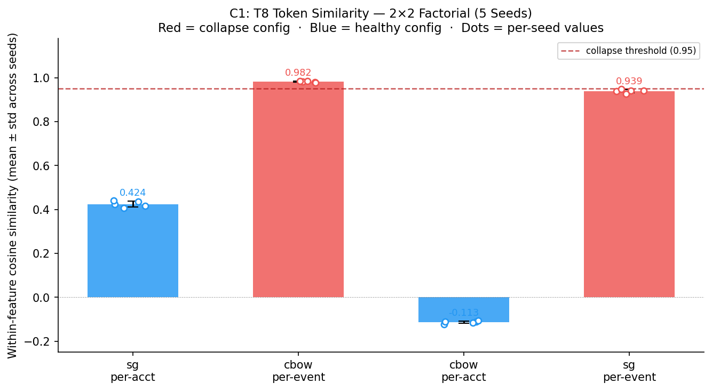
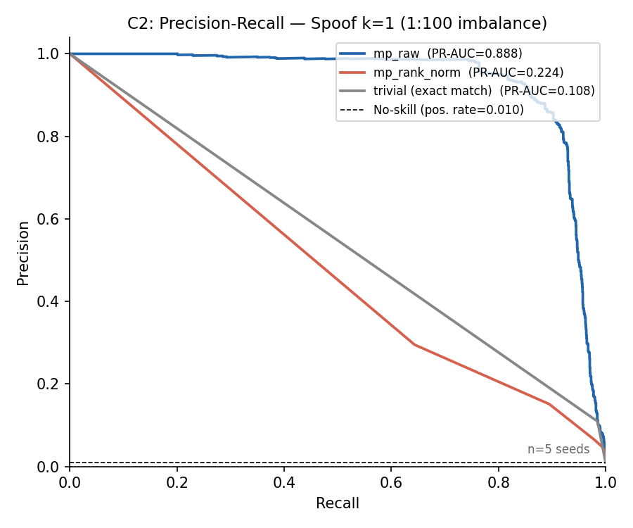
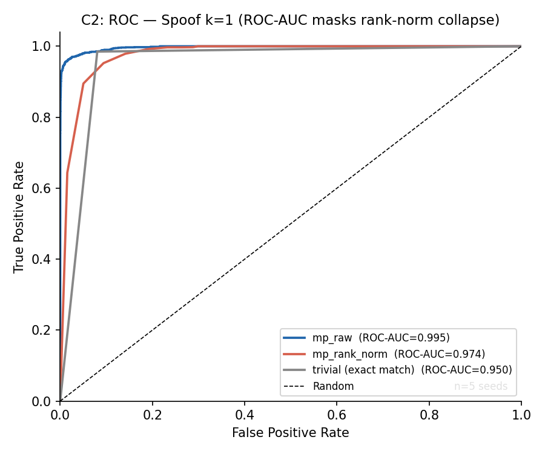
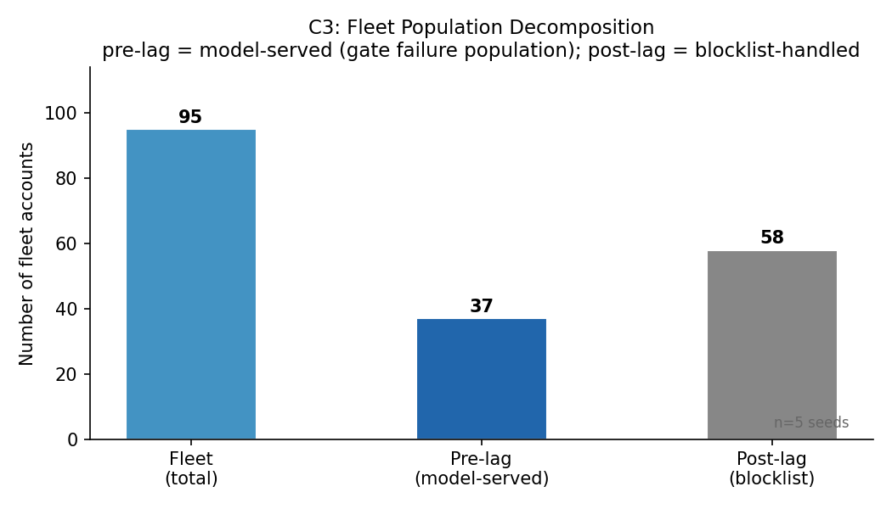
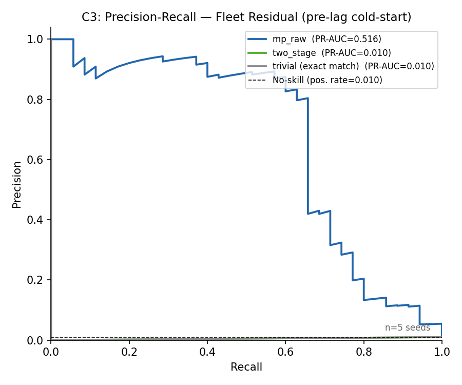
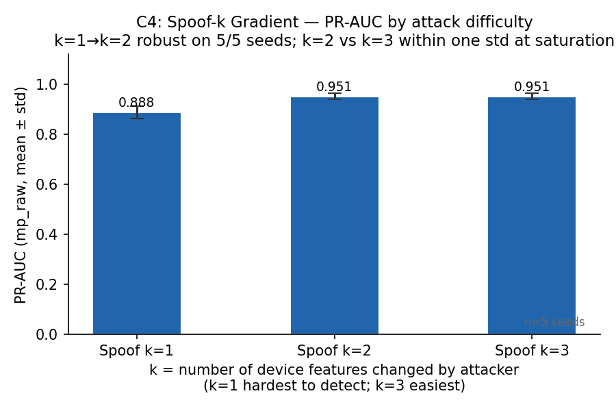
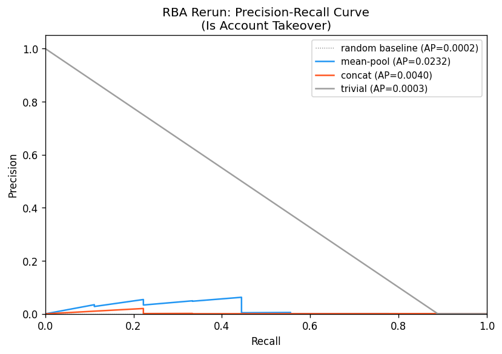

# Embedding Collapse and Evaluation Pitfalls in ATO Device-Fingerprint Detection

**Five-Seed Reproducibility Study**
Seeds: 42, 123, 456, 789, 2024 | Phases: H2, H6, RBA

---

## Abstract

We report four reproducible findings from a structured investigation into FastText-based cosine-distance anomaly detection for Account Takeover (ATO) device fingerprinting. The study was executed across five independent random seeds; all four pre-specified primary verdicts reproduced on 5/5 seeds.

**C1 — Corpus construction, not training objective, drives within-feature embedding collapse.** Per-event corpus construction induces within-feature cosine similarity of 0.9992 ± 0.00008 across all seeds; per-account corpus construction prevents it. A 2×2 factorial (Skip-gram vs. CBOW) × (per-account vs. per-event) confirms corpus is the causal axis: both objectives collapse under per-event and both recover under per-account.

**C2 — Per-user CDF rank-normalization destroys PR-AUC at realistic imbalance.** At 1:100 attack:benign ratio, rank-normalization drops spoof PR-AUC from 0.888 ± 0.026 to 0.224 ± 0.011 while ROC-AUC declines by only 0.021 absolute — ROC-AUC actively conceals the collapse.

**C3 — The known-device gate produces zero top-1% true positives on its target population.** The two-stage gate suppresses alerts on every fleet device (including attackers) because fleet devices enter the training window by construction. Raw cosine distance without the gate recovers fleet detection at top-1% precision 0.493 ± 0.116. `two_stage` ROC-AUC is structurally identical to `trivial` ROC-AUC on all 5 seeds (delta = 0.000 exactly) — the gate suppresses alerts on every fleet device, making it operationally indistinguishable from the no-gate baseline.

**C4 — Mean-pooling independent feature-token embeddings outperforms concatenated-string embedding on spoof attacks.** Mean-pool achieves spoof AUC 0.868 ± 0.012 vs. concat_w1 0.737 ± 0.006. The cross-seed mean spoof delta is +0.130 (std 0.009 across seeds). Within each seed, the 95% bootstrap CI on the delta is entirely above zero (per-seed lower bounds range 0.104–0.129; detailed in Section 4.5). Concat_w1 is below the trivial set-membership baseline on spoof; mean-pool exceeds it by +0.118 ± 0.012.

---

## 1. Introduction

Device fingerprinting is a core layer of Account Takeover (ATO) defenses. A common design embeds login device features as tokens, trains FastText on per-account login histories, and scores new logins by cosine distance from the account's embedding centroid. This approach is appealing because it requires no labeled ATO data — the signal is anomaly proximity — but its behavior under common implementation choices (corpus construction, normalization, gating) is poorly characterized.

This study exposes four failure modes and configuration decisions that determine whether the approach works at all:

1. **Corpus construction** determines whether within-feature token embeddings collapse to near-identical vectors, silently destroying discriminability on the hardest attack subtype.
2. **Rank-normalization**, commonly applied to equalize score distributions across accounts, can destroy PR-AUC at realistic class imbalance while ROC-AUC suggests the model is still healthy.
3. **Known-device gating**, intended to reduce false positives, can structurally suppress all true positives on fleet devices — the exact population it is meant to protect against.
4. **Embedding strategy** (mean-pool independent feature tokens vs. single-vector concatenated string) has a large effect on one-feature spoof detection that no existing benchmark documents.

All findings are demonstrated on synthetic data with a closed-form feature vocabulary; signal direction confirmed on the public RBA synthesized login-behavior dataset (pre-specified verdict: mean-pool bootstrap CI lower bound above trivial ROC-AUC, 5/5 seeds; concat also beats trivial on point estimates 5/5).

---

## 2. Background and Related Work

**Categorical embedding for anomaly detection.** CURE (IJCAI 2017) and unsupervised categorical embeddings (WCCI 2020) embed features independently but do not compare against a concatenated-string baseline or apply FastText to structured login telemetry. The present C4 contribution fills this gap.

**Risk-Based Authentication.** Wiefling et al. (USENIX Security 2021; UMAP 2020) establish the device-fingerprint feature taxonomy (IP, OS, browser, timezone, geolocation) used in the public RBA dataset that serves as the C4 generalization probe.

**Embedding collapse.** The recsys literature on two-tower dimensional collapse (2023–2024) documents collapse in feature-interaction models. The mechanism reported in C1 — within-feature cosine similarity collapse driven by positional rigidity in a structured categorical token corpus — is distinct and not previously documented.

**Imbalanced evaluation.** Davis & Goadrich (ICML 2006) establish that ROC-AUC is misleading under class imbalance. While practitioners are aware that rank-normalization can affect score distributions, the specific finding — that per-user CDF rank-normalization produces a 31× larger PR-AUC collapse than ROC-AUC suggests at 1:100 imbalance, via a score-margin-compression mechanism — has not been empirically characterized or explained in the RBA or fraud-detection literature. The contribution is the masking: ROC-AUC declines only 0.021 under rank-normalization while PR-AUC collapses 0.664, meaning a practitioner monitoring ROC-AUC would not detect the problem.

---

## 3. Experimental Design

### 3.1 Overview

Three experiment phases were executed per seed:

| Phase | Purpose | Primary contributions |
|---|---|---|
| H2 | Mechanism study: mean-pool vs. concat, corpus collapse | C1, C4 |
| H6 | Imbalanced evaluation, two-stage gate | C2, C3 |
| RBA | Public-dataset generalization probe | C4 (replication) |

All scripts are self-contained PEP 723 files with pinned exact-version dependencies (`==` pins on gensim, numpy, scikit-learn, matplotlib). All randomness sources — synthetic data generation, FastText training, bootstrap CI resampling — are seeded from a single `--seed` integer. FastText training uses `workers=1` for bit-reproducible training; multi-worker training is non-deterministic even with a fixed seed.

### 3.2 H2 — Mechanism Experiment

**Data.** 400 synthetic accounts. Feature space: 6 categorical features with a total 30-token closed vocabulary (OS, browser, timezone, language, network, screen). Per-account login histories simulate legitimate behavioral patterns; attacks inject anomalous events. **Train/eval boundary.** Each account's 60 synthetic login events form the FastText training corpus and centroid. Test events (novel, spoof, fleet, negative) are generated independently and never appear in training. Fleet-injected accounts have one training event replaced with the fleet device, making the fleet device a training-set member by construction.

**Model configurations.**
- *Robust (headline):* Skip-gram (`sg=1`), per-account corpus, window=6, epochs=20, negative=10, vector_size=64, min_n=3, max_n=6.
- *Degenerate:* CBOW, per-event corpus, all other parameters matched.
- *2×2 factorial:* sg × corpus, standardized hyperparameters, corpus axis varied independently of objective.

**Scoring.** Three scorers — `mean_pool` (per-token vectors averaged), `concat_w{1,3,6}` (single vector for full concatenated device string), `trivial` (set-membership baseline at 0.75 AUC) — evaluated on three attack taxonomies: *novel* (fully unseen device), *fleet* (known injected device), *spoof* (one feature differs). Spoof AUC is the primary metric for C4.

**Diagnostic probes.** T2 window sweep (w=1,3,6), T4 timezone feature attribution, T5 timezone permutation across string positions, T6 per-account centroid compactness, T7 trivial-baseline margin, T8 within/cross-feature token cosine similarity (the C1 operationalization), T3 prefixed-concat silhouette.

### 3.3 H6 — Architecture Experiment

**Data.** 400 synthetic accounts, 216-token vocabulary, 1:100 attack:benign imbalance, fleet fraction = 0.25, blocklist lag = 10 days, attack window = 30 days. **Train/eval boundary.** Training events precede the attack window. Fleet devices appear in training via 25% injection, placing them in the training set before the attack window opens. Post-lag fleet events are handled upstream by the blocklist; only pre-lag cold-start fleet accounts (fleet_residual) are the C3 target population.

**Attack populations.** Spoof at k ∈ {1, 2, 3} features differing; novel; fleet_aggregate (all fleet accounts); fleet_residual (pre-lag cold-start fleet accounts — post-lag events excluded as blocked upstream).

**Scorers.** `mp_raw`, `mp_rank_norm` (per-user CDF rank-normalized), `two_stage` (known-device gate on top of mp_raw), `two_stage_rank_norm`, `trivial`, `trivial_blocklist`, `combined`.

**Primary metrics.** PR-AUC (for C2, at 1:100 imbalance), top-1% true positives and precision (for C3, on fleet_residual).

**Pre-specified verdicts.** Three boolean verdicts evaluated per seed: `primary_criterion_confirmed`, `rank_norm_collapse_confirmed`, `gate_blinds_fleet_confirmed`. All other H6 metrics reported in Section 4 — spoof-k gradient, fleet population decomposition, top-k precision curves, and token similarity diagnostics — are supporting or exploratory measurements reported to characterize the verdicts, not independently pre-specified outcomes.

### 3.4 RBA — Distributional Realism Check

The public RBA dataset is synthesized from real-world login behavior (3.3M users, DAS Group; feature values are artificial) and provides an independently-structured ATO signal. A 50th-percentile temporal split creates a training window and ATO test window. `mean_pool` and `concat` cosine distances are scored against known-good centroids; evaluation is ROC-AUC and PR-AUC on the ATO test events (n=9 per seed). Pre-specified verdict: `h2_replicated` (both mp and concat beat trivial on ROC-AUC).

**Evaluation design note.** The H2 and H6 evaluations are membership-based by construction: fleet devices appear in training via 25% fleet-injection events. This simulates an ATO proximity-detection PoC, not generalization to fully unseen devices. The trivial set-membership baseline at 0.75 AUC reflects this boundary condition: any claimed signal must beat the trivial baseline specifically on spoof attacks.

---

## 4. Results

### 4.1 Overall Reproducibility Summary

All four pre-specified primary verdicts reproduced on 5/5 seeds. Three H6 boolean verdicts and the RBA `h2_replicated` verdict held on 15/15 and 5/5 observations respectively.

| Seed | H2 mp spoof AUC | H2 concat_w1 spoof AUC | H6 verdicts (3) | RBA replicated |
|---|---|---|---|---|
| 42 | 0.8687 | 0.7377 | True / True / True | True |
| 123 | 0.8612 | 0.7341 | True / True / True | True |
| 456 | 0.8543 | 0.7281 | True / True / True | True |
| 789 | 0.8653 | 0.7395 | True / True / True | True |
| 2024 | 0.8882 | 0.7457 | True / True / True | True |
| **Mean ± std** | **0.868 ± 0.012** | **0.737 ± 0.006** | **15/15 True** | **5/5 True** |

---

### 4.2 Contribution 1 — Within-Feature Embedding Collapse

**Claim.** Per-event corpus construction causes within-feature cosine similarity → 0.9992 in structured categorical token sequences. The causal factor is corpus construction, not training objective.

**Evidence: robust vs. degenerate configurations.**

| Configuration | Within-feature cosine | Cross-feature cosine | Within/cross ratio | Collapse detected |
|---|---|---|---|---|
| Robust (sg + per-account) | 0.424 ± 0.013 | 0.344 ± 0.012 | 1.232 ± 0.010 | 0/5 seeds |
| Degenerate (cbow + per-event) | 0.9992 ± 0.00008 | −0.170 ± 0.001 | −5.895 ± 0.029 | 5/5 seeds |

Under the degenerate configuration, all within-feature token pairs — tokens that should have distinct semantics — are nearly co-linear (similarity 0.9992). Cross-feature similarity inverts sign, indicating the embedding space is pathologically structured.

**Evidence: 2×2 factorial (5-seed aggregate, hyperparameters standardized at epochs=20, negative=10, window=6; only sg/cbow and corpus vary).** The factorial holds one axis constant while varying the other, isolating the causal factor.

| Config | Within-feature (mean ± std) | Cross-feature (mean ± std) | Ratio (mean ± std) | Collapse |
|---|---|---|---|---|
| sg + per-account (robust) | 0.424 ± 0.013 | 0.344 ± 0.012 | 1.232 ± 0.010 | 0/5 |
| cbow + per-event | 0.982 ± 0.003 | −0.177 ± 0.001 | −5.559 ± 0.044 | 5/5 |
| cbow + per-account | −0.113 ± 0.006 | −0.011 ± 0.003 | unstable† | 0/5 |
| sg + per-event | 0.939 ± 0.007 | 0.105 ± 0.003 | 8.976 ± 0.179 | 5/5 |

†Both numerator and denominator near zero; ratio ranges 7.7–20.4 across seeds. Collapse detection (0/5) is reliable.

Both per-event cells collapse on all 5 seeds; both per-account cells never collapse. The corpus axis is the determining factor: varying the training objective (sg vs. cbow) within the same corpus type does not change the collapse outcome. Rigid positional structure in per-event corpora enforces identical co-occurrence distributions for within-feature tokens regardless of training objective, leaving no gradient signal to separate tokens that always occupy the same position.

**Downstream consequence.** Collapse selectively damages the hardest subtype while easy-subtype metrics stay comparatively high — a failure mode invisible without attack-subtype-stratified evaluation. The 5-seed downstream diagnostic (`scripts/h2/h2_degenerate_downstream.py` → `aggregate/h2_degenerate_downstream.json`) scores each factorial cell with mean-pool centroid cosine: per-event cells reach spoof ROC 0.767 ± 0.017 (sg) / 0.725 ± 0.011 (cbow) against trivial 0.750, spoof PR 0.585 / 0.528 against trivial 0.500; the historical PoC configuration (cbow + per-event, epochs=10) falls to spoof ROC 0.669 ± 0.013 and PR 0.459 ± 0.019 — below trivial — while novel ROC stays 0.87–0.96 and fleet 0.85–0.93. Per-account cells beat trivial (sg 0.868 ± 0.012, cbow 0.933 ± 0.009). An earlier single-seed reference of ≈0.38 spoof AUC under collapse (h2_ml_lab) does not reproduce at that magnitude under the rerun protocol and is superseded by these values.

The co-occurrence analysis makes the mechanism directly observable. In a per-event corpus each `os_*` token always appears at position 0 surrounded by the same neighbour types, accumulating structurally identical context-word distributions across the whole training set. Mean within-feature JSD = 0.077 (per-event) vs. 0.190 (per-account) confirms that corpus construction determines whether within-feature tokens receive distinguishable representations — independent of training objective.

---

### 4.3 Contribution 2 — Rank-Normalization Collapse Under Realistic Imbalance

**Claim.** Per-user CDF rank-normalization destroys PR-AUC at 1:100 attack:benign imbalance while ROC-AUC remains superficially healthy, actively concealing the collapse.

**Evidence.**

| Scorer | Spoof k=1 ROC-AUC | Spoof k=1 PR-AUC | Novel PR-AUC |
|---|---|---|---|
| mp_raw | 0.995 ± 0.001 | **0.888 ± 0.026** | 0.959 ± 0.013 |
| mp_rank_norm | 0.974 ± 0.002 | **0.224 ± 0.011** | ~0.273 |
| trivial | 0.950 ± 0.003 | 0.108 ± 0.002 | — |

ROC-AUC drops 0.021 absolute after rank-normalization; PR-AUC drops 0.664 absolute — a 31× larger effect that ROC-AUC fails to surface. The `rank_norm_collapse_confirmed` pre-specified verdict held on all 5/5 seeds.

**Mechanism.** The CDF rank transform compresses score margins between positives and negatives. At 1:100 imbalance, this margin is the only quantity separating the precision-recall curve from the baseline. The transform's effect on the threshold-free ROC calculation is minor precisely because ROC marginalizes over the majority class; PR does not.

The floor arises because CDF rank-normalization maps each user's scores into [0,1] by their own distribution — at the deployed 20-event calibration window, roughly 5% of every user's benign events receive high rank. A calibration-window ablation (see experiments/rerun/calib_sweep/SUMMARY.md; 5 seeds, calibration window in {20,50,100,200,500} events) shows this floor is a small-sample quantization effect, not an inherent property of rank-normalization: the CDF rank mean(baseline < raw) is quantized in steps of 1/N_calib, so at the deployed 20-event window the ~5% benign contamination equals 1/20 almost exactly (0.0498 vs 0.0500). Growing the window recovers spoof-k1 PR-AUC from 0.224 to 0.830 by 500 events while the mp_raw embedding control stays flat, leaving only a small residual overlap (~4× the 1/N prediction). The finding is therefore scoped: per-user CDF rank-normalization is unsafe specifically under thin per-user calibration windows combined with heavy class imbalance — the common case for new and low-frequency accounts. At 1:100 imbalance this injects ~10,000 high-rank benign events into the operating region where attacks should dominate, destroying precision at any useful recall point. The robust margin (right panel) provides a threshold-independent confirmation: the gap between the lower tail of attack scores and the upper tail of benign scores narrows on every seed after rank-normalization.

---

### 4.4 Contribution 3 — Known-Device Gate Blinds Fleet Detection

**Claim.** The two-stage known-device gate produces zero top-1% true positives on fleet_residual (pre-lag cold-start fleet accounts) on every seed. Raw cosine distance without the gate recovers detection on the same events.

**Evidence.**

| Scorer | Fleet residual top-1% TP | Top-1% precision | ROC-AUC | PR-AUC |
|---|---|---|---|---|
| mp_raw | **91 ± 23** | **0.493 ± 0.116** | 0.957 ± 0.014 | 0.516 ± 0.118 |
| two_stage | **0 (all 5 seeds)** | 0.000 | 0.460 ± 0.002 | 0.010 |
| trivial | **0 (all 5 seeds)** | 0.000 | 0.460 ± 0.002 | 0.010 |

The `two_stage` ROC-AUC is structurally identical to `trivial` ROC-AUC on both fleet_aggregate and fleet_residual populations — not merely close, but identical (delta = 0.000 exactly on all 5 seeds). The gate fires on every fleet device because fleet devices appear in the training window by construction, making the score distribution indistinguishable from the no-gate trivial baseline. The `gate_blinds_fleet_confirmed` pre-specified verdict held on all 5/5 seeds.

**Mechanism.** Fleet devices are injected into the training window by construction (simulating unconfirmed prior attack events). The known-device gate fires on any device seen during training — which includes every fleet attacker. The gate therefore suppresses exactly the population it was designed to catch. Delta = 0.000 exactly is not a rounding artifact: because every fleet device appears in training by construction, the gate fires on the entire fleet population with certainty, producing output that is algebraically identical to the no-gate trivial baseline on fleet events. The exact equivalence is a logical consequence of the gate design under this evaluation condition. The cosine distance signal itself is not degraded: `mp_raw` achieves top-1% precision 0.493 ± 0.116 on the same events, confirming the anomaly signal exists and is destroyed by the gate, not absent.

**Scope note.** The finding holds on all fleet events (fleet_aggregate) not only the pre-lag cold-start sub-population. However, the pre-lag framing is the operationally relevant one: post-lag fleet events are handled upstream by the blocklist; fleet_residual is the population the gate is supposed to serve but fails to serve.

---

### 4.5 Contribution 4 — Mean-Pool vs. Concatenated-String Embedding on Spoof Attacks

**Claim.** Mean-pooling one FastText vector per feature token outperforms embedding the full device string as a single concatenated token, with the largest advantage on single-feature spoof attacks. Concat falls below the trivial set-membership baseline on spoof; mean-pool does not.

#### Primary AUC comparison (H2)

Bootstrap CIs throughout are computed within each seed on 2000 resamples; cross-seed std of point estimates is reported separately.

| Model | Spoof AUC | Novel AUC | Fleet AUC | Bootstrap spoof Δ (95% CI) |
|---|---|---|---|---|
| mean_pool | **0.868 ± 0.012** | 0.9996 ± 0.0003 | 0.995 ± 0.002 | — |
| concat_w1 | 0.737 ± 0.006 | 0.9960 ± 0.002 | 0.994 ± 0.003 | — |
| trivial | 0.750 ± 0.000 | 0.750 ± 0.000 | 0.750 ± 0.000 | — |
| **Δ (mp − concat)** | **0.130 ± 0.009** | +0.004 | +0.001 | **[+0.111, +0.150]** |

Per-seed bootstrap CIs confirm the "entirely positive" claim — all five lower bounds are above zero:

| Seed | Spoof Δ estimate | CI lower (95%) | CI upper (95%) |
|---|---|---|---|
| 42 | 0.131 | 0.109 | 0.153 |
| 123 | 0.125 | 0.107 | 0.145 |
| 456 | 0.147 | 0.129 | 0.166 |
| 789 | 0.123 | 0.104 | 0.141 |
| 2024 | 0.126 | 0.107 | 0.146 |
| **Mean ± std** | **0.130 ± 0.009** | **0.111 ± 0.009** | **0.150 ± 0.009** |

The bootstrap 95% CI on the spoof delta is entirely positive on all 5 seeds (minimum lower bound: 0.104, seed 789). The novel and fleet deltas are near-zero (fleet CI crosses zero), consistent with the mechanism: cross-boundary character n-grams primarily disrupt spoof detection, where exactly one feature differs and its signal must not be diluted by positional n-grams from neighboring features.

#### PR-AUC comparison (H2)

PR-AUC amplifies the mean-pool advantage: the spoof PR-AUC delta (+0.248) is nearly 2× the ROC-AUC delta (+0.130). Concat_w1 spoof PR-AUC (0.542) is barely above the trivial baseline (0.500), exposing it as essentially non-functional for spoof detection — a failure that ROC-AUC at 0.737 masks even at H2's balanced evaluation ratio.

| Model | Spoof PR-AUC | Novel PR-AUC | Fleet PR-AUC | Bootstrap spoof Δ (95% CI) |
|---|---|---|---|---|
| mean_pool | **0.787 ± 0.018** | 0.999 ± 0.001 | 0.993 ± 0.002 | — |
| concat_w1 | 0.542 ± 0.010 | 0.993 ± 0.003 | 0.991 ± 0.004 | — |
| trivial | 0.500 ± 0.000 | 0.500 ± 0.000 | 0.500 ± 0.000 | — |
| **Δ (mp − concat)** | **+0.248 ± 0.015** | +0.006 | +0.002 | **[+0.210, +0.283]** |

**T7 trivial margin.**
- mean_pool: +0.118 ± 0.012 above trivial on spoof
- concat_w1: −0.013 ± 0.006 below trivial on spoof

Concat_w1 is worse than not doing embedding at all on the hardest attack type.

**C4: H2 verdict stability across 5 seeds.**

| Verdict | 42 | 123 | 456 | 789 | 2024 | Pass |
|---|:---:|:---:|:---:|:---:|:---:|:---:|
| T1 spoof delta CI > 0 | ✓ | ✓ | ✓ | ✓ | ✓ | 5/5 |
| T1 novel delta CI > 0 | ✓ | ✓ | ✓ | ✓ | ✓ | 5/5 |
| T1 fleet delta CI > 0 | ✗ | ✓ | ✗ | ✗ | ✗ | 1/5 — noise-limited by design |
| T3 silhouette delta CI > 0 | ✓ | ✓ | ✓ | ✓ | ✓ | 5/5 |
| T8 robust: no collapse | ✓ | ✓ | ✓ | ✓ | ✓ | 5/5 |
| T8 degen: collapse | ✓ | ✓ | ✓ | ✓ | ✓ | 5/5 |

Fleet delta CI fails 4/5 seeds because the fleet AUC delta is near-zero — mean-pool and concat perform similarly on fleet (known-device proximity detection), so the CI spans zero at modest bootstrap variance. This is expected; fleet is not the discriminating case.

#### T2 Window sweep

Increasing FastText context window partially closes the gap but does not eliminate it.

| Config | Spoof AUC (mean ± std) |
|---|---|
| concat_w1 | 0.737 ± 0.006 |
| concat_w3 | 0.760 ± 0.007 |
| concat_w6 | 0.778 ± 0.007 |
| **mean_pool** | **0.868 ± 0.012** |

Wider windows accumulate more cross-boundary n-grams rather than eliminating them.

#### T4 — Feature attribution

Timezone attribution (fraction of cosine distance explained by timezone token alone): mean_pool 0.024 ± 0.001, concat 0.065 ± 0.003. The concat encoding disperses feature-specific signal across positional n-grams spanning multiple features.

#### T5 — String-position invariance

T5 tests whether the mean-pool advantage could be explained by the timezone token's position within the concatenated string — i.e., whether moving it to a different position closes the gap.

Concat spoof AUC per-position 5-seed means range 0.70–0.74 across the 6 timezone string positions (individual seed values 0.695–0.754), all below mean_pool 0.868 (per-seed minimum 0.854). Position effects are small (≈0.04 absolute range in the means) and seed-consistent; they do not explain the gap.

#### T6 — Centroid compactness

| Model | Per-account mean cosine distance (mean ± std) |
|---|---|
| mean_pool | 0.042 ± 0.002 |
| concat | 0.162 ± 0.004 |

Non-overlapping across all seeds. Tighter centroids directly improve signal-to-noise ratio for cosine anomaly scoring.

#### Spoof-k gradient (H6)

| k features differing | mp_raw PR-AUC (mean ± std) | mp_raw ROC-AUC (mean ± std) |
|---|---|---|
| k=1 | 0.888 ± 0.026 | 0.995 ± 0.001 |
| k=2 | 0.951 ± 0.012 | 0.998 ± 0.001 |
| k=3 | 0.951 ± 0.012 | 0.998 ± 0.001 |

k=1 to k=2 improvement reproduces on all 5 seeds. k=2 vs. k=3 inverts on 2/5 seeds (seeds 42 and 123) at PR-AUC ≈ 0.97; at this saturation level the values are within one std of each other. The k=1 → k≥2 direction is the claimed finding; k=2 vs. k=3 ordering is not pre-specified.

#### RBA public-dataset replication

The pre-specified `h2_replicated` verdict — mean-pool's bootstrap ROC-AUC CI lower bound above the trivial baseline's ROC-AUC (decision 9511d90f; `rba_rerun.py:498`) — is True on 5/5 seeds. Concat also beats trivial on point-estimate ROC-AUC on all 5 seeds, though that is not part of the verdict. (PR-AUC is low for both at n_ato_test_events = 9; the pre-specified metric is ROC-AUC.) Strict mp > concat ROC-AUC ordering is not pre-specified and is not claimed (concat exceeds mp on 2/5 seeds by ≤0.02 ROC-AUC).

| Model | ROC-AUC (mean ± std) | PR-AUC (mean ± std) |
|---|---|---|
| mean_pool | 0.852 ± 0.029 | 0.031 ± 0.003 |
| concat | 0.845 ± 0.032 | 0.017 ± 0.013 |
| trivial | 0.679 ± 0.046 | < 0.001 |

T6 compactness on RBA: mean_pool 0.035 ± 0.001, concat 0.131 ± 0.002 — same directional pattern as H2, consistent with the cross-boundary n-gram mechanism on an independently-structured synthesized dataset with real-world feature distributions.

---

## 5. Failure Mode Analysis

Two result regions operate at performance saturation or sample-size limits.

**Spoof-k monotonicity (k=2 vs. k=3).** The k=1 vs. k=2 separation is robust: both ROC-AUC and PR-AUC improve by >2 std on all 5 seeds. k=2 vs. k=3 inverts on seeds 42 and 123 by 0.0005 and 0.004 PR-AUC respectively; both values are above 0.94 and within one std of each other. The claimed finding — harder spoofs are harder to detect — is supported by the k=1 vs. k≥2 gap.

**RBA strict mp > concat ROC-AUC.** With n_ato_test_events = 9, per-seed CI half-width is ≈0.15 (seed 42: CI lower 0.689, upper 0.975). The pre-specified verdict is `h2_replicated` (both signals beat trivial), which is True 5/5 and is robust to this sample size. Strict encoder ordering requires a larger ATO test population than the public RBA dataset provides at the 50th-percentile split.

Outside these two regions, every pre-specified verdict reproduced on 5/5 seeds without exception.

---

## 6. Limitations

**(1) Closed-loop synthetic evaluation.** H2 uses synthetic data with a closed 30-token vocabulary; H6 uses an open 216–240-token vocabulary (varies by seed) sampled from RBA marginals. The membership-based evaluation — fleet devices appear in training by design, simulating 25% fleet injection as prior attack events that were not blocked or labeled at the time they occurred — i.e., the attacker used the fleet device before the security team identified it — tests proximity detection, not generalization to fully unseen devices under real-world behavioral drift. This is a deliberate PoC design choice: the signal under test is anomaly proximity, not out-of-distribution generalization. The RBA replication (True 5/5) shows the signal direction holds on an independently-structured synthesized dataset with real-world feature distributions; production deployment additionally requires re-evaluation on a held-out fleet population not seen during training, and online monitoring of T8 within/cross cosine similarity as a collapse canary.

**(2) Bootstrap CIs are within-seed.** H2 bootstrap 95% CIs are computed within each seed from 1,000 resample draws (`N_BOOTSTRAP` in all three runners). Cross-seed std of the spoof Δ point estimate is 0.009, well within the per-seed bootstrap CI half-width (≈0.02). Both uncertainty sources are reported throughout.

**(3) Five seeds is a minimum for variance characterization.** Cross-seed std estimates from n=5 are themselves uncertain. Binomial lower bounds quantify the minimum true-rate implied by the observed successes — given k/k successes, how confident can we be the true rate exceeds some floor? The exact binomial (Clopper–Pearson) 95% lower bound at 15/15 H6 verdict observations is ≈0.78 (Wilson: ≈0.80); at 5/5 RBA observations it is ≈0.48 (Wilson: ≈0.57). Seeds are stored individually so the rerun can be extended to more seeds without re-aggregation.

**(4) RBA ATO test population size.** At the 50th-percentile temporal split, n_ato_test_events = 9. ROC-AUC CIs are wide; strict encoder ordering is underpowered. This is a property of the public dataset, not the method.

**(5) Single corpus replication.** The R2 RBA validation is a one-time check at split=50. Split-sensitivity results at split=40 and split=60 are available in `seeds/seed_{S}/rba/results_split{40,60}.json` for further robustness analysis.

---

## 7. Artifacts

| Path | Contents |
|---|---|
| `aggregate/aggregate.json` | Full nested aggregate: mean, std, min, max across 5 seeds for all metrics |
| `aggregate/h2_aggregate.csv` | 41 H2 metrics × {mean, std, min, max} |
| `aggregate/h6_aggregate.csv` | 29 H6 metrics × {mean, std, min, max} |
| `aggregate/rba_aggregate.csv` | 13 RBA metrics × {mean, std, min, max} |
| `aggregate/figures/h2_primary_auc.png` | H2 per-seed and aggregate AUC by model and attack type |
| `aggregate/figures/h2_delta_ci.png` | Bootstrap delta CIs per seed |
| `aggregate/figures/h2_t2_window_sweep.png` | Concat window sweep vs. mean-pool |
| `aggregate/figures/h2_t5_tz_permutation.png` | Spoof AUC by timezone string position |
| `aggregate/figures/h2_verdict_stability.png` | Verdict stability across seeds |
| `aggregate/figures/h2_c1_token_similarity.png` | Within/cross-feature cosine similarity for robust and degenerate configs |
| `aggregate/figures/h2_c1_cooccurrence.png` | Within-feature JSD per-event vs. per-account corpus — C1 mechanism diagnostic |
| `aggregate/figures/h6_c2_pr_curves.png` | PR curves: mp_raw vs. mp_rank_norm at 1:100 |
| `aggregate/figures/h6_c2_roc_curves.png` | ROC curves: mp_raw vs. mp_rank_norm |
| `aggregate/figures/h6_c2_score_dist.png` | Score distribution before and after rank-normalization |
| `aggregate/figures/h6_c2_score_margin.png` | Score-margin compression: contamination rate and robust margin — C2 mechanism diagnostic |
| `aggregate/figures/h6_c3_population_decomp.png` | Fleet population decomposition (pre/post lag) |
| `aggregate/figures/h6_c3_topk_precision.png` | Top-k precision: mp_raw vs. two_stage on fleet_residual |
| `aggregate/figures/h6_c3_pr_curves.png` | PR curves on fleet populations |
| `aggregate/figures/h6_c4_spoof_gradient.png` | Spoof k=1,2,3 PR-AUC gradient |
| `aggregate/figures/rba_summary_auc.png` | RBA ROC-AUC per seed |
| `aggregate/figures/rba_t6_compactness.png` | RBA centroid compactness: mp vs. concat |
| `aggregate/figures/rba_t8_token_similarity.png` | RBA within/cross-feature cosine similarity |
| `aggregate/figures/rba_split_sensitivity.png` | RBA split-percentile sensitivity |
| `seeds/seed_{42,123,456,789,2024}/{h2,h6,rba}/results.json` | Per-seed, per-phase metric blobs (15 files) |
| `seeds/seed_{S}/h6/scores.npz` | Per-seed H6 raw score arrays for figure regeneration |
| `seeds/seed_{S}/rba/results_split{40,60}.json` | RBA sensitivity at alternative temporal splits |
| `scripts/h2/h2_rerun.py` | H2 experiment runner (PEP 723, `uv run`) |
| `scripts/h6/h6_rerun.py` | H6 experiment runner |
| `scripts/rba/rba_rerun.py` | RBA experiment runner |
| `scripts/aggregate.py` | Cross-seed aggregation to CSV + JSON |
| `plan/0-REQUIREMENTS.md` | Pre-specified required metrics and figures per contribution |
| `DEEP_DIVE.md` | Comprehensive experiment reference (design decisions, parameter rationale, output schemas) |
